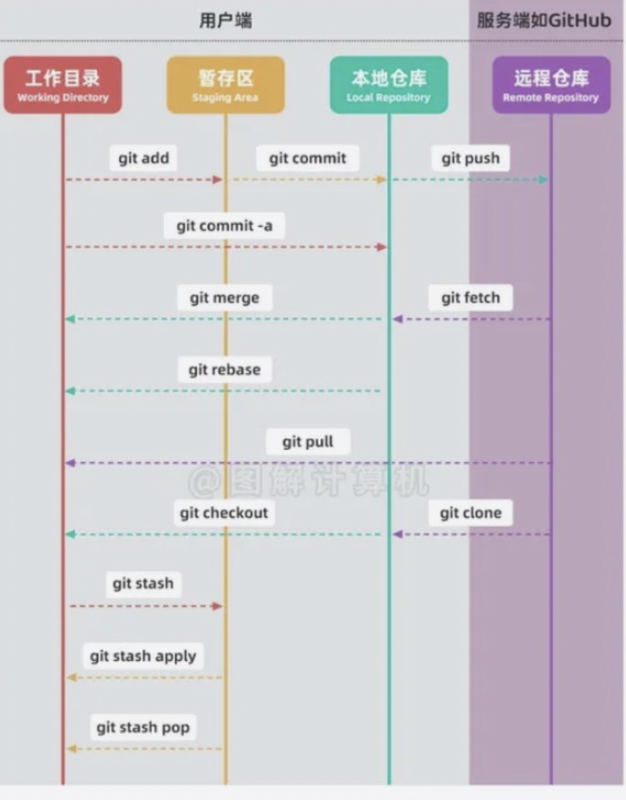
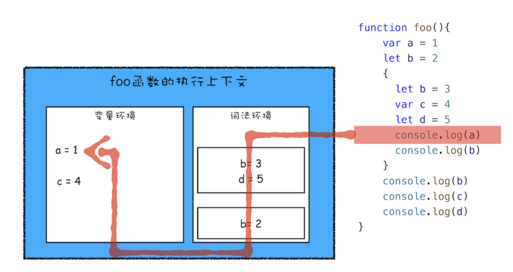
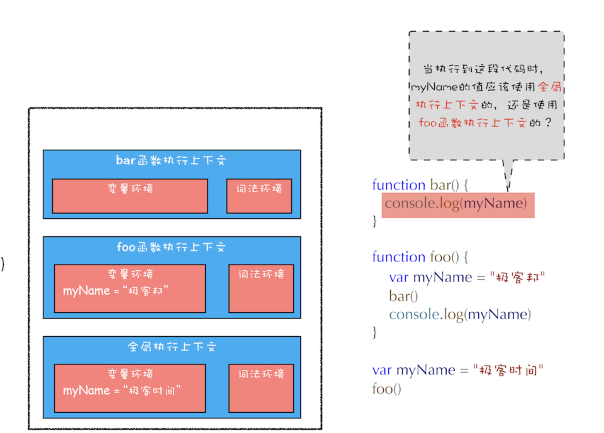
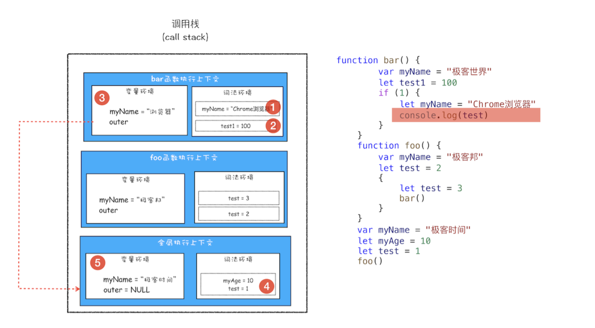
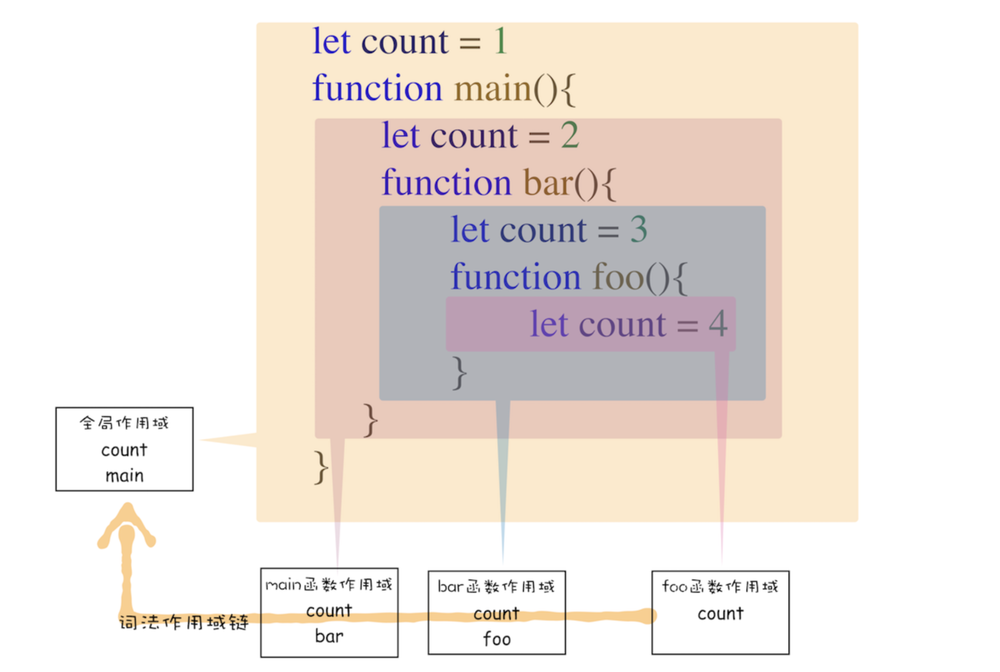
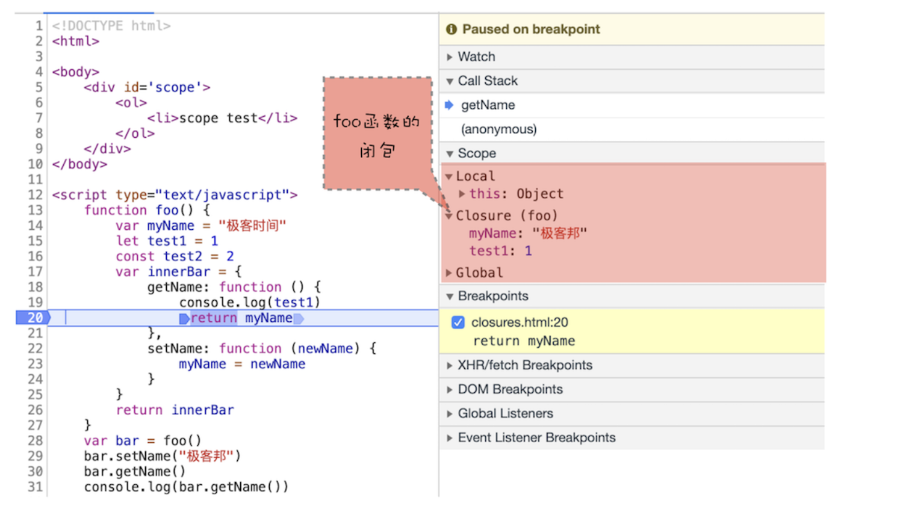

# Git

- 
- sourcetree git 可视化工具

# 计算机基础

## UTF8编码规则总结

UTF8是一种**变长编码**方式，其核心是通过字节的起始位标识来确定编码长度，既节省存储空间，又兼容ASCII，还具备一定容错性。

### 一、字节长度的判断：靠起始位说话

第一个字节的起始位模式决定了整个字符编码所需的字节数，具体规则如下：

| 起始位模式 | 所需字节数 | 说明                   |
| ---------- | ---------- | ---------------------- |
| 0xxxxxxx   | 1字节      | 兼容ASCII，数据位为7位 |
| 110xxxxx   | 2字节      | 数据位共11位           |
| 1110xxxx   | 3字节      | 数据位共16位           |
| 11110xxx   | 4字节      | 数据位共21位           |

### 二、数据存储的规矩：起始位+数据位

- 从第二个字节开始，均以**10xxxxxx**为固定起始模式，剩余6位为数据位。
- 不同字节长度对应的数据位总数不同：1字节（7位）、2字节（11位）、3字节（16位）、4字节（21位）。

### 三、字符数据的填入：按位从左到右

1. 将字符的Unicode编码转为二进制。
2. 二进制数据从左到右，依次填入编码中的数据位（起始位之外的bit位）。
3. 若数据位未填满，左侧空缺部分补0。

**示例**：Unicode编码128523（二进制为11111011000001011，共17位）需4字节编码，结果为11110000 10011111 10011000 10001011。

### 四、三大核心优势

- **变长特性**：根据字符所需存储空间动态调整编码长度，节省空间。
- **ASCII兼容**：1字节编码时以0开头，直接兼容标准ASCII字符。
- **容错能力**：非首字节固定以10开头，便于计算机检测字节丢失，减少数据损失。

### 总结：UTF8的核心

UTF8通过**起始位标识字节长度**、**变长编码节省空间**、**兼容ASCII**及**固定非首字节起始模式实现容错**，成为广泛应用的编码方式。其设计既满足了多语言字符的编码需求，又兼顾了存储效率和兼容性。

## 整数与浮点数在计算机中的表示和运算总结

在JavaScript中，整数和浮点数的底层表示、运算（包括位运算）有其特殊性，核心源于JS**所有数字均以64位双精度浮点数存储**，但位运算会特殊处理：

### 一、表示方式（64位双精度浮点数）

无论整数还是浮点数，均遵循IEEE 754标准，结构为：`符号位(1位) + 指数位(11位) + 尾数位(52位)`

- **整数**：当数值为整数且在 `-2^53 ~ 2^53` 范围内时，尾数位可精确存储（无小数部分）；超出则丢失精度。
- **浮点数**：小数部分通过尾数位近似表示（部分十进制小数如0.1无法用二进制精确表示，导致精度误差）。
- 以十进制数 `10`（二进制 `1010`）为例，其二进制科学计数法为 `1.01 × 2^3`：

### 二、普通运算（加减乘除等）

基于浮点数规则：

- 整数运算：在安全范围（`-2^53 ~ 2^53`）内精确，超出则因尾数位有限（53位）丢失精度（如 `2^53 + 1 === 2^53` 为 `true`）。
- 浮点数运算：因二进制近似表示，存在精度误差（如 `0.1 + 0.2 = 0.30000000000000004`）。

### 三、位运算（特殊处理）

JS的位运算（如 `&`、`|`、`^`、`~`、`<<`、`>>`、`>>>`）**仅对32位有符号整数生效**，过程如下：

1. **转换**：先将参与运算的数字（无论整数还是浮点数）转换为32位有符号整数（步骤：忽略小数部分→截断超出32位的部分→符号位为第32位）。
   - 例：浮点数 `3.9` 会被转为整数 `3`；超大数 `2^32 + 1` 会被截断为 `1`。
2. **运算**：对转换后的32位二进制数执行位操作（如 `5 & 3` 即 `101 & 011 = 001`，结果为 `1`）。
3. **转回**：运算结果再转换为64位浮点数存储

### 四、JS失真问题

`0.1 + 0.2` 结果失真（等于 `0.30000000000000004`），核心原因是**十进制小数无法被二进制精确表示**，导致计算机存储和运算时产生精度误差，具体过程如下：

#### 1. 十进制小数转二进制的“无限循环”问题

计算机只能用二进制（0和1）存储数字，而 `0.1` 和 `0.2` 这类十进制小数，转换为二进制时是**无限循环小数**，无法用有限位数表示：

- `0.1` 转二进制：`0.0001100110011...`（`0011` 无限循环）
- `0.2` 转二进制：`0.001100110011...`（`0011` 无限循环）

#### 2. 浮点数存储的“截断”误差

计算机用**64位双精度浮点数**存储数字时，尾数位仅能保留52位（加隐含位共53位）。对于无限循环的二进制小数，只能截取前53位作为近似值：

- `0.1` 的二进制近似值：截取后约等于 `0.10000000000000000555...`（十进制）
- `0.2` 的二进制近似值：截取后约等于 `0.2000000000000000111...`（十进制）

#### 3. 运算时的误差累积

`0.1 + 0.2` 实际是两个近似值相加：
`0.10000000000000000555... + 0.2000000000000000111... = 0.3000000000000000444...`
这个结果无法精确等于 `0.3`（因为 `0.3` 的二进制也是无限循环小数，存储时同样有近似值），最终显示为 `0.30000000000000004`。

#### 总结

`0.1 + 0.2` 失真的本质是**十进制到二进制的转换存在精度损失**，且浮点数的有限存储位数无法完整保留无限循环的二进制小数，导致运算结果与预期的十进制值不一致。这是所有基于 IEEE 754 标准的编程语言（如 JS、Java、Python 等）共有的现象。

## 编程语言知识总结

### 一、静态语言与动态语言

| 类型     | 代表语言                 | 核心特点                                                                     |
| -------- | ------------------------ | ---------------------------------------------------------------------------- |
| 静态语言 | C、C++、Java、TypeScript | 变量有明确类型，且只能指向对应类型的值，类型检查通常在编译阶段完成           |
| 动态语言 | JavaScript、Python、Ruby | 变量无类型限制，但值有类型，变量可指向不同类型的值，类型检查多在运行阶段进行 |

### 二、强类型与弱类型

| 类型       | 代表语言      | 核心特点                                                                       |
| ---------- | ------------- | ------------------------------------------------------------------------------ |
| 强类型语言 | Python、Java  | 程序运行时，值的类型不会自动转换，类型不匹配的运算会直接报错                   |
| 弱类型语言 | C、JavaScript | 程序运行时，值的类型可根据运算符自动转换，即使类型不匹配也可能通过转换继续执行 |

### 三、静态作用域与动态作用域

| 类型                     | 核心特点                                                                     | 现状                                                                    |
| ------------------------ | ---------------------------------------------------------------------------- | ----------------------------------------------------------------------- |
| 静态作用域（词法作用域） | 变量的作用域在编译时静态确定，仅在声明的区域内可见，区域外不可访问或无法访问 | 主流编程语言（如 C、Java、JavaScript 等）均采用，是目前的主流作用域类型 |
| 动态作用域               | 变量的作用域是动态的，只要有代码访问该变量，变量就一直存在                   | 较少单独使用，部分语言可兼容两种作用域类型                              |

## Base64

一种用 64 个可打印字符（A-Z、a-z、0-9、`+`、`/` 等）表示二进制数据的编码方式，将二进制转为文本，便于传输和存储。

### 主要用途

1. 在仅支持文本的协议/场景（如 HTTP、JSON、数据库）中传输/存储二进制数据。例如网页中嵌入图片时使用 `data:image/png;base64,...` 格式，直接将图片二进制数据编码为文本嵌入 HTML
2. 避免二进制中的特殊字符导致解析错误。
3. 简单混淆数据（非加密，可逆）。

### 特点

- 编码后体积增加约 33%，可逆，兼容性强，几乎所有编程语言均支持。

## Linux命令行

### 系统差异

* 类Unix 系统（Unix/Linux/macOS）可以直接使用
* window不能直接使用
  * 通过 **WSL（Windows Subsystem for Linux）** 运行完整 Linux 环境，直接使用 Linux 命令行，与类 Unix 系统用法一致
  * 跨平台工具如 **Cygwin** 或  **Git Bash** （基于 msys2），在 Windows 上模拟类 Unix 命令集

### 常用类unix命令

| **功能分类**      | **命令**        | **作用描述**                                    | **常用选项示例**                                                                         |
| ----------------- | --------------- | ----------------------------------------------- | ---------------------------------------------------------------------------------------- |
| **文件/目录操作** | `ls`            | 列出目录内容                                    | `-l`（详细列表）、`-a`（显示隐藏文件）、`-h`（人类可读大小，如 K/M）                     |
|                   | `cd`            | 切换当前目录                                    | `cd ~`（回到用户主目录）、`cd ..`（回到父目录）                                          |
|                   | `pwd`           | 显示当前工作目录的绝对路径                      | 无常用选项                                                                               |
|                   | `mkdir`         | 创建新目录                                      | `-p`（递归创建多级目录，如 `mkdir -p a/b/c`）                                            |
|                   | `rm`            | 删除文件或目录                                  | `-r`（递归删除目录）、`-f`（强制删除，不提示）、`rm -rf dir`（危险！删除目录及内容）     |
|                   | `cp`            | 复制文件/目录                                   | `-r`（复制目录）、`-i`（覆盖前提示）、`cp src/* dest`（复制所有文件到目标目录）          |
|                   | `mv`            | 移动/重命名文件/目录                            | `-i`（覆盖前提示）、`mv oldname newname`（重命名）                                       |
|                   | `touch`         | 创建空文件或更新文件时间戳                      | `touch file.txt`（创建或更新文件）                                                       |
|                   | `ln`            | 创建链接文件                                    | `-s`（创建软链接，如 `ln -s target linkname`）                                           |
| **文件内容查看**  | `cat`           | 查看文件内容（适合短文件）                      | `-n`（显示行号）、`cat file1 file2`（合并显示多个文件）                                  |
|                   | `more`          | 分页查看文件内容（按 Enter 翻行，空格翻页）     | 无常用选项                                                                               |
|                   | `less`          | 高级分页查看（支持上下滚动、搜索，按 `q` 退出） | `-N`（显示行号）、`less +/keyword file`（直接定位到关键词）                              |
|                   | `head`          | 查看文件前 N 行                                 | `-n 10`（默认前10行，可指定行数，如 `head -n 5 file`）                                   |
|                   | `tail`          | 查看文件后 N 行或实时更新                       | `-n 10`（默认后10行）、`-f`（实时监控文件新增内容，如 `tail -f log.txt`）                |
| **文本处理**      | `grep`          | 按模式搜索文本                                  | `-i`（忽略大小写）、`-r`（递归搜索目录）、`-n`（显示匹配行号）、`grep "keyword" file`    |
|                   | `sed`           | 流式文本编辑（替换、删除等）                    | `sed 's/old/new/g' file`（全局替换）、`sed '/pattern/d' file`（删除匹配行）              |
|                   | `awk`           | 按列处理文本（适合结构化数据）                  | `awk '{print $1}' file`（打印第一列）、`awk -F ',' '{print $2}' csvfile`（按逗号分隔）   |
|                   | `sort`          | 对文本行排序                                    | `-n`（数值排序）、`-r`（逆序）、`-k 2`（按第2列排序）                                    |
|                   | `wc`            | 统计文件行数、单词数、字节数                    | `-l`（仅统计行数）、`-w`（仅统计单词数）、`wc file`（默认输出 行 词 字节）               |
| **权限管理**      | `chmod`         | 修改文件/目录权限                               | `chmod 755 file`（所有者读写执行，组和其他读执行）、`chmod +x script.sh`（添加执行权限） |
|                   | `chown`         | 修改文件/目录的所有者和所属组                   | `chown user:group file`（设置用户和组）、`chown -R user dir`（递归修改目录）             |
| **系统信息**      | `uname`         | 显示系统信息                                    | `-a`（显示所有信息，如内核版本、主机名）                                                 |
|                   | `df`            | 查看磁盘空间使用情况                            | `-h`（人类可读单位）、`df -h /`（查看根目录磁盘使用）                                    |
|                   | `du`            | 查看目录/文件大小                               | `-h`（人类可读）、`-s`（仅显示总和）、`du -sh dir`（查看目录总大小）                     |
|                   | `top`/`htop`    | 实时查看进程资源占用（`htop` 为增强版）         | 按 `q` 退出，`P` 按CPU排序，`M` 按内存排序                                               |
|                   | `ps`            | 查看当前进程快照                                | `ps aux`（显示所有进程）、`ps -ef                                                        |
| **进程管理**      | `kill`          | 终止进程                                        | `kill PID`（通过进程ID终止）、`kill -9 PID`（强制终止，慎用）                            |
|                   | `bg`/`fg`       | 管理后台/前台进程                               | `bg`（将暂停的进程放入后台）、`fg %1`（将编号1的后台进程调至前台）                       |
| **网络操作**      | `ping`          | 测试网络连通性                                  | `ping -c 4 host`（发送4个数据包）                                                        |
|                   | `ifconfig`/`ip` | 查看/配置网络接口（`ip` 为新一代工具）          | `ifconfig eth0`（查看网卡eth0信息）、`ip addr`（显示所有网络接口）                       |
|                   | `netstat`/`ss`  | 查看网络连接状态（`ss` 为新一代工具）           | `netstat -tuln`（显示监听的TCP/UDP端口）、`ss -lntu`                                     |
| **其他常用**      | `man`           | 查看命令手册（manual）                          | `man ls`（查看 `ls` 命令帮助）                                                           |
|                   | `tar`           | 打包/解压文件                                   | `tar -zcvf archive.tar.gz dir`（压缩）、`tar -zxvf archive.tar.gz`（解压）               |
|                   | `wget`/`curl`   | 下载网络文件（`curl` 功能更丰富）               | `wget url`、`curl -O url`（下载文件）、`curl -X POST url`（发送POST请求）                |

这些命令在 Linux、macOS、Unix 系统中通用（部分细节可能因版本略有差异），是类 Unix 环境下日常操作和开发的基础工具。

# HTML

## Canvas 和 SVG 总结

| 特性       | Canvas                                   | SVG                                    |
| ---------- | ---------------------------------------- | -------------------------------------- |
| 原理       | 基于像素的位图绘制                       | 基于 XML 的矢量图形                    |
| 渲染方式   | 逐像素即时绘制（无 DOM 节点）            | 以 DOM 节点形式描述图形                |
| 适合场景   | 大量图形频繁重绘、游戏、数据可视化、动画 | 图表、图标、静态矢量图、交互性强的图形 |
| 清晰度     | 放大会失真                               | 任意缩放不失真                         |
| 事件支持   | 需手动计算坐标实现交互                   | 内置事件支持，可直接监听 DOM 节点事件  |
| 性能       | 适合大量复杂图形和实时渲染               | 适合少量图形或静态场景                 |
| 动画       | 需手动实现重绘逻辑                       | 部分属性支持 CSS/SMIL 动画             |
| 修改元素   | 必须重绘整个画布                         | 可单独修改某一个图形元素               |
| 导出       | 易于导出为图片                           | 易于导出为 XML/SVG 文件                |
| 浏览器支持 | HTML5 标准，主流浏览器均支持             | 所有主流浏览器均支持                   |
| 代码示例   | `canvas.getContext('2d').fillRect(...)`  | `<svg><rect ... /></svg>`              |

### - 简要结论

- **Canvas** 适合高性能、高刷新率的动态图形，如游戏、实时数据可视化等。
- **SVG** 适合结构化、可交互、可缩放的静态或少量动态图形，如图表、图标、可编辑图片等。
- 实际开发中可根据需求灵活选择或结合使用。

## link标签预加载

`link` 标签的 `preload` 和 `prefetch` 是用于**资源预加载**的两个重要属性，目的是提前加载关键资源或可能需要的资源，优化页面性能，但它们的使用场景和行为机制有明显区别。

### 一、`preload`：预加载当前页面的关键资源

**作用**：强制浏览器在页面加载的早期阶段（优先级高）预加载指定的关键资源，确保这些资源在需要时能立即使用，不会阻塞初始渲染。

#### 语法

```html
<link rel="preload" href="critical.css" as="style">
<link rel="preload" href="main.js" as="script">
<link rel="preload" href="font.woff2" as="font" type="font/woff2" crossorigin>
```

#### 核心特性

1. **高优先级**：`preload` 资源会被浏览器视为“当前页面必需”，加载优先级极高（高于普通资源），不会被其他资源阻塞。
2. **必须指定资源类型**：通过 `as` 属性声明资源类型（如 `style`、`script`、`image`、`font` 等），浏览器会根据类型分配正确的优先级和处理方式。若缺少 `as`，会被当作低优先级的 `fetch` 请求，且无法正确应用。
3. **加载后需手动使用**：`preload` 仅负责“加载资源”，不自动执行/应用（如 CSS 需通过 `link` 或 `@import` 引用，JS 需通过 `import` 或 `script` 标签执行）。
4. **适用于当前页面**：仅预加载当前页面马上需要的关键资源（如首屏 CSS、核心 JS、自定义字体等）。

### 二、`prefetch`：预加载未来可能需要的资源

**作用**：在浏览器**空闲时**（当前页面加载和渲染完成后）预加载“未来页面可能需要”的资源（如用户可能跳转的下一页资源），提升后续页面的加载速度。

#### 语法

```html
<link rel="prefetch" href="next-page.js" as="script">
<link rel="prefetch" href="next-image.jpg" as="image">
```

#### 核心特性

1. **低优先级**：`prefetch` 资源的加载优先级极低，仅在浏览器空闲时（如主线程不忙、网络空闲）才会加载，不会影响当前页面的关键资源加载。
2. **适用于未来页面**：主要用于预加载用户可能访问的下一个页面的资源（如列表页预加载详情页的 JS/CSS）。
3. **缓存机制**：预加载的资源会被存入 HTTP 缓存或内存缓存，当用户访问对应页面时，可直接从缓存读取，减少请求耗时。

### 三、关键区别对比

| 特性     | `preload`                        | `prefetch`                   |
| -------- | -------------------------------- | ---------------------------- |
| 加载时机 | 页面加载早期（高优先级）         | 浏览器空闲时（低优先级）     |
| 适用场景 | 当前页面必需的关键资源           | 未来页面可能需要的资源       |
| 优先级   | 高（不阻塞但优先加载）           | 低（不影响当前页面）         |
| 资源处理 | 需手动应用（加载后不会自动生效） | 缓存起来，未来使用时自动生效 |

### 四、使用场景示例

1. **`preload` 示例**：

   - 首屏必需的 CSS（避免 CSSOM 构建延迟导致的渲染阻塞）。
   - 自定义字体（避免字体加载导致的文本闪烁 FOIT）。
   - 核心 JS（如启动框架的入口文件）。

   ```html
   <!-- 预加载首屏关键 CSS -->
   <link rel="preload" href="critical.css" as="style" onload="this.rel='stylesheet'">
   <!-- 预加载自定义字体 -->
   <link rel="preload" href="myfont.woff2" as="font" type="font/woff2" crossorigin>
   ```
2. **`prefetch` 示例**：

   - 首页预加载登录页的 JS/CSS。
   - 列表页预加载排名靠前的详情页资源。

   ```html
   <!-- 首页预加载登录页的脚本 -->
   <link rel="prefetch" href="/login.js" as="script">
   ```

### 五、注意事项

- 避免滥用：`preload` 过多资源会占用带宽，反而影响关键资源加载；`prefetch` 过多可能浪费用户流量（尤其是移动网络）。
- 兼容性：现代浏览器（Chrome 50+、Firefox 39+、Edge 12+）均支持，IE 不支持。
- 配合 `onload` 处理：`preload` 的 CSS 可通过 `onload` 动态修改 `rel` 为 `stylesheet` 应用样式，避免重复加载。

总结：`preload` 是“当前页面紧急资源的抢先加载”，`prefetch` 是“未来页面资源的空闲时预存”，合理使用可显著提升页面加载速度和用户体验。

# CSS

## CSS选择器

### 元素选择器

* div{}

### 属性类选择器【属性 = 值

- input[type='text']

### 层级选择器

- . 表示类选择器
- #号表示 ID 选择器
- .foo .bar 空格表示后代选择器
- div > p >号表示子元素选择器
- div + p + p 邻接选择器，只选择 1 个紧邻着的兄弟标签
- div ~ p  div 后面的所有兄弟 p 标签

### 伪类选择器

* 通过元素的特定状态或位置选择元素，使用 `:`前缀。
* a:hover

### **伪元素选择器**

* 选择元素的特定部分（如文本的首字母、内容前后插入的元素），使用 `::`前缀
* h1::before

### 选择器的优先级

- 第一：!important（优先级最高）
  第二：（内联样式， #， 类选择器 / 属性选择器 / 伪类选择器，元素选择器（标签选择器）/ 伪元素选择器）
  第三：继承（即使是继承下来的！important 也是没有优先权的）
- 通配符 \*
  - 优先级为 0，0，0，0
- 内联样式 / 行内样式 / 行间样式 /inline style
  - 1，0，0，0
- 继承
  - 没有优先级，比【\*】的优先级还要小

## 盒子模型

- 左边界 + 左边框 + 左填充 +content box+ 右填充 + 右边框 + 右边界 = 父元素内容区宽度
  上边界 + 上边框 + 上填充 +content box+ 下填充 + 下边框 + 下边界 = 父元素内容区高度
- box-sizing：border box/content box，默认值为 content box，声明宽高是哪部分盒子的尺寸
- 正常流： Normal Flow，从左往右，由上往下
- 如果为边框设置了样式（如 `border-style: solid`）但没有指定颜色（即省略了 `border-color`），边框颜色会默认继承元素的文本颜色（即 `color`属性值）

## BFC

- 具有 BFC 特性的元素可以看作是隔离了的独立容器，容器里面的元素不会在布局上影响到外面的元素。
- 作用

  * 清除浮动（解决浮动元素导致的父元素高度塌陷问题）
  * 防止 margin 重叠
  * 自适应两栏布局（隔离浮动元素与普通元素）
- 下列方式会触发 BFC：

  * 浮动元素（元素的 float 不是 none）
  * 绝对定位元素（元素的 position 为 absolute 或 fixed）
  * 行内块元素（元素的 display 为 inline-block）
  * 弹性元素（display 为 flex 或 inline-flex 元素的直接子元素）
  * overflow 值不为 visible 的块元素

## 定位 position

- 默认值 static，表示常规流。
- 定位指的是 margin box 定位到对象的 padding box
- 固定定位 fixed
  相对于视口固定 ，不随滚动条滚动，脱离常规流
- 相对定位 relative
  相对定位的元素是在文档中的正常位置偏移给定的值，但是不影响其他元素的偏移。相对自己定位，原来的位置保留在常规流
- 绝对定位 absolute
  相对于最近的定位祖先定位，如果祖先没有定位，相对于第一屏（滚动条在最上方时的可视窗口）定位，脱离常规流
- 粘性定位 sticky
  CSS 的粘性定位（sticky）是一种定位方式，结合了相对定位（relative）和固定定位（fixed）的特性。使用 sticky 定位时，元素在其父容器的滚动区域内表现为相对定位；当元素滚动到设定的阈值（通常是 top、bottom、left 或 right）时，元素会变为固定定位，粘在指定的位置

  * 导航栏、侧边栏等场景

  - 如果 sticky 元素的任何父元素设置了 overflow: hidden/auto/scroll，sticky 可能会失效。
- 层叠覆盖关系

  - 定位流盖住常规流
  - 后出现的定位流元素盖住前面定位流元素
  - z-index 必须配合定位使用

    - 调节层叠覆盖关系，常规流默认值为 0
    - z-index: 值； 值大的盖住值小的，可以 有负值，都为整数

    * 如果父元素创建了层叠上下文，那么子元素的 `z-index`再大，也无法超出父元素所在的层叠层级。
  - 元素的方位

    - top left right bottom
    - 当不明确指定时，元素的从它在常规流中开始的位置开始。对于 static 定位不生效
    - 取百分比时，百分比相对于包含块（或定位祖先）的 padding-box 的对应尺寸

## 行内布局

| 特性                   | 说明                                   |
| ---------------------- | -------------------------------------- |
| 行内元素               | span、a、em、strong、img等             |
| 排布方式               | 一行排列，内容超出自动换行             |
| 对齐方式               | 默认基线对齐，可用vertical-align调整   |
| 行盒（line box）       | 包含一行内所有行内元素和文本的矩形区域 |
| 行高（line-height）    | 控制行盒的高度和行内元素的垂直间距     |
| 行内块（inline-block） | 行内排列但可设置宽高                   |
| 空白间隙               | 源码中的空格/换行会影响布局            |
| 溢出处理               | 默认换行，white-space可控制            |

## 浮动

| 内容点            | 说明                                                                           |
| ----------------- | ------------------------------------------------------------------------------ |
| 启用浮动          | 使用 `float: left;` 或 `float: right;` 让元素从文档流中脱离并向一侧浮动        |
| 典型用途          | 图文环绕、导航栏横向排列、宫格布局等                                           |
| 脱离标准文档流    | 浮动元素不再占据原有空间，后续块级元素会上移填补                               |
| 影响高度塌陷      | 父元素只包含浮动子元素时，高度会塌陷为 0                                       |
| 清除浮动          | 使用 `clear: left/right/both;` 清除浮动影响，常用于浮动元素后                  |
| 清除浮动技巧      | 伪元素法（如 `.clearfix` 类，`::after{content:"";display:block;clear:both;}`） |
| 浮动与文本关系    | 文本和行内元素会环绕浮动元素排列                                               |
| 多列排列          | 多个浮动元素可以并排横向排列，常用于布局                                       |
| 父级 BFC 解决塌陷 | 触发父元素 BFC（如 `overflow: hidden;`）可避免高度塌陷                         |
| 浮动元素宽度      | 未设置宽度时，浮动元素会自动缩放至内容宽度（块级元素）                         |
| 兼容性            | 所有主流浏览器支持浮动布局                                                     |
| 局限性            | 复杂布局不易维护，易引起浮动 BUG，一般推荐用 Flex、Grid 替代                   |

## 伪类和伪元素

### 伪类

* 伪类是添加到选择器的关键字，用于指定所选元素的特殊状态
* :hover、`first-child`

### 伪元素

* 常见用法

| 伪元素           | 常用属性                           | 注意事项                             |
| ---------------- | ---------------------------------- | ------------------------------------ |
| ::before/::after | content, color, background, margin | 必须有 content 属性，否则不显示      |
| ::first-line     | color, font-weight, background     | 仅支持部分文本相关属性               |
| ::first-letter   | font-size, color, float, margin    | 支持浮动、margin、padding、border 等 |
| ::selection      | background, color, text-shadow     | 仅支持极少数属性                     |

- content属性

| 用法点        | 说明                                                | 示例代码                        | 备注                                  |
| ------------- | --------------------------------------------------- | ------------------------------- | ------------------------------------- |
| 基本写法      | 必须用于 ::before 或 ::after 伪元素，指定插入的内容 | .box::before { content: "Hi"; } | 没有 content，伪元素不会显示          |
| 插入文本      | 直接插入字符串文本                                  | content: "提示：";              | 支持转义字符，如 `\A` 换行            |
| 插入图片      | 使用 `url()` 插入图片                               | content: url(icon.png);         | 可加在文本前后，常用于图标            |
| 插入属性值    | 使用 `attr()` 插入元素属性值                        | content: attr(data-title);      | 仅部分属性可用，常用于 data-* 属性    |
| 空内容        | 不插入任何内容，可用于清除浮动                      | content: "";                    | .clearfix::after { content: ""; ... } |
| 换行/特殊字符 | 使用转义字符插入特殊内容，如 `\A` 换行              | content: "第一行\A第二行";      | 需配合 white-space: pre;              |

## 回流与重绘

- 回流 reflow relayout

  - 页面样式的变化涉及到重新计算布局，回流速度慢
  - 读取布局属性会引起回流；element.offsetWidth/offsetHeight/scrollTop 等
- 重绘 repaint

  - 页面样式的变化不涉及布局的计算，只变了颜色，背景，阴影等不影响布局样式，速度快

## CSS3 知识

### CSS3新特性

| 新特性              | 说明与举例                                                       |
| ------------------- | ---------------------------------------------------------------- |
| 选择器增强          | 属性选择器、伪类（:nth-child）、伪元素（::before、::after）等    |
| 媒体查询            | 响应式布局核心，`@media` 根据屏幕宽度、高度等条件应用不同样式    |
| 弹性盒子（Flexbox） | `display: flex`，简化一维布局，支持弹性排列、对齐、分配空间      |
| 网格布局（Grid）    | `display: grid`，强大的二维网格布局系统，适合复杂网页结构        |
| 过渡与动画          | `transition`、`animation` 属性，实现平滑的动画与交互动效         |
| 变形与变换          | `transform: scale/rotate/translate/skew` 实现2D/3D变化           |
| 阴影与圆角          | `box-shadow`、`text-shadow`、`border-radius` 增强视觉表现        |
| 背景增强            | 多背景、背景渐变（linear-gradient, radial-gradient）、背景尺寸等 |
| 新增颜色模式        | RGBA、HSLA、透明度（opacity）等                                  |
| 自定义字体          | `@font-face` 可引入网络字体                                      |
| 多列布局            | `column-count`、`column-gap` 实现杂志式分栏                      |
| 其它视觉效果        | `filter`（滤镜）、`backdrop-filter`、`mask` 遮罩等               |
| 盒模型增强          | `box-sizing: border-box`，更易于布局计算                         |
| 伪类/伪元素增强     | `:not()`、`:nth-of-type()`、`::selection` 等                     |
| 结构性模块          | `calc()` 计算表达式、`var()` CSS变量、自定义属性                 |
| 新增UI属性          | `resize` 可拖动尺寸、`outline-offset`、`cursor`增强              |

### media query

| 用法点     | 说明与示例                                                             | 备注                                |
| ---------- | ---------------------------------------------------------------------- | ----------------------------------- |
| 基本语法   | `@media 媒体类型 and (条件) { CSS规则 }`                               | 媒体类型可省略，常用 all, screen 等 |
| 响应式布局 | 根据屏幕宽度等条件，应用不同的样式                                     | 实现PC端/移动端自适应               |
| 常见条件   | `min-width`、`max-width`、`orientation`、`resolution`、`min-height` 等 | 可组合多个条件                      |
| 多条件组合 | `@media (min-width:600px) and (max-width:900px) { ... }`               | 用 and/only/not 连接                |
| 多媒体查询 | `@media screen, print { ... }`                                         | 用逗号分隔，表示“或”关系            |
| 典型示例   | `@media (max-width: 600px) { body { font-size: 14px; } }`              | 小屏幕字体变小                      |
| 设备方向   | `@media (orientation: landscape) { ... }`                              | 横屏时应用                          |
| 媒体类型   | `screen`（屏幕），`print`（打印），`all`（全部）                       | 常见类型                            |
| 嵌入方式   | 可在CSS文件、style标签、内联style中使用                                | 推荐写在外部CSS文件中               |
| 高级用法   | 支持 `@media (pointer: coarse)` 检测是否为触摸屏等                     | CSS4/5支持更多新特性示例代码        |

```css
/* 响应式字体 */
@media (max-width: 600px) {
  body { font-size: 14px; }
}

/* 横屏样式 */
@media (orientation: landscape) {
  .banner { height: 200px; }
}

/* 只在打印时应用 */
@media print {
  nav, footer { display: none; }
}

/* 组合条件 */
@media screen and (min-width: 800px) and (max-width: 1200px) {
  .container { width: 80%; }
}
```

### 移动端的适配方法

| 方法                    | 主要特点与说明                                                                                        | 优缺点                                   |
| ----------------------- | ----------------------------------------------------------------------------------------------------- | ---------------------------------------- |
| 媒体查询（Media Query） | 使用 `@media` 根据屏幕宽度/分辨率切换不同样式；响应式布局的核心方法                                   | 兼容性好，灵活，常与弹性/百分比/REM配合  |
| REM/EM 布局             | 用 rem/em 单位，配合动态设置 html 字体大小（如 vw 方案），实现所有元素等比缩放                        | 适合多终端统一设计，需 JS 或媒体查询配合 |
| vw/vh 布局              | 用视口宽高（vw/vh）为单位，直接根据屏幕尺寸自适应                                                     | 精准自适应，字体需适配                   |
| Viewport 适配           | 设置 `<meta name="viewport" `content="width=device-width"`>` 控制页面缩放和宽度，配合其他适配方案使用 | 必须设置，可防止页面缩放/溢出            |

### 变换transform

| 用法点                    | 说明与示例                                                       | 备注                                |
| ------------------------- | ---------------------------------------------------------------- | ----------------------------------- |
| 基本语法                  | `transform: 函数1(参数) 函数2(参数) ...;`                        | 可同时使用多个变形函数，顺序有影响  |
| 平移 translate            | `transform: translateX(50px) translateY(-20px);`                 | 支持 translateX/Y/Z/3d              |
| 缩放 scale                | `transform: scale(1.2)<br>``transform: scaleX(1.5) scaleY(0.5);` | scale3d 支持三维缩放                |
| 旋转 rotate               | `transform: rotate(45deg)<br>``transform: rotateZ(30deg)`        | 支持 rotateX/Y/Z/3d                 |
| 倾斜 skew                 | `transform: skew(30deg, 10deg)<br>``transform: skewX(-15deg)`    | 只支持二维倾斜                      |
| 变换中心 transform-origin | `transform-origin: 50% 0;`（以顶部中点为中心变形）               | 默认中心为元素中心                  |
| 矩阵 matrix               | `transform: matrix(a, b, c, d, e, f)` 表示 2D 变换矩阵           | 少用，通常由工具自动生成            |
| 3D变换                    | `transform: translateZ(50px) rotateY(45deg) scale3d(1,2,1);`     | 需配合 `perspective` 属性产生3D效果 |
| 动画结合                  | 可与 `transition` 或 `animation` 搭配，实现平滑动画效果          | 常用于悬停、切换等交互              |
| 兼容性                    | 现代浏览器均支持，部分老浏览器需要前缀（如 -webkit-）            | 推荐检查兼容性                      |

---

### 过度与动画

| 分类       | 属性/语法                  | 说明                                                      | 备注/常用值                                     |
| ---------- | -------------------------- | --------------------------------------------------------- | ----------------------------------------------- |
| transition | transition                 | 平滑地改变 CSS 属性值（可简写，duration 必须在 delay 前） | 如：transition: all 0.3s ease 0s;               |
|            | transition-property        | 指定哪些属性参与过渡（默认 all）                          | 例：opacity，height                             |
|            | transition-duration        | 过渡持续时间                                              | 如：0.5s，200ms                                 |
|            | transition-delay           | 过渡延迟时间，动画开始前/结束后都会有延迟                 | 如：0.2s                                        |
|            | transition-timing-function | 过渡缓动类型                                              | ease，linear，ease-in，ease-out，cubic-bezier() |
| animation  | @keyframes name {...}      | 定义关键帧动画，百分比或 from/to（0%/100%）               | 例：@keyframes bounce {...}                     |
|            | animation-name             | 关键帧名称，引用 @keyframes 名称                          |                                                 |
|            | animation-duration         | 动画持续时间                                              | 如：1s                                          |
|            | animation-timing-function  | 动画缓动类型                                              | 同 transition                                   |
|            | animation-delay            | 动画延迟开始时间                                          | 如：0.5s                                        |
|            | animation-iteration-count  | 动画执行次数，默认 1，infinite 为无限次                   | 1，2，infinite                                  |
|            | animation-direction        | 动画方向                                                  | normal，alternate                               |
|            | animation-fill-mode        | 动画执行前后样式如何应用到目标                            | none，forwards，backwards，both                 |
|            | animation-play-state       | 动画播放状态                                              | running（播放），paused（暂停）                 |

---

**- 常用简写示例：**

```css
/* transition */
transition: opacity 0.5s linear 0.2s;

/* animation */
animation: bounce 1s ease-in-out 0.2s infinite alternate both
```

## Flex 布局总结

Flex（弹性盒）布局是一种高效的 CSS 布局方式，适用于一维空间（行或列）的分布对齐与自适应。核心概念如下：

### 1. 基本概念

- **Flex 容器**：设置 `display: flex;` 的元素，包含所有 flex 项目。
- **Flex 项目**：Flex 容器的直接子元素。
- **主轴（main axis）**：项目排列的轴（默认水平，从左到右）。
- **交叉轴（cross axis）**：与主轴垂直的轴（默认垂直，从上到下）

### 2. Flex 容器属性

| 属性            | 说明                                                     | 常用值                                                                     |
| --------------- | -------------------------------------------------------- | -------------------------------------------------------------------------- |
| display         | 设置容器为弹性盒                                         | flex, inline-flex                                                          |
| flex-direction  | 主轴方向                                                 | row（默认），row-reverse，column，column-reverse                           |
| flex-wrap       | 是否换行                                                 | nowrap（默认），wrap，wrap-reverse                                         |
| flex-flow       | `flex-direction` 和 `flex-wrap` 简写                     | 如：row nowrap                                                             |
| justify-content | 主轴对齐方式                                             | flex-start（默认），flex-end，center，space-between，space-around          |
| align-items     | 交叉轴对齐方式                                           | stretch（默认），flex-start，flex-end，center，baseline                    |
| align-content   | 多行时交叉轴对齐方式                                     | stretch（默认），flex-start，flex-end，center，space-between，space-around |
| gap             | Flex 项目之间的距离，也可以单独设置 row-gap、 column-gap | 20px                                                                       |

### 3. Flex 项目属性

| 属性        | 说明                                                         | 常用值及说明                                                          |
| ----------- | ------------------------------------------------------------ | --------------------------------------------------------------------- |
| order       | 排列顺序，数值越小越靠前，默认 0                             |                                                                       |
| flex-grow   | 放大比例，默认 0，不放大                                     | 剩余空间按比例分配                                                    |
| flex-shrink | 缩小比例，默认 1，可缩小                                     | 空间不足时按比例缩小                                                  |
| flex-basis  | 主轴空间分配前的初始大小，默认 auto                          | 优先级高于 width/height（非 auto 时）                                 |
| flex        | `flex-grow`、`flex-shrink`、`flex-basis` 简写，默认 0 1 auto | 如：1 0 100px                                                         |
| align-self  | 单个项目沿交叉轴对齐方式，覆盖 align-items                   | auto（默认，继承父），flex-start，flex-end，center，baseline，stretch |

### 4. 其他说明

- Flex 布局下，float、clear、vertical-align 失效。
- 项目默认沿主轴排列，主轴方向和交叉轴方向可通过上述属性灵活设置。
- Flex 是常规流布局的增强，先进行普通布局，再调整弹性分布。
- 多数容器和项目属性均有简写方式，便于书写。
- `flex: 1` 表示flex子项的伸缩比例为1，即会占据父容器中剩余的所有可用空间，相当于 `flex-grow: 1; flex-shrink: 1; flex-basis: 0%`的简写。

## 水平垂直居中方法总结

1. **行高+text-align**

   - 父元素 `line-height = height` 实现**垂直居中**（适用于单行文本）。
   - 父元素 `text-align: center` 实现**水平居中**。
2. **绝对定位 + transform**

   - 子元素绝对定位于父元素中心：`top: 50%; left: 50%;`
   - 再用 `transform: translate(-50%, -50%)`，自身**水平垂直居中**。
3. **margin: auto**

   - 块级内容区设置 `margin: auto`，在有固定宽度下**水平居中**。
   - 绝对定位元素（上下左右均为0）时，`margin: auto` 可实现**水平垂直居中**。
4. **Flex 布局**

   - 父元素 `display: flex; justify-content: center; align-items: center;`，内容区**水平垂直居中**
5. **vertical-align + font-size: 0**

   - 行内元素设置 `vertical-align: middle`，再配合父元素 `font-size: 0`，可实现**垂直居中**（常用于图片）。
6. 父容器设置为 Grid 容器，直接通过 `place-items` 简写属性居中，display: grid + place-items: center

## 常用 CSS 预编译器

| 预编译器      | 主要特点                                                             | 适用场景与生态                                        |
| ------------- | -------------------------------------------------------------------- | ----------------------------------------------------- |
| **Sass/SCSS** | 支持变量、嵌套、mixin、继承、循环、函数等高级特性                    | - 大型团队、复杂样式工程首选                          |
| **Less**      | - 支持变量、嵌套、mixin、运算等                                      | - 前端自动化工程、UI 库开发 ， 与 Node 生态结合紧密   |
| **Stylus**    | - 语法灵活，可省略大括号、分号、冒号 ，支持变量、嵌套、函数、混合宏  | - 适合追求极致灵活性的项目                            |
| **PostCSS**   | - 提供插件机制可实现自动前缀、嵌套、变量等功能                       | -  配合 webpack、Vite 等构建工具                      |
| 模块 CSS      | - vue中通过 `<style module>`注册，react中通过[文件名].module.css使用 | -类名会被**哈希化**，有效避免样式冲突，适合组件化开发 |

## CSS 框架

| 框架名称              | 类型              | 主要特点                                                                        | 适用场景                      | 生态与社区              |
| --------------------- | ----------------- | ------------------------------------------------------------------------------- | ----------------------------- | ----------------------- |
| Tailwind CSS          | 原子化/实用类 CSS | - 原子化类名，极致灵活 `<br>`- 配置化强，定制方便 `<br>`- 组件生态丰富          | 现代Web、定制化UI、响应式开发 | 非常活跃                |
| Bootstrap 5           | 组件化通用CSS框架 | - 经典组件库 `<br>`- 响应式栅格系统 `<br>`- 文档和示例完善 `<br>`- 无jQuery依赖 | 企业、后台、快速原型开发      | 非常活跃                |
| Ant Design/Element Ui | 企业级UI组件库    | - 设计规范完善 `<br>`- 组件丰富 `<br>`- 强大的表单和表格 `<br>`- 国际化支持     | 中后台系统、React 、vue项目   | 社区庞大javascript 笔记 |

# 浏览器原理

## 参考

[https://blog.poetries.top/browser-working-principle/guide/part1/lesson01.html]()

## 浏览器主要进程及其职责

### 1. 浏览器主进程（Browser Process / Main Process）

* **作用** ：浏览器的 “大脑” 和 “总指挥”。
* **主要职责** ：

  * **用户界面管理** ：绘制地址栏、书签栏、前进 / 后退按钮、窗口框架等浏览器自身 UI。
  * **标签页管理** ：创建、销毁标签页，协调标签页之间的交互。
  * **其他进程管理** ：启动、停止和协调渲染进程、GPU 进程、网络进程等子进程。
  * **文件访问** ：处理用户文件访问请求（如下载、上传）。
  * **网络栈管理（部分浏览器）** ：部分架构中，网络请求由其或网络进程集中处理。
  * **全局状态管理** ：管理浏览历史、书签、Cookie（通常委托给存储进程）、用户偏好设置等。

### 2. 渲染进程（Renderer Process）

* **作用** ：处理网页内容本身的核心进程。通常每个标签页（或同源的多个标签页 /iframe）运行一个或多个独立的渲染进程。
* **主要职责** ：

  * **HTML/CSS 解析** ：解析网页的 HTML 结构和 CSS 样式。
  * **布局（Layout）** ：计算每个元素在屏幕上的精确位置和大小。
  * **渲染（Painting）** ：将布局后的元素绘制成像素。
  * **JavaScript 执行** ：通过 V8 引擎等运行网页中的 JavaScript 代码。
  * **处理用户交互** ：响应用户在网页内的点击、输入、滚动等操作。
  * **关键特性** ：
    * **沙箱化** ：运行在严格沙箱环境中，无法直接访问本地文件系统、网络或操作系统功能，仅通过 IPC 向浏览器进程请求权限，安全性高。
    * **隔离性** ：一个渲染进程崩溃通常仅影响其负责的标签页，不会导致整个浏览器或其他标签页崩溃。

### 3. GPU 进程（GPU Process）

* **作用** ：专门处理与图形渲染相关的任务，利用图形处理器提升性能和效率。
* **主要职责** ：

  * **加速渲染** ：使用 GPU 硬件加速网页的 2D/3D 图形绘制（如 Canvas、WebGL、CSS 3D Transforms 等）。
  * **合成** ：将多个渲染进程绘制的不同图层（页面内容、滚动条、视频等）高效组合成最终用户看到的单一图像帧。
  * **处理操作系统图形接口** ：与操作系统底层图形 API（如 DirectX、Vulkan、Metal）交互。
  * **目的** ：将图形密集型任务与其他进程分离，提高图形性能和整体稳定性，GPU 驱动错误或崩溃通常可被隔离。

### 4. 网络进程（Network Process / Service）

* **作用** ：在较新架构中，集中管理浏览器的所有网络活动。
* **主要职责** ：

  * **发起网络请求** ：处理来自渲染进程和浏览器进程的 HTTP/HTTPS 请求、WebSocket 连接等。
  * **资源加载** ：下载 HTML、CSS、JavaScript、图片、字体、视频等网络资源。
  * **缓存管理** ：管理 HTTP 缓存。
  * **Cookie 管理** ：存储和发送 Cookie（通常与存储进程协作）。
  * **网络栈实现** ：包含 DNS 解析、TCP/UDP 连接管理、TLS/SSL 加密解密等。
  * **目的** ：提供统一网络资源访问点，便于实施一致的网络策略（安全、缓存等），优化资源加载，减少渲染进程负担和潜在攻击面。

### 5. 插件进程（Plugin Process / Extension Process）

* **作用** ：隔离运行浏览器插件或扩展程序（如旧的 NPAPI 插件 Flash 及现代浏览器扩展）。
* **主要职责** ：

  * **执行插件 / 扩展代码** ：运行第三方插件或扩展的逻辑。
  * **提供 API 访问** ：受控地访问浏览器 API 和网页内容（根据权限）。
  * **关键特性** ：
  * **严格隔离** ：通常运行在独立沙箱进程中。
  * **按需启动** ：仅在需要时启动。
  * **目的** ：防止有缺陷或恶意的插件 / 扩展影响浏览器主进程、渲染进程或其他标签页的稳定性与安全性。

### 6. 存储进程（Storage Process / Service）

* **作用** ：在较新架构中，集中、安全地管理浏览器的本地数据存储。
* **主要职责** ：

  * **管理存储 API** ：处理 IndexedDB、LocalStorage、SessionStorage、Cookies、Cache API（Service Worker 缓存）等 Web Storage 和浏览器自身数据的读写。
  * **数据库操作** ：直接操作存储文件（如 IndexedDB 数据库文件）。
  * **实施配额和策略** ：管理不同来源的存储配额限制。
  * **目的** ：
    * **安全** ：将敏感存储操作与渲染进程隔离，防止恶意网站通过脚本漏洞读取或篡改其他网站存储数据。
    * **性能与一致性** ：提供高效、统一的存储访问接口，避免多个渲染进程同时访问底层文件造成冲突或性能瓶颈。

### 7. 实用工具进程（Utility Processes）

* **作用** ：运行特定、非核心的公共服务或任务，按需启动。
* **主要职责** ：

  * **音频播放** ：解码和播放音频（Web Audio API）。
  * **视频捕获** ：处理摄像头和麦克风输入。
  * **数据解码** ：解码图片（如 WebP、AVIF）或其他格式数据。
  * **文件 I/O** ：执行耗时的文件读写操作。
  * **运行不受信任的任务** ：执行需要隔离但不属于插件或渲染范畴的任务。
  * **目的** ：将功能性强、资源消耗大或需额外隔离的任务从其他进程中剥离，提高模块化和安全性。

### 总结关键优势

1. **稳定性** ：一个标签页 / 插件崩溃不会导致整个浏览器崩溃。
2. **安全性** ：沙箱机制隔离网页、插件代码与操作系统和用户数据，降低恶意攻击风险。
3. **性能** ：支持并行处理（利用多核 CPU）、GPU 加速、资源加载优化等。
4. **容错性** ：出问题的进程可独立重启。
5. **模块化** ：不同功能模块分离，便于维护和更新。

## 从输入网址到页面渲染完成的过程总结

| 阶段序号 | 阶段名称              | 主要操作                                                                                                                                                                                                                                                                                                                                                                                                                                                        | 说明                                                           |
| -------- | --------------------- | --------------------------------------------------------------------------------------------------------------------------------------------------------------------------------------------------------------------------------------------------------------------------------------------------------------------------------------------------------------------------------------------------------------------------------------------------------------- | -------------------------------------------------------------- |
| 1        | URL 处理              | 1. 检查输入是否为有效 URL，否则作为搜索关键字；2. 自动补全协议（http/https）；3. 检查本地缓存和历史记录                                                                                                                                                                                                                                                                                                                                                         | 对用户输入的网址进行初步处理和验证，优先利用本地存储资源       |
| 2        | DNS 解析              | 1. 查找本地 DNS 缓存、Hosts 文件、操作系统缓存；2. 本地无结果时，向 DNS 服务器递归请求，获取目标服务器 IP 地址                                                                                                                                                                                                                                                                                                                                                  | 将域名转换为服务器可识别的 IP 地址，是连接服务器的前提         |
| 3        | 建立连接              | 1. TCP 三次握手建立连接（HTTPS 需先进行 TLS/SSL 握手，完成加密协商）；2. 现代浏览器可能采用 HTTP/2、QUIC（HTTP/3）等协议，利用多路复用或 0-RTT 技术                                                                                                                                                                                                                                                                                                             | 建立浏览器与服务器之间的通信链路，保障数据传输的可靠性和安全性 |
| 4        | 发送 HTTP 请求        | 1. 构造 HTTP 请求报文，包含请求方法（GET/POST 等）、Cookie、User-Agent、缓存信息等；2. 将请求发送到目标服务器                                                                                                                                                                                                                                                                                                                                                   | 向服务器明确请求的资源和相关参数                               |
| 5        | 服务器处理请求        | 1. 接收请求，处理动态 / 静态资源（如通过 PHP/Node/Java 等后端逻辑处理）；2. 将处理结果（HTML、CSS、JS、图片等）封装为 HTTP 响应报文返回                                                                                                                                                                                                                                                                                                                         | 服务器根据请求内容进行处理，生成并返回所需资源                 |
| 6        | 浏览器接收并处理响应  | 1. 接收响应头和主体内容，检查状态码（200、304、404 等）；2. 根据响应头判断资源类型、缓存策略、是否重定向；3. 若为重定向（301/302），自动跳转新地址并重新请求                                                                                                                                                                                                                                                                                                    | 对服务器返回的内容进行解析和初步处理，确保资源的有效性和正确性 |
| 7        | 浏览器解析和渲染页面  | 7.1 解析 HTML 构建 DOM 树：边下载边解析 HTML，script 标签可能阻塞解析（加 async/defer 可避免）；<br />7.2 解析 CSS 构建 stylesheets：解析所有样式表（内联、外链、内嵌），生成 document.stylesheets；<br />7.3 合成渲染树（Render Tree）：DOM 树与 stylesheets 结合，仅包含可见元素；<br />7.4 布局（Layout/Reflow）：计算每个元素的几何信息（大小、位置）；<br />7.5 绘制（Paint）：将节点绘制为像素；<br />7.6 合成与显示：多层合成，利用 GPU 加速合成最终画面 | 将资源转换为可视化页面的核心过程，涉及多个步骤的协同处理       |
| 8        | 解析和执行 JavaScript | 1. 下载并执行 `<script>` 标签中的 JS；2. 可能操作 DOM/stylesheets，引发回流（reflow）与重绘（repaint）                                                                                                                                                                                                                                                                                                                                                          | 实现页面的交互逻辑和动态效果，可能影响页面的渲染状态           |
| 9        | 资源加载与异步处理    | 1. 异步加载图片、字体、音视频等资源，页面边渲染边加载；2. 利用 Service Worker、Web Worker、懒加载等优化体验                                                                                                                                                                                                                                                                                                                                                     | 提升页面加载效率和用户体验，避免因资源加载阻塞页面渲染         |
| 10       | 页面渲染完成          | 1. DOM 树构建完成时，触发 DOMContentLoaded 事件；2. 所有资源（图片、样式等）加载完成时，触发 load 事件                                                                                                                                                                                                                                                                                                                                                          | 标志着页面渲染过程的最终完成，可通过事件感知页面状态           |

用户输入网址 → DNS 解析 → 建立连接（TLS/SSL）→ 发送 HTTP 请求 → 服务器响应 → 浏览器解析响应 → 构建 DOM/stylesheets → 合成渲染树 → 布局 → 绘制 → 合成显示 → 执行 JS → 加载其它资源 → 完成渲染

## JavaScript 的执行机制

### V8中的执行过程

| 步骤序号 | 阶段名称        | 主要内容简述                                                 |
| -------- | --------------- | ------------------------------------------------------------ |
| 1        | 解析（Parsing） | 将 JS 源代码转换为抽象语法树（AST），完成词法和语法分析      |
| 2        | 预编译          | 变量/函数提升，形成执行上下文和可执行代码2部分               |
| 3        | 生成字节码      | 通过解释器将 AST 编译为字节码，准备执行                      |
| 4        | 解释执行        | 用解释器直接执行字节码，启动速度快，适合冷代码               |
| 5        | 热点分析        | 监控代码运行情况，识别高频执行的“热点代码”                   |
| 6        | JIT 编译优化    | 热点代码由 TurboFan 编译器进一步优化为机器码，提升执行效率   |
| 7        | 反优化（降级）  | 发现类型变化或假设不成立时，回退到解释执行，保持兼容与灵活性 |

## 执行上下文

### 定义

执行上下文是可执行代码执行时的环境容器

### 组成

| 组成部分          | 存储内容及作用                                      | 编译阶段表现                           |
| ----------------- | --------------------------------------------------- | -------------------------------------- |
| 变量环境          | 存储 `var` 声明的变量、function声明，记录初始绑定   | 声明提升，var不赋值，function直接赋值  |
| 词法环境          | 存储 `let`、`const`、`class` 声明的变量及块级作用域 | 存在“暂时性死区”，需等实际声明后才可用 |
| outer（外部引用） | 指向上一级（父级）词法环境，形成作用域链            | 建立作用域链结构                       |
| this 绑定         | 当前上下文中 `this` 关键字的指向                    | 编译阶段确定（如函数调用时绑定）       |

### 类型

| 类型           | 说明                                                                        |
| -------------- | --------------------------------------------------------------------------- |
| 全局执行上下文 | 页面加载时创建，仅 1 个；包含全局对象（如浏览器的window），this指向全局对象 |
| 函数执行上下文 | 函数调用时创建，多个函数调用产生多个独立实例；调用结束后销毁                |

### 变量查找过程

* 词法环境的栈结构

  * let声明的变量都是独立存储在词法环境，块级作用域里面的let声明统一存储在词法环境

- 如果代码是在块级作用域执行，沿着词法环境的栈顶向下查询，如果在词法环境中的某个块中查找到了，就直接返回给 JavaScript 引擎，如果没有查找到，那么继续在变量环境中查找
- 如果代码是在函数作用域执行，无法访问内部块级作用域的let声明的变量，直接读取当前函数作用域的变量
- 

## 调用栈

### 定义

* 在执行上下文创建好后，JavaScript 引擎会将执行上下文压入栈中，通常把这种用来管理执行上下文的栈称为 **执行上下文栈** ，又称 **调用栈**
* 每调用一个函数，JavaScript 引擎会为其创建执行上下文，并把该执行上下文压入调用栈，然后 JavaScript 引擎开始执行函数代码
* 如果在一个函数 A 中调用了另外一个函数 B，那么 JavaScript 引擎会为 B 函数创建执行上下文，并将 B 函数的执行上下文压入栈顶
* 当前函数执行完毕后，JavaScript 引擎会将该函数的执行上下文弹出栈。
* 当分配的调用栈空间被占满时，会引发“堆栈溢出”问题

### 工作流程

```javascript
var a = 2;
function add(b, c) { return b + c; }
function addAll(b, c) {
  var d = 10;
  result = add(b, c);
  return a + result + d;
}
addAll(3, 6);
```

- 

## 作用域

### 类型

| 类型             | 定义                                                                              |
| ---------------- | --------------------------------------------------------------------------------- |
| 全局作用域       | 代码最外层的作用域，在整个程序中都能访问，未声明直接赋值的变量会自动成为全局变量  |
| 函数作用域       | 函数内部的作用域，仅在当前函数内可访问                                            |
| 块作用域（ES6+） | 由 `let`/`const`声明的变量在 `{}`（如 `if`/`for`/`switch`等块结构）内形成的作用域 |

### 词法作用域

* **词法作用域就是指作用域是由代码中函数声明的位置来决定的，所以词法作用域是静态的作用域**
* 作用域和作用域链由函数声明的位置决定
* 
* 

### 闭包

* 在 JavaScript 中，根据词法作用域的规则，内部函数总是可以访问其外部函数中声明的变量，当通过调用一个外部函数返回一个内部函数后，即使该外部函数已经执行结束了，但是内部函数引用外部函数的变量依然保存在内存中，我们就把这些变量的集合称为闭包
* 带有闭包的函数执行时变量查找顺序。当前执行上下文–>函数的闭包–> 全局执行上下文
* 浏览器会单独留一个堆空间给闭包，可以在调试工具中看到这种结构
* 
* 

## 事件循环

事件循环（Event Loop）是浏览器任务调度的核心机制，用于协调同步代码、异步操作（如定时器、网络请求、用户交互）的执行顺序，保证单线程的 JavaScript 能高效处理多任务

### 消息队列

#### 宏任务队列

* `setTimeout`、`setInterval`、DOM 事件、I/O 操作、`requestAnimationFrame`、整体脚本
* 每次事件循环仅执行 1 个宏任务
* 浏览器为不同任务源（定时器、网络请求、DOM事件）维护 **独立的宏任务队列** ，根据优先级调度（如用户交互任务优先）

#### 微任务队列

* `Promise.then`/`catch`/`finally`、`MutationObserver`、`queueMicrotask()`
* 当前宏任务结束后立即清空整个队列
* 微任务执行期间产生的新微任务会 **立即加入当前队列** ，并在本次清空中执行

### 完整流程

1. 执行一个宏任务
2. 清空微任务队列，期间有新加入的微任务也在本轮执行
3. 渲染
4. 执行下一个宏任务

## 垃圾回收

### 一、不同语言的垃圾回收策略

| 策略类型 | 代表语言                 | 核心特点                                               | 风险                                   |
| -------- | ------------------------ | ------------------------------------------------------ | -------------------------------------- |
| 手动回收 | C/C++                    | 需手动调用malloc分配内存、free释放内存，完全由代码控制 | 易因未释放内存导致**内存泄漏**         |
| 自动回收 | JavaScript、Java、Python | 垃圾数据由垃圾回收器自动释放，无需手动干预             | 可能让开发者忽视内存管理，隐含性能问题 |

### 二、栈内存中数据的回收机制

* **核心原理** ：通过**ESP（执行状态指针）** 下移实现。
* **过程** ：当函数执行结束后，ESP 从当前函数执行上下文下移至外层执行上下文，原执行上下文变为无效内存，后续新执行上下文会直接覆盖该区域，从而完成回收。

### 三、堆内存中数据的回收（V8 引擎）

#### 1. 代际假说与堆分区

* **代际假说** ：① 多数对象存活时间短；② 不死对象存活久。
* **堆分区** ：
  * **新生代** ：容量 1-8M，存放生存时间短的对象，由**副垃圾回收器**负责。
  * **老生代** ：容量大，存放生存时间久的对象（含新生代晋升对象、大对象），由**主垃圾回收器**负责。

#### 2. 垃圾回收器的通用工作流程

1. **标记** ：区分活动对象（被引用的对象）和非活动对象（可回收对象）。
2. **回收** ：清理非活动对象占用的内存。
3. **整理** ：（可选）减少内存碎片（连续内存更利于大对象分配）。

#### 3. 副垃圾回收器（新生代回收）

| 项目     | 详情                                                                                                                   |
| -------- | ---------------------------------------------------------------------------------------------------------------------- |
| 算法     | Scavenge：将新生代分为对象区（存新对象）和空闲区（备用）                                                               |
| 回收过程 | ① 标记对象区的活动对象；② 复制活动对象至空闲区（同时整理内存，消除碎片）；③ 角色翻转（对象区变空闲区，空闲区变对象区） |
| 晋升策略 | 经 2 次垃圾回收仍存活的对象，移至老生代                                                                                |
| 特点     | 回收频繁，因空间小（1-8M），全停顿影响小                                                                               |

#### 4. 主垃圾回收器（老生代回收）

| 算法        | 过程                                                       | 优缺点                                   |
| ----------- | ---------------------------------------------------------- | ---------------------------------------- |
| 标记 - 清除 | ① 标记活动对象；② 直接清理非活动对象                       | 优点：实现简单；缺点：产生**内存碎片**   |
| 标记 - 整理 | ① 标记活动对象；② 移动活动对象至内存一端；③ 清理边界外内存 | 优点：消除内存碎片；缺点：移动对象成本高 |
| 适用场景    | 处理大对象、长期存活对象，回收频率低于新生代               |                                          |

#### 5. 全停顿与增量标记

* **全停顿（Stop-The-World）** ：垃圾回收时暂停 JS 执行，老生代回收可能耗时 200ms+，导致页面卡顿（如动画中断）。
* **增量标记优化** ：将标记过程拆分为多个子任务，与 JS 逻辑交替执行，减少单次停顿时间，缓解卡顿。

## 网络安全

### 一、XSS（跨站脚本攻击，Cross-Site Scripting）

#### 原理

攻击者将恶意脚本（如JavaScript代码）注入到网页中，当用户访问该页面时，脚本被浏览器执行，从而窃取用户信息（如Cookie、Token）、篡改页面内容或伪造用户操作。

#### 典型场景

1. **存储型XSS**：恶意脚本被存储到服务器（如用户评论、数据库），所有访问该页面的用户都会触发。例如：在论坛评论区输入 `<script>窃取Cookie的代码</script>`，其他用户查看评论时脚本执行。
2. **反射型XSS**：恶意脚本通过URL参数传递，服务器未过滤直接返回页面，仅针对单次请求生效。例如：诱导用户点击 `http://xxx.com/search?query=<script>恶意代码</script>`，页面加载时执行脚本。
3. **DOM型XSS**：恶意脚本未经过服务器，直接通过前端JS操作DOM时注入。例如：前端用 `document.write(location.hash)`直接插入URL中的哈希值，而哈希值包含恶意脚本。

#### 防御措施

1. **输入过滤与输出编码**：对用户输入的特殊字符（如 `<`、`>`、`&`）转义（如 `<`转义为 `&lt;`），避免直接插入DOM；优先使用 `textContent`（纯文本）而非 `innerHTML`（解析HTML）。
2. **启用CSP（内容安全策略）**：通过HTTP头限制脚本加载源（如 `default-src 'self'`仅允许自身域名脚本），禁止内联脚本和 `eval()`。
3. **安全设置Cookie**：为敏感Cookie添加 `HttpOnly`（禁止JS访问）、`Secure`（仅HTTPS传输）属性。

### 二、CSRF（跨站请求伪造，Cross-Site Request Forgery）

#### 原理

攻击者诱导已登录目标网站的用户，在第三方网站发起一个“看似合法”的请求（如转账、修改信息），利用用户的登录态（Cookie）让目标网站误以为是用户主动操作，从而执行恶意行为。

#### 典型场景

1. 用户登录银行网站 `A`后，访问攻击者的网站 `B`，`B`中隐藏一个自动提交的表单，指向银行的转账接口 `http://bank.com/transfer?to=攻击者账号&amount=1000`，利用用户的登录Cookie完成转账。
2. 诱导用户点击第三方网站的链接，触发已登录社交平台的“关注”“点赞”等操作（如链接指向 `http://social.com/follow?user=攻击者ID`）。

#### 防御措施

1. **使用CSRF Token**：服务器为每个请求生成唯一Token（如表单中嵌入隐藏字段），前端请求时携带，服务器验证Token有效性（Token需随机不可预测）。
2. **验证Referer/Origin**：服务器检查请求的来源域名（`Referer`或 `Origin`），仅允许可信域名的请求（如仅接受自身域名）。
3. **设置SameSite Cookie**：为Cookie添加 `SameSite=Strict`（完全禁止跨站发送）或 `SameSite=Lax`（仅允许GET等安全方法跨站发送），阻止第三方网站携带Cookie。
4. **使用自定义请求头**：如 `X-Requested-With: XMLHttpRequest`，服务器验证该头存在（第三方网站因CORS限制无法添加）。

# JavaScriot

## 数据类型

### **基本数据类型（按值存储,栈内存）**

* String、Number、Boolean
* Null、Undefined
* **Symbol** ：ES6 引入的类型，用于表示唯一标识符
* **BigInt** ：ES2020 新增，用于表示任意大的整数。在数字后加 n 表示，能解决 Number 类型的精度局限

#### Symbo

##### 一、Symbol 基本概念

- **数据类型**：ES6 新增的**原始数据类型**（非对象），表示独一无二的值
- **创建方式**：通过 `Symbol()` 函数创建，**不能使用 `new` 关键字**
  ```javascript
  const a = Symbol();
  const b = Symbol();
  ```
- **唯一性**：即使创建时传入相同参数，两个 Symbol 值也不相等
  ```javascript
  const a = Symbol('test');
  const b = Symbol('test');
  a === b; // false
  ```
- **类型转换限制**：无法进行隐式类型转换，强制转换可能报错
  ```javascript
  a + 2; // 报错（Cannot convert a Symbol value to a number）
  String(a); // 可行，返回 "Symbol(test)"
  ```

##### 二、主要用途：作为对象属性名

Symbol 最主要的作用是作为对象的**唯一属性名**，避免属性名冲突

```javascript
const prop = Symbol('uniqueKey');
const obj = {
  [prop]: '这是一个唯一属性'
};

// 访问方式
console.log(obj[prop]); // "这是一个唯一属性"
```

##### 三、Symbol.iterator：迭代器标识

- **作用**：为对象定义默认迭代器，使对象可被 `for...of` 循环遍历
- **用法**：通过给对象添加 `Symbol.iterator` 属性,该属性执行返回包含next属性的对象，那么这个对象具有可迭代性，可以通过for...of
  ```javascript
  const myIterable = {};
  myIterable[Symbol.iterator] = function* () {
    yield 1;
    yield 2;
    yield 3;
  };

  // 可被 for...of 遍历
  for (const item of myIterable) {
    console.log(item); // 1, 2, 3
  }

  // 可被扩展运算符展开
  [...myIterable]; // [1, 2, 3]
  ```
- **内置可迭代类型**：Array、String、Map、Set、TypedArray 等默认拥有 `Symbol.iterator`，可直接使用 `for...of`

##### 四、Symbol.for()：共享 Symbol

- **功能**：创建可共享的 Symbol，通过相同字符串 key 生成同一个 Symbol
- **特性**：全局维护一个 Symbol 注册表，相同 key 会返回同一个值
  ```javascript
  const a = Symbol.for('aa');
  const b = Symbol.for('aa');
  a === b; // true
  ```

##### 五、实现私有属性

利用 Symbol 作为属性名不会被常规遍历方法（如 `for...in`、`Object.keys()`）访问的特性，可实现对象的私有属性

```javascript
const privateProp = Symbol('private');

class MyClass {
  constructor() {
    this[privateProp] = '私有数据';
  }

  getPrivate() {
    return this[privateProp]; // 只能通过类内部方法访问
  }
}

const instance = new MyClass();
console.log(instance[privateProp]); // 外部无法直接访问（需知道具体 Symbol）
console.log(instance.getPrivate()); // "私有数据"（通过内部方法访问）
```

##### 总结

Symbol 作为 ES6 新增的原始类型，核心特性是**唯一性**，主要用途包括：作为对象唯一属性名、定义迭代器（`Symbol.iterator`）、创建共享符号（`Symbol.for()`）以及实现私有属性。其特性使其在避免命名冲突和实现特殊功能（如迭代器）方面非常有用。

### **引用数据类型** （按引用存储，堆内存)

* **Object**
  * *Array、Function、Map 、Set*

## JSON

在 JavaScript 中，**JSON（JavaScript Object Notation）** 是一种轻量级的数据交换格式，它基于 JavaScript 对象字面量语法，但本质上是一种独立的文本格式，用于存储和传输结构化数据。

### 核心特点

1. **文本格式**：JSON 以纯文本形式存在，便于在网络中传输或存储到文件中。
2. **结构化**：支持键值对、数组、字符串、数字、布尔值、`null` 等数据类型，可表示复杂的嵌套结构。
3. **语言无关**：虽然基于 JavaScript 语法，但几乎所有编程语言都有解析和生成 JSON 的工具。

### 常用操作

JavaScript 内置了处理 JSON 的全局对象 `JSON`，提供两个核心方法：

1. **`JSON.stringify()`**：将 JavaScript 对象转换为 JSON 字符串。

   ```javascript
   const obj = { name: "Alice", age: 20, isStudent: true };
   const jsonStr = JSON.stringify(obj);
   // 结果：'{"name":"Alice","age":20,"isStudent":true}'
   ```
2. **`JSON.parse()`**：将 JSON 字符串解析为 JavaScript 对象。

   ```javascript
   const jsonStr = '{"name":"Bob","hobbies":["reading","coding"]}';
   const obj = JSON.parse(jsonStr);
   // 结果：{ name: "Bob", hobbies: ["reading", "coding"] }
   ```

### 用途

- 网络传输：前后端数据交互（如 API 请求/响应）。
- 数据存储：本地存储（如 `localStorage` 只能存储字符串，常用 JSON 格式）。
- 配置文件：许多工具和框架使用 JSON 作为配置文件格式（如 `package.json`）
- 深拷贝

  * `JSON.parse(JSON.stringify(obj))`
  * 适合纯数据场景：对普通 JSON 类型（字符串、数字、布尔值、null、对象、数组）的拷贝效果可靠
  * JSON 深拷贝的缺点：
    * 不支持特殊类型：无法拷贝 `Function`、`Date`、`RegExp`、`Map`、`Set`、`Symbol` 等，会导致数据失真（如 `Date` 变成字符串，`Function` 被直接忽略）
    * 循环引用报错：若对象存在循环引用（如 `obj.self = obj`），`JSON.stringify()` 会直接抛出错误
    * 丢失原型链：拷贝后的对象会变成普通 `Object`，原对象的原型链信息会丢失
    * 忽略部分属性：对象中值为 `undefined` 或 `Symbol` 类型的属性会被忽略

## 对象

### 常用方法

#### 1. `Object.keys(obj)`

**作用**：获取对象自身可枚举属性的键名数组。

```javascript
const obj = { a: 1, b: 2 };
console.log(Object.keys(obj)); // ['a', 'b']
```

#### 2. `Object.values(obj)`

**作用**：获取对象自身可枚举属性的值数组。

```javascript
const obj = { a: 1, b: 2 };
console.log(Object.values(obj)); // [1, 2]
```

#### 3. `Object.entries(obj)`

**作用**：获取对象自身可枚举属性的「键值对数组」。

```javascript
const obj = { a: 1, b: 2 };
console.log(Object.entries(obj)); // [['a', 1], ['b', 2]]
```

#### 4. for-in循环

**作用**： 编历对象**自身的可枚举属性** + **原型链上的可枚举属性，使用时需配合 `Object.hasOwn(obj, key)` 过滤原型链属性，只保留自身属性。

#### 5. `Object.assign(target, ...sources)`

**作用**：合并对象（浅拷贝，源对象属性覆盖目标对象）。

```javascript
const target = { a: 1 };
Object.assign(target, { b: 2 }, { a: 3 });
console.log(target); // { a: 3, b: 2 }
```

#### 6. `Object.hasOwn(obj, key)`

**作用**：检查对象是否有指定的「自有属性」（非继承）。

```javascript
const obj = { a: 1 };
console.log(Object.hasOwn(obj, 'a')); // true
console.log(Object.hasOwn(obj, 'toString')); // false（继承属性）
```

#### 7. `Object.fromEntries(entries)`

**作用**：将「键值对数组」转为对象（`Object.entries` 的逆操作）。

```javascript
const entries = [['a', 1], ['b', 2]];
console.log(Object.fromEntries(entries)); // { a: 1, b: 2 }
```

#### 8. `Object.is(a, b)`

**作用**：严格比较两个值是否相等，原始值直接比，对象比引用地址，修复了 `===` 对 `NaN` 和 `±0` 的判断缺陷

```javascript
console.log(Object.is(NaN, NaN)); // true（=== 会返回 false）
console.log(Object.is(0, -0)); // false（=== 会返回 true）
```

#### 9. Object.create(obj)

**作用**：基于原型创建对象（实现原型继承）。

```javascript
const 新对象 = Object.create(原型对象, [属性描述符对象]);
```

#### 10. `Object.freeze(obj)`

**作用**：冻结对象（禁止修改、添加、删除属性）。

```javascript
const obj = { a: 1 };
Object.freeze(obj);
obj.a = 2; // 无效（严格模式报错）
console.log(obj.a); // 1
```

### 对象与原始类型的比较及引用特性

1. **对象与原始类型的 `==` 比较**当对象与原始类型（Number、String、Boolean）用 `==` 对比时，会先调用对象的 `valueOf()` 方法，使用其返回值参与比较。
2. **对象与原始类型的相等性判断逻辑**

   - **对象之间**：`==` 和 `===` 均比较**引用地址**，仅当两个对象指向**同一内存实体**时才为 `true`（内容相同但地址不同则为 `false`）。
   - **原始类型之间**
     - === 同时比较**值**和 **类型** ，两者必须完全一致才返回true，无类型转换
     - == 只比较**值** ，允许进行类型转换 （会先尝试将两边值转为同一类型，再比较值）
3. **对象引用赋值的特性**

   - `obj1 = obj2` 会让 `obj1` 指向 `obj2` 对应的对象实体，因此 `obj1 === obj2` 为 `true`。
   - 若修改该对象实体的内容，`obj1` 和 `obj2` 会同时受到影响（因共享同一实体）。
4. **对象的深浅对比**

   - **浅对比**：==和 `===` 属于浅比较，仅检查两个对象是否为**同一引用**（不关心内容）。
   - **深对比**：检查两个对象的**所有嵌套属性值是否完全一致**（与引用地址无关）。

### 原始数据类型与包装对象的特性

#### 1. 原始数据类型（Number、String、Boolean）的不可变性

- **值固定且不可扩展**：原始类型的值是不可变的，无法为其添加持久属性。
- **添加属性的“静默失败”**：尝试给原始类型添加属性时，JavaScript 不会报错，但属性无法被保留（因临时包装对象的特性）。

  ```javascript
  let num = 123;
  num.abc = "test"; // 尝试添加属性，无报错
  console.log(num.abc); // undefined（属性未被保留）
  ```

#### 2. 原始类型的“临时包装对象”机制

当原始类型被当作对象使用时（如调用方法、添加属性），JavaScript 会自动执行以下步骤：

1. **创建临时包装对象**：生成一个对应类型的临时对象（如 `Number`、`String` 实例），包裹原始值。
2. **执行操作**：在临时对象上执行属性添加、方法调用等操作。
3. **销毁临时对象**：操作完成后，临时对象被立即回收，不保留任何修改。

```javascript
  // 示例：添加属性的过程
  "hello".length; // 正常获取长度（临时对象调用new String('hello').length方法后销毁）
  
  "hello".test = 1; // 生成临时对象A，添加test属性 → A被销毁
  console.log("hello".test); // 生成新临时对象B，B中无test属性 → 返回undefined
```

#### 3. 包装对象与原生对象的区别

| 类型         | 定义                                                                              | 示例                               |
| ------------ | --------------------------------------------------------------------------------- | ---------------------------------- |
| **包装对象** | 由 `Object()` 或内置构造函数（`Number`、`String` 等）创建的对象，用于包裹原始值。 | `Object(123)`、`new String("abc")` |
| **原生对象** | 直接通过字面量或 `new Object()` 创建的普通对象，不依赖原始值包装。                | `const obj = {}`、`new Object()`   |

#### 4. 关键特性对比

- **包装对象**：是真实对象，可持久添加属性，与原始值存在“拆箱/装箱”关系（通过 `valueOf()` 可获取原始值）。

  ```javascript
  const wrapNum = Object(123); // 包装对象
  wrapNum.abc = "test"; 
  console.log(wrapNum.abc); // "test"（属性被保留）
  console.log(wrapNum.valueOf()); // 123（获取原始值）
  ```
- **原生对象**：独立存在的对象，属性操作直接作用于自身，无临时销毁机制。

  ```javascript
  const obj = { a: 1 }; // 原生对象
  obj.b = 2; 
  console.log(obj.b); // 2（属性被保留）
  ```

#### 总结

- 原始类型的“对象式操作”依赖临时包装对象，导致属性无法持久化；
- 包装对象是原始值的“对象形式”，可像普通对象一样操作属性；
- 原生对象是独立的对象实体，属性操作直接且持久。

## 数组

### 常用方法

- ```javascript
  // 1. push() - 向数组末尾添加元素（返回新长度）
  const arr1 = [1, 2];
  arr1.push(3);
  console.log(arr1); // [1, 2, 3]

  // 2. pop() - 删除最后一个元素（返回被删除元素）
  const arr2 = [1, 2, 3];
  arr2.pop();
  console.log(arr2); // [1, 2]

  // 3. unshift() - 向数组开头添加元素（返回新长度）
  const arr3 = [2, 3];
  arr3.unshift(1);
  console.log(arr3); // [1, 2, 3]

  // 4. shift() - 删除第一个元素（返回被删除元素）
  const arr4 = [1, 2, 3];
  arr4.shift();
  console.log(arr4); // [2, 3]

  // 5. slice(start, end) - 截取子数组（不修改原数组）
  const arr5 = [1, 2, 3, 4];
  console.log(arr5.slice(1, 3)); // [2, 3]

  // 6. splice(start, deleteCount, ...items) - 增删改元素（修改原数组）
  const arr6 = [1, 2, 3];
  arr6.splice(1, 1, 5); // 从索引1删除1个元素，插入5
  console.log(arr6); // [1, 5, 3]

  // 7. forEach() - 遍历数组
  const arr7 = [1, 2, 3];
  arr7.forEach(item => console.log(item * 2)); // 输出2、4、6

  // 8. map() - 映射新数组（返回新数组）
  const arr8 = [1, 2, 3];
  console.log(arr8.map(item => item * 2)); // [2, 4, 6]

  // 9. filter() - 过滤元素（返回新数组）
  const arr9 = [1, 2, 3, 4];
  console.log(arr9.filter(item => item % 2 === 0)); // [2, 4]

  // 10. reduce() - 累加计算（返回单个值）
  const arr10 = [1, 2, 3];
  console.log(arr10.reduce((sum, item) => sum + item, 0)); // 6

  // 11. find() - 查找第一个符合条件的元素
  const arr11 = [1, 3, 5];
  console.log(arr11.find(item => item > 2)); // 3

  // 12. findIndex() - 查找第一个符合条件的元素索引
  const arr12 = [1, 3, 5];
  console.log(arr12.findIndex(item => item > 2)); // 1

  // 13. includes() - 判断是否包含指定值
  const arr13 = [1, 2, 3];
  console.log(arr13.includes(2)); // true

  // 14. indexOf() - 返回指定值的索引（找不到返回-1）
  const arr14 = [1, 2, 3];
  console.log(arr14.indexOf(2)); // 1

  // 15. join(separator) - 数组转字符串
  const arr15 = [1, 2, 3];
  console.log(arr15.join('-')); // "1-2-3"

  // 16. reverse() - 反转数组（修改原数组）
  const arr16 = [1, 2, 3];
  arr16.reverse();
  console.log(arr16); // [3, 2, 1]

  // 17. sort() - 排序数组（修改原数组，默认按字符串排序）
  const arr17 = [3, 1, 2];
  arr17.sort((a, b) => a - b); // 数字升序
  console.log(arr17); // [1, 2, 3]

  // 18. concat() - 合并数组（返回新数组）
  const arr18 = [1, 2];
  console.log(arr18.concat([3, 4])); // [1, 2, 3, 4]

  // 19. flat(depth) - 扁平化数组
  const arr19 = [1, [2, [3]]];
  console.log(arr19.flat(2)); // [1, 2, 3]

  // 20. some() - 判断是否至少有一个元素符合条件
  const arr20 = [1, 2, 3];
  console.log(arr20.some(item => item > 2)); // true

  // 21. flatmap - 先执行 map 再执行 flat(1)
  const arr = ['hello world', 'foo bar'];
  console.log(arr.flatMap(str => str.split(' '))); // ['hello', 'world', 'foo', 'bar']

  // 22. fill - 用固定值填充数组指定范围（修改原数组）
  const arr = new Array(3);
  arr.fill(0); // 填充所有元素为0
  console.log(arr); // [0, 0, 0]

  const arr2 = [1, 2, 3, 4];
  arr2.fill(5, 1, 3); // 从索引1到3（不含3）填充5
  console.log(arr2); // [1, 5, 5, 4]

  //23. Array.from - 从类数组对象或可迭代对象（如 Set、String）创建新数组
  // 从字符串创建数组
  console.log(Array.from('hello')); // ['h', 'e', 'l', 'l', 'o']

  // 从类数组对象（含 length 属性）创建
  const arrLike = { 0: 'a', 1: 'b', length: 2 };
  console.log(Array.from(arrLike)); // ['a', 'b']

  // 带映射函数
  console.log(Array.from([1, 2, 3], x => x * 2)); // [2, 4, 6]

  ```

## ES6+

### 一、语法基础增强

- **块级作用域**：`let`（可修改变量）、`const`（只读常量）替代 `var`，解决变量提升
- **箭头函数**：`(x) => x*2`，无独立 `this`，简化回调写法
- **模板字符串**：反引号包裹，支持多行文本与变量插入 `${}`
- **解构赋值**：数组按位置 `[a,b]=[1,2]`，对象按键名 `{x,y}={x:1,y:2}`
- **扩展/剩余运算符**：`...`用于展开数组/对象或收集参数
- **默认参数**：`function fn(x=1){}`为参数设置默认值
- **对象简写**：属性 `{x}`、方法 `{fn(){}}`的简洁语法

### 二、数据结构扩展

- **Set**：存储唯一值，方法 `add()/delete()/has()`，支持去重
- **Map**：键值对集合，键可任意类型，方法 `set()/get()/has()`
- **WeakSet/WeakMap**：弱引用集合，不阻止垃圾回收，适合临时关联数据
- **数组新方法**：`includes()/find()/flat()/flatMap()/from()/of()`等
- **字符串新方法**：`includes()/startsWith()/endsWith()/padStart()/padEnd()`

### 三、函数与类

- **函数扩展**：参数解构、尾调用优化、`Function.prototype.name`
- **Class类**：`class A {}`定义类，`constructor`为构造函数
- **继承**：`class B extends A { super() }`实现继承
- **静态成员**：`static`定义类级别的方法/属性
- **私有属性**：`#prop`定义真正私有属性（ES2022）
- **Getter/Setter**：`get prop() {}`/`set prop(val) {}`封装属性访问

### 四、异步编程

- **Promise**：`new Promise((resolve,reject)=>{})`，解决回调地狱
  - 方法：`then()/catch()/finally()`
  - 静态方法：`all()/race()/resolve()/reject()/allSettled()`
- **async/await**：`async function()`中用 `await`简化Promise调用
- **Generator**：`function*`定义，`yield`暂停执行，`next()`恢复
- **队列微任务**：`queueMicrotask()`向微任务队列添加回调

### 五、模块化

- **模块系统**：`import`导入、`export`导出（命名导出/默认导出）
- **模块特性**：自动严格模式、独立作用域、顶层 `this`为 `undefined`
- **动态导入**：`import('./module.js')`返回Promise，支持按需加载
- **import.meta**：模块元数据，如 `import.meta.url`

### 六、符号与迭代

- **Symbol**：原始类型，`Symbol()`创建唯一值，用于对象唯一键
  - `Symbol.for()`/`Symbol.keyFor()`：全局符号注册表
  - 内置符号：`Symbol.iterator`（迭代器）、`Symbol.asyncIterator`（异步迭代器）等
- **迭代器协议**：对象实现 `[Symbol.iterator]()`返回迭代器，支持 `for...of`
- **可迭代对象**：Array、String、Set、Map、Generator等
- **for...of循环**：遍历可迭代对象的值（区别于 `for...in`遍历键）

### 七、其他重要特性

- **可选链**：`obj?.a?.b`安全访问嵌套属性，避免类型错误
- **空值合并**：`a ?? b`当a为 `null/undefined`时取b（区别于 `||`）
- **逻辑赋值运算符**：`??=/&&=||=`简化赋值逻辑
  - a ?? = b => a = a ?? b
  - a && = b => a = a && b
  - a ||= b => a = a || b
- **BigInt**：`123n`表示大整数，支持超出Number范围的整数运算
- **数值分隔符**：`1_000_000`增强大数字可读性
  - 不会改变数字的值，仅用于可读性优化，解析时 JavaScript 会自动忽略
- **Promise改进**：`Promise.any()`（ES2021）返回第一个成功的Promise
- **数组分组**：`Object.groupBy()`/`Array.prototype.groupBy()`（ES2023）

### 八、反射与代理

- **Proxy**：`new Proxy(target, handler)`拦截对象操作（get/set等）
- **Reflect**：提供对象操作的函数式API，如 `Reflect.get()/set()`

## 原型链

### 原型与原型属性的基本关系

1. **核心概念区分**

   - **原型（`__proto__`）**：几乎所有对象都有一个“原型”，是属性查找的 fallback 对象（当对象本身没有某个属性时，会去原型中查找）。可通过 `Object.getPrototypeOf(obj)` 或 `obj.__proto__` 访问（前者更推荐）。
   - **原型属性（`F.prototype`）**：仅函数（通常是构造函数）拥有，指向其创建的实例的原型。例如，`Foo.prototype` 是 `new Foo()` 实例的 `__proto__`。
2. **特殊原型关系**

   - 所有原生构造函数（`Function`、`String`、`Number`、`Object` 等）的 `__proto__` 均指向 `Function.prototype`（因它们本质是函数）。

### 构造函数与 `new` 操作符

1. **`new` 运算符的执行过程**

   - 创建空对象 `A`，其原型为构造函数 `F` 的原型属性（`A.__proto__ = F.prototype`）。
   - 将 `F` 的 `this` 绑定到 `A`，并调用 `F` 处理 `A`。
   - 若 `F` 无返回值或返回非对象，返回 `A`；若返回对象，返回该对象。
2. **`new` 的相关特性**

   - `new.target`：在构造函数中返回当前构造函数（普通函数调用时为 `undefined`）。
   - 优先级：`new` 比 `.` 高；无参数时可省略 `()`（如 `new Foo` 等价于 `new Foo()`）。
3. **模拟 `new` 的实现（`myNew`）**

   ```javascript
   function myNew(Obj, ...args) {
     const obj = Object.create(Obj.prototype); // 绑定原型
     Obj.apply(obj, args); // 绑定this并执行构造函数
     return obj; // 返回实例
   }
   ```

### 原型链与原型特性

1. **原型链结构**

   - 函数的原型属性默认指向空对象 `{}`，该对象的原型是 `Object.prototype`，最终 `Object.prototype.__proto__ = null`（原型链终点）。
   - 例：`f.prototype -> {} -> Object.prototype -> null`（`f` 为函数）。
2. **`constructor` 属性**

   - 原型对象的 `constructor` 指向其关联的构造函数。例如：`Foo.prototype.constructor === Foo`，`new Foo().__proto__.constructor === Foo`。
3. **原型判断规则**

   - 实例的原型 = 其构造函数的原型属性。例如：`Object.getPrototypeOf([]) === Array.prototype`。
   - `null` 和 `undefined` 无原型；`Object.prototype` 的原型是 `null`。

### 数据类型判断方法

| 方法                                | 作用                                           | 示例                                   |
| ----------------------------------- | ---------------------------------------------- | -------------------------------------- |
| `Object.prototype.toString.call(x)` | 判断原生类型（返回 `"[object 类型]"`）         | `toString.call([]) → "[object Array]"` |
| `instanceof`                        | 判断对象是否为构造函数的实例（查原型链）       | `[] instanceof Array → true`           |
| `typeof`                            | 判断原始类型（数组、`null` 均返回 `"object"`） | `typeof 123 → "number"`                |

### 对象属性与特性

1. **属性枚举与访问**

   - `in` 运算符：检查对象及其原型链中是否有某属性（含不可枚举）。
   - `for...in`：遍历对象及其原型链中的可枚举属性。
   - `hasOwnProperty()`：仅检查对象自身属性（不查原型）。
2. **`Object.defineProperty()`**

   - 为对象添加/修改属性，可配置是否可枚举、可写、可配置等。
   - 示例：定义 getter/setter
     ```javascript
     Object.defineProperty(obj, "sum", {
       get() { return this.a + this.b; },
       set(val) { this.a = val; }
     });
     ```
3. **getter 与 setter**

   - 定义属性的读取/修改行为，访问属性时调用 `get`，赋值时调用 `set`。
   - 直接定义示例：
     ```javascript
     const obj = {
       a: 1,
       b: 2,
       get sum() { return this.a + this.b; },
       set sum(val) { this.a = val; }
     };
     ```

### with

`with` 是 JavaScript 中的一个关键字，用于**临时扩展当前作用域链**，让代码块内可以直接访问某个对象的属性，而无需重复书写对象名。

#### 基本用法

```javascript
const obj = { name: "张三", age: 20 };

// 使用 with 后，可直接访问 obj 的属性
with (obj) {
  console.log(name); // 等价于 console.log(obj.name) → "张三"
  console.log(age); // 等价于 console.log(obj.age) → 20
  gender = "男"; // 等价于 obj.gender = "男"（给 obj 新增属性）
}

console.log(obj.gender); // "男"
```

#### 核心作用

简化对同一个对象的多次属性访问，减少代码中的重复对象名书写。例如，当需要频繁操作某个对象的属性时，`with` 可以让代码更简洁。

#### 场景

* js沙箱

#### 问题与风险

`with` 因存在严重的**性能和歧义问题**，在现代 JavaScript 开发中**强烈不推荐使用**，甚至在严格模式（`'use strict'`）中被完全禁止：

1. **性能低下**：JavaScript 引擎无法在编译阶段确定 `with` 代码块中变量的归属（是属于对象属性还是外部变量），导致无法优化，执行效率降低。
2. **歧义与错误**：如果 `with` 代码块中的变量名与外部变量重名，会优先访问对象属性，可能导致意外覆盖或逻辑错误。

   ```javascript
   const obj = { name: "张三" };
   const name = "全局名称";

   with (obj) {
     console.log(name); // "张三"（优先访问 obj 的属性，而非全局变量）
     age = 20; // 若 obj 中没有 age，会意外创建全局变量 age（而非 obj.age）
   }
   console.log(age); // 20（全局变量被意外修改）
   ```
3. **严格模式禁止**：
   在严格模式中使用 `with` 会直接报错：

   ```javascript
   'use strict';
   with (obj) {} // 报错：Uncaught SyntaxError: Strict mode code may not include a with statement
   ```

#### 替代方案

如需简化对象属性访问，可使用**解构赋值**或**变量引用**，既安全又高效：

```javascript
const obj = { name: "张三", age: 20 };

// 方案1：解构赋值
const { name, age } = obj;
console.log(name, age); // "张三" 20

// 方案2：变量引用（短命名）
const o = obj;
console.log(o.name, o.age); // "张三" 20
```

#### 总结

`with` 的设计初衷是简化对象属性访问，但因性能差、易出错且被严格模式禁止，实际开发中已被废弃。如需简化代码，应使用解构赋值或变量引用等更安全的方式。

## JS常用工具库

- **Lodash**：处理数组、对象、函数（去重、深拷贝、防抖等），功能全。
- **jQuery**：简化DOM操作、事件、AJAX，兼容旧浏览器。
- **Day.js**：轻量，API同Moment.js，替代停止维护的Moment.js。
- **Axios**：支持拦截器、取消请求，浏览器/Node通用
- AntV X6, 基于 HTML 和 SVG 的图编辑引擎，可快速搭建 DAG 图、ER 图、流程图等，组件完备，开箱即用，定制成本低。ECharts,基于 JavaScript 的数据可视化图表库，提供丰富的图表类型，如折线图、柱状图、饼图等，支持动态数据更新和交互操作，可定制性高，社区活跃。

## 动态执行代码

### eval

`eval()` 是 JavaScript 中一个特殊函数，用于**将字符串作为代码执行**，其语法和特性如下：

基本用法

```javascript
// 执行字符串中的表达式
const result = eval('1 + 2 * 3');
console.log(result); // 7（等价于直接执行 1 + 2 * 3）

// 执行多条语句
eval('let a = 10; let b = 20; console.log(a + b)'); // 输出 30

// 动态创建变量或函数
eval('const name = "test"; function greet() { return "hello"; }');
console.log(name); // "test"
console.log(greet()); // "hello"
```

核心特性

1. **作用域继承**：`eval()` 执行的代码会**继承当前作用域**，可以访问和修改局部变量。

   ```javascript
   function test() {
     let x = 1;
     eval('x = 10; console.log(x)'); // 输出 10（修改了局部变量 x）
     console.log(x); // 10（局部变量已被修改）
   }
   test();
   ```
2. **字符串必须是合法代码**：如果字符串不是有效的 JavaScript 代码，会抛出语法错误。

   ```javascript
   eval('1 +'); // 报错：Uncaught SyntaxError: Unexpected end of input
   ```
3. **严格模式下的限制**：在严格模式（`'use strict'`）中，`eval()` 会创建独立的作用域，无法访问/修改外部变量，安全性稍高。

   ```javascript
   'use strict';
   let x = 1;
   eval('x = 10'); // 报错：Uncaught ReferenceError: x is not defined
   ```

风险与问题

1. **安全漏洞**：如果 `eval()` 的参数包含用户输入的字符串，可能被注入恶意代码（如 `eval(userInput)`），导致 XSS 攻击或数据泄露。

   ```javascript
   // 危险示例：用户输入可能包含恶意代码
   const userInput = 'alert("你的数据被窃取了");';
   eval(userInput); // 直接执行恶意代码
   ```
2. **性能低下**：`eval()` 执行的代码无法被 JavaScript 引擎预编译优化，会降低代码执行效率。
3. **代码可读性差**：字符串形式的代码难以调试和维护，不符合常规开发逻辑。

适用场景（极少）

- 解析动态生成的简单表达式（如配置文件中的计算逻辑），且能确保输入绝对安全。
- 兼容极旧的代码（现代开发中几乎无需使用）。

总结

`eval()` 的核心功能是“执行字符串代码”，但因其**安全风险高、性能差**，在现代 JavaScript 开发中**强烈不推荐使用**。如需动态执行逻辑，可优先考虑 `new Function()`（作用域隔离更好）或静态代码逻辑替代。

### `Function` 构造函数

通过 `new Function()` 创建函数，其最后一个参数为函数体字符串，前面的参数为函数参数。
**示例**：

```javascript
// 创建一个接收 a、b 并返回其和的函数
const add = new Function('a', 'b', 'return a + b');
console.log(add(2, 3)); // 5
```

**特点**：

- 函数体是字符串，运行时动态解析，类似 `eval()`。
- 作用域与 `eval()` 不同：`Function` 构造函数创建的函数，其作用域始终是全局作用域，无法访问局部变量（更安全一些）。

### 定时器函数（`setTimeout`/`setInterval`）

当第一个参数传入字符串时，会被动态解析为代码执行（不推荐，等价于 `eval()`）。
**示例**：

```javascript
// 字符串参数会被动态执行
setTimeout('console.log("动态执行的代码")', 1000);
```

**特点**：

- 本质上是将字符串传递给 `eval()` 执行，存在安全风险和性能问题。
- 推荐使用函数作为参数（`setTimeout(() => { ... }, 1000)`），避免字符串形式。

### `JSON.parse()` 配合恶意构造的字符串（边缘场景）

正常情况下 `JSON.parse()` 仅解析 JSON 数据，但如果配合某些特殊处理（如利用原型链污染+动态代码），可能被间接用于执行代码（非原生能力，属于漏洞利用）。
**示例**：

```javascript
// 恶意示例（谨慎使用）
const malicious = '{"__proto__": {"toString": "console.log(\'恶意代码\')"}}';
const obj = JSON.parse(malicious);
// 若后续有代码触发 obj.toString() 并动态执行，可能执行恶意代码
```

### 模块动态导入（`import()`）

`import()` 可以接收字符串作为模块路径，动态加载并执行模块（ES 模块特性）。
**示例**：

```javascript
// 动态导入模块（路径为字符串，可动态生成）
const modulePath = './utils.js';
import(modulePath).then(module => {
  module.doSomething();
});
```

**特点**：

- 用于动态加载模块，而非直接执行任意代码，安全性较高。
- 返回 Promise，属于异步操作。

### 区别

| 特性     | `eval()`                         | `new Function()`           | `setTimeout`（字符串参数） |
| -------- | -------------------------------- | -------------------------- | -------------------------- |
| 作用域   | 继承当前作用域（可访问局部变量） | 仅全局作用域               | 全局作用域                 |
| 安全性   | 风险高（可修改局部变量）         | 风险较低（隔离局部作用域） | 风险高（等价于 `eval()`）  |
| 主要用途 | 动态执行任意代码                 | 动态创建函数               | 不推荐，应使用函数参数     |

### 注意事项

所有动态执行代码的特性（包括 `eval()`、`Function` 构造函数等）都存在**安全风险**（如注入攻击）和**性能问题**（无法被 JavaScript 引擎优化），除非必要，否则应避免使用。

- 优先使用静态代码逻辑替代动态执行。
- 若必须动态处理，需严格校验输入内容，避免执行不可信的字符串。

## 异步

### 为什么需要异步

JavaScript 是**单线程**语言（只有一个主线程），同一时间只能执行一个任务。如果遇到耗时操作（如网络请求、文件读写、定时器等），同步执行会导致主线程阻塞（页面卡顿、无法响应用户操作）。

**异步的核心目的**：让耗时操作在“后台”执行，主线程继续处理其他任务，待耗时操作完成后，再通过回调等方式处理结果，避免阻塞。

### 异步的实现方式（按发展历程）

#### 1. 回调函数（Callback）

最原始的异步方式，将异步操作的结果处理逻辑封装为函数，作为参数传递给异步函数，操作完成后调用该函数。

##### 场景：

* **定时器**
* dom事件
* XMLHttpRequest

##### 优点：

- 简单直接，易于理解。

##### 缺点：

- **回调地狱（Callback Hell）**：多个异步操作嵌套时，代码层级过深，可读性和可维护性极差。
  ```javascript
  // 回调地狱示例
  async1((err, res1) => {
    if (err) { /* 处理错误 */ }
    async2(res1, (err, res2) => {
      if (err) { /* 处理错误 */ }
      async3(res2, (err, res3) => {
        // ... 更多嵌套
      });
    });
  });
  ```
- 错误处理分散，难以统一管理。

#### 2. Promise（ES6 引入）

Promise 是一种用于处理异步操作的对象，通过“状态管理”解决回调地狱，支持链式调用和统一错误处理。

##### 核心概念：

- **状态**：
  - `pending`（初始状态）→ `fulfilled`（操作成功）或 `rejected`（操作失败），状态一旦改变则不可逆。
- **方法**：
  - `then(onFulfilled, onRejected)`：状态变为 `fulfilled` 时执行 `onFulfilled`，`rejected` 时执行 `onRejected`，返回新的 Promise（支持链式调用）。
  - `catch(onRejected)`：专门处理错误（等价于 `then(null, onRejected)`）。
  - `finally(onFinally)`：无论成功/失败都会执行（不接收参数）。
- **静态方法**：
  - `Promise.resolve(value)`：快速创建一个成功状态的 Promise。
  - `Promise.reject(error)`：快速创建一个失败状态的 Promise。
  - `Promise.all(iterable)`：等待所有 Promise 成功，返回结果数组；只要有一个失败，立即返回失败。
  - `Promise.race(iterable)`：返回第一个完成（成功或失败）的 Promise 的结果。

##### 场景

* fetch

##### 优点：

- 链式调用替代嵌套，解决回调地狱。
- 错误统一通过 `catch` 处理，更集中。
- 支持并行（`Promise.all`）、竞速（`Promise.race`）等复杂异步场景。

##### 缺点：

- 无法中途取消，一旦创建就会执行。
- 链式调用过长时，代码仍可能不够直观。

#### 3. Generator 函数（ES6 引入）

##### 一、基本构成

Generator 函数的核心构成是：

- 函数声明时的 `function*` 关键字（必须包含 `*`）
- 函数体内的 `yield` 运算符（用于暂停执行）

##### 二、基本用法与执行机制

```javascript
function* gen() {
  a = yield 1;
  b = yield 2;
  c = yield 3;
  d = yield 4;
}

// 创建生成器实例
const g1 = gen(); // g1 是一个生成器对象
```

执行过程：

1. `g1.next()` → `{value: 1, done: false}`函数执行到第一个 `yield` 处暂停（停在第一个 `=` 号右边）
2. `g1.next(88)` → `{value: 2, done: false}`

   - 传入的参数 `88` 作为上一个 `yield` 的返回值，完成赋值 `a = 88`
   - 函数暂停在第二个 `=` 号右边
3. `g1.next(99)` → `{value: 3, done: false}`

   - 完成赋值 `b = 99`，暂停在第三个 `=` 号右边
4. `g1.next(77)` → `{value: 4, done: false}`

   - 完成赋值 `c = 77`，暂停在第四个 `=` 号右边
5. `g1.next(55)` → `{value: undefined, done: true}`

   - 完成赋值 `d = 55`，函数执行完毕

##### 三、核心方法与属性

1. **next() 方法**

   - 返回值：`{value: 当前 yield 后的值, done: 是否执行完毕}`
   - 参数：作为上一个 `yield` 的运算结果（用于给变量赋值）
2. **yield 运算符**

   - 作用：暂停函数执行，将其后的值作为 `next()` 返回的 `value`
   - 运算结果：由下一次调用 `next(参数)` 时传入的参数决定
3. **return() 方法**

   - 作用：立即终止生成器执行
   - 示例：`g1.return(8)` → `{value: 8, done: true}`
   - 特性：无论暂停在何处，都会立即停止并返回指定值
4. **throw() 方法**

   - 作用：向生成器抛出异常并恢复执行
   - 要求：需配合 `try/catch` 语句捕获异常
   - 特性：异常被捕获后，生成器会继续执行后续代码

##### 四、高级特性

1. **生成器嵌套（yield*）**

   ```javascript
   function* gen() {
     a = yield 1;
     b = yield* g2; // 进入 g2 生成器并执行完毕
     c = yield* g3; // 进入 g3 生成器并执行完毕
     d = yield 4;
   }
   ```

   - 执行规则：遇到 `yield*` 会优先执行嵌套的生成器，完成后再继续执行外部代码
2. **生成器的可迭代性**

   - **扩展运算符（...）**：可将生成器所有 `value` 展开为数组 `[...g1] → [1, 2, 3, 4]`
   - **for...of 循环**：直接遍历生成器的 `value` 值

     ```javascript
     for (let num of g1) {
       console.log(num); // 依次输出 1, 2, 3, 4
     }
     ```

##### 语法示例（配合 Promise 处理异步）：

```javascript
function* asyncGenerator() {
  try {
    // 用 yield 暂停，等待 Promise 完成
    const data1 = yield readFilePromise('test.txt');
    console.log('第一步结果：', data1);
  
    const data2 = yield readFilePromise('next.txt');
    console.log('第二步结果：', data2);
  } catch (err) {
    console.error('错误：', err);
  }
}

// 执行 Generator
const gen = asyncGenerator();
// 第一次调用 next()：启动 Generator，执行到第一个 yield
gen.next().value.then(data1 => {
  // 第二次调用 next(data1)：将 data1 作为第一个 yield 的返回值，继续执行到第二个 yield
  gen.next(data1).value.then(data2 => {
    // 第三次调用 next(data2)：完成执行
    gen.next(data2);
  });
});
```

###### 优点：

- 可暂停/恢复执行，适合复杂分步异步场景。
- 错误可通过 `try/catch` 统一处理。

###### 缺点：

- 执行流程需要手动控制（多次调用 `next()`），不够自动化。
- 语法相对复杂，实际开发中较少直接使用。

#### 4. async/await（ES2017 引入）

`async/await` 是 Promise 的语法糖，基于 Generator 和 Promise 实现，让异步代码写法更接近同步代码，可读性极强。

##### 核心概念：

- `async`：修饰函数，使其返回一个 Promise（无论函数内是否有异步操作）。
- `await`：只能在 `async` 函数内使用，用于等待一个 Promise 完成，返回 Promise 的结果（跳过 `pending` 状态，直接取 `fulfilled` 的值）。
- 错误处理：通过 `try/catch` 捕获（替代 Promise 的 `catch`）。

##### 语法示例：

```javascript
// 定义 async 函数
async function asyncOperation() {
  try {
    // 用 await 等待 Promise 结果，写法类似同步
    const data1 = await readFilePromise('test.txt');
    console.log('第一步结果：', data1);
  
    const data2 = await readFilePromise('next.txt');
    console.log('第二步结果：', data2);
  
    return '全部完成'; // 最终返回的结果会被包装为 Promise
  } catch (err) {
    console.error('错误：', err); // 统一捕获所有 await 中的错误
  }
}

// 调用 async 函数（返回 Promise）
asyncOperation().then(result => {
  console.log(result); // 输出："全部完成"
});
```

##### 优点：

- 代码结构清晰，接近同步逻辑，可读性最佳。
- 错误处理通过 `try/catch`，符合开发者直觉。
- 可结合 Promise 的静态方法（如 `Promise.all`）处理并行异步。

  ```javascript
  // 并行执行多个异步操作
  async function parallelAsync() {
    const [data1, data2] = await Promise.all([
      readFilePromise('a.txt'),
      readFilePromise('b.txt')
    ]);
    console.log('并行结果：', data1, data2);
  }
  ```

##### 缺点：

- `await` 会阻塞当前 `async` 函数的执行（但不阻塞主线程），滥用可能导致性能问题（如需并行执行，需配合 `Promise.all`）。

#### 五、异步方式对比与最佳实践

| 方式        | 优点                   | 缺点                     | 适用场景                       |
| ----------- | ---------------------- | ------------------------ | ------------------------------ |
| 回调函数    | 简单直接               | 回调地狱、错误处理分散   | 简单异步场景（如简单事件监听） |
| Promise     | 链式调用、解决回调地狱 | 无法取消、链式过长不直观 | 复杂异步流程、并行/竞速操作    |
| Generator   | 可暂停/恢复执行        | 手动控制流程、语法复杂   | 特殊分步异步场景（较少用）     |
| async/await | 接近同步语法、可读性强 | 滥用可能阻塞 async 函数  | 大多数异步场景（推荐首选）     |

**最佳实践**：

- 优先使用 `async/await` + Promise，兼顾可读性和灵活性。
- 并行异步操作使用 `Promise.all` 提高效率。
- 错误处理统一用 `try/catch`（`async/await`）或 `catch`（Promise）。
- 避免在循环中使用 `await`（会串行执行，应改用 `Promise.all` 并行）。

### requestAnimationFrame

 是浏览器提供的一个用于**平滑动画渲染**的 API，专门用于让开发者能够将动画更新逻辑与浏览器的重绘周期同步，从而实现更流畅、更高性能的动画效果。

#### 核心作用

它解决了传统 `setTimeout` 或 `setInterval` 实现动画的缺陷（如时间精度不足、与浏览器渲染步调不一致导致的卡顿），通过让动画回调函数在浏览器**下一次重绘前执行**，确保动画帧率与浏览器刷新频率（通常为 60Hz，即每秒 60 次）保持同步，避免过度绘制造成的性能浪费。

#### 基本用法

```javascript
// 定义动画回调函数
function animate(timestamp) {
  // timestamp：从页面加载开始到当前的毫秒数（高精度时间戳）
  // 1. 执行动画逻辑（如更新元素位置、样式等）
  const element = document.getElementById('box');
  const left = parseInt(getComputedStyle(element).left) || 0;
  element.style.left = left + 1 + 'px'; // 每次移动1px

  // 2. 递归调用，继续下一帧动画
  if (left < 500) { // 限制移动范围
    requestId = requestAnimationFrame(animate);
  }
}

// 启动动画（返回一个唯一ID，用于取消动画）
const requestId = requestAnimationFrame(animate);

// 取消动画（如需中途停止）
// cancelAnimationFrame(requestId);
```

#### 特点与优势

1. **与浏览器渲染同步**：浏览器每次重绘前会执行 `requestAnimationFrame` 注册的回调，确保动画帧率与屏幕刷新频率一致（60fps 时每帧约 16.7ms），避免不必要的计算。
2. **自动优化性能**：

   - 当页面处于后台（如切换标签页）时，动画会自动暂停，减少 CPU/ GPU 消耗。
   - 浏览器会合并多个 `requestAnimationFrame` 回调，避免短时间内多次重绘。
3. **高精度时间戳**：回调函数接收的 `timestamp` 参数是高精度时间（毫秒级），可用于计算动画进度（如缓动效果、速度控制），比 `Date.now()` 更可靠。
4. **替代传统定时器**：
   相比 `setTimeout(fn, 16)`，`requestAnimationFrame` 无需手动指定间隔时间，由浏览器自动调节，动画更平滑且性能更优。

#### 适用场景

- 网页动画（如元素移动、缩放、旋转）。
- canvas/ SVG 动画。
- 滚动动画、进度条动画。
- 任何需要视觉连续变化的场景（替代 `setInterval` 实现的动画）。

#### 与 `setTimeout`/`setInterval` 的区别

| 特性     | `requestAnimationFrame`      | `setTimeout`/`setInterval`             |
| -------- | ---------------------------- | -------------------------------------- |
| 执行时机 | 浏览器下一次重绘前           | 按指定时间延迟执行（可能与重绘不同步） |
| 帧率控制 | 与屏幕刷新率同步（自动适配） | 需手动指定间隔（如 16ms），可能卡顿    |
| 后台运行 | 自动暂停（节省资源）         | 继续执行（浪费资源）                   |
| 时间精度 | 提供高精度时间戳             | 依赖系统时间，精度较低                 |

## BOM（Browser Object Model）相关知识点总结

BOM（浏览器对象模型）是浏览器提供的用于操作浏览器窗口和页面环境的API集合，它以 `window`为核心对象，包含一系列子对象，用于控制浏览器的行为（如导航、窗口大小、历史记录等），与DOM（文档对象模型）不同，BOM没有统一的标准，但各浏览器实现基本一致。

### 一、核心对象：window

`window`是BOM的顶层对象，代表浏览器窗口，所有BOM对象都是 `window`的属性，全局变量和函数也会成为 `window`的属性。

- **访问方式**：可直接使用 `window`，或省略（如 `window.alert()`可简写为 `alert()`）。
- **核心作用**：控制窗口本身、管理全局环境、提供核心API。

### 二、BOM主要子对象及功能

#### 1. document（文档对象）

- 虽属于DOM，但作为 `window`的属性，常被归入BOM范畴，代表当前加载的HTML文档。
- 常用API：
  - `document.title`：获取/设置页面标题。
  - `document.getElementById()`：通过ID获取DOM元素。
  - `document.querySelector()`：通过选择器获取DOM元素。

#### 2. location（地址栏对象）

控制当前页面的URL，可用于跳转、刷新或获取URL信息。

| 属性/方法               | 说明                                                                            |
| ----------------------- | ------------------------------------------------------------------------------- |
| `location.href`         | 获取完整URL（如 `"https://example.com/path?name=test#hash"`），修改可跳转页面。 |
| `location.protocol`     | 获取协议（如 `"https:"`）。                                                     |
| `location.host`         | 获取主机名+端口（如 `"example.com:8080"`）。                                    |
| `location.pathname`     | 获取路径（如 `"/path"`）。                                                      |
| `location.search`       | 获取查询参数（如 `"?name=test"`）。                                             |
| `location.hash`         | 获取哈希值（如 `"#hash"`，常用于单页应用路由）。                                |
| `location.reload()`     | 刷新页面（参数 `true`表示强制从服务器刷新）。                                   |
| `location.assign(url)`  | 跳转到指定URL（可通过 `history`回退）。                                         |
| `location.replace(url)` | 跳转到指定URL（替换当前历史记录，不可回退）。                                   |

#### 3. history（历史记录对象）

管理浏览器的历史记录（即用户访问过的URL），可实现前进/后退操作。

| 方法/属性                                 | 说明                                                                 |
| ----------------------------------------- | -------------------------------------------------------------------- |
| `history.length`                          | 获取历史记录条数。                                                   |
| `history.back()`                          | 后退到上一页（等价于浏览器“后退”按钮）。                             |
| `history.forward()`                       | 前进到下一页（等价于浏览器“前进”按钮）。                             |
| `history.go(n)`                           | 跳转到相对当前的第 `n`页（`n=1`前进1页，`n=-1`后退1页，`n=0`刷新）。 |
| `history.pushState(state, title, url)`    | 新增历史记录（不刷新页面，用于单页应用路由），`state`为自定义数据。  |
| `history.replaceState(state, title, url)` | 替换当前历史记录（不刷新页面）。                                     |

#### 4. navigator（浏览器信息对象）

获取浏览器和设备的信息（如浏览器类型、版本、操作系统等）。

| 常用属性                | 说明                                                                       |
| ----------------------- | -------------------------------------------------------------------------- |
| `navigator.userAgent`   | 浏览器标识字符串（包含浏览器类型、版本、操作系统等信息，常用于判断设备）。 |
| `navigator.platform`    | 运行浏览器的操作系统（如 `"Win32"`、`"MacIntel"`）。                       |
| `navigator.language`    | 浏览器默认语言（如 `"zh-CN"`）。                                           |
| `navigator.onLine`      | 布尔值，判断浏览器是否联网（`true`为在线）。                               |
| `navigator.geolocation` | 用于获取用户地理位置（需用户授权，属于HTML5 API）。                        |

#### 5. screen（屏幕信息对象）

获取用户屏幕的信息（如尺寸、分辨率等）。

| 常用属性             | 说明                                    |
| -------------------- | --------------------------------------- |
| `screen.width`       | 屏幕宽度（像素）。                      |
| `screen.height`      | 屏幕高度（像素）。                      |
| `screen.availWidth`  | 可用屏幕宽度（减去任务栏等占用空间）。  |
| `screen.availHeight` | 可用屏幕高度。                          |
| `screen.colorDepth`  | 屏幕颜色深度（如 `24`表示24位真彩色）。 |

### 三、window对象的常用方法

#### 1. 弹窗相关

- `alert(message)`：显示警告弹窗（只有“确定”按钮）。
- `confirm(message)`：显示确认弹窗（返回 `true`/`false`，表示用户点击“确定”/“取消”）。
- `prompt(message, defaultValue)`：显示输入弹窗（返回用户输入的内容，取消则返回 `null`）。
  ```javascript
  const isAgree = confirm("是否继续？");
  if (isAgree) {
    const name = prompt("请输入姓名", "张三");
    alert(`你好，${name}`);
  }
  ```

#### 2. 定时器

- `setTimeout(callback, delay)`：延迟 `delay`毫秒后执行 `callback`（只执行一次），返回定时器ID。
- `clearTimeout(timerId)`：取消 `setTimeout`创建的定时器。
- `setInterval(callback, interval)`：每隔 `interval`毫秒执行一次 `callback`（重复执行），返回定时器ID。
- `clearInterval(timerId)`：取消 `setInterval`创建的定时器。
  ```javascript
  // 3秒后执行一次
  const timer1 = setTimeout(() => console.log("3秒后执行"), 3000);
  clearTimeout(timer1); // 取消定时器

  // 每隔1秒执行一次
  const timer2 = setInterval(() => console.log("每隔1秒执行"), 1000);
  clearInterval(timer2); // 取消定时器
  ```

#### 3. 窗口控制

- `window.open(url, name, features)`：打开新窗口，`features`可设置窗口大小（如 `"width=500,height=300"`）。
- `window.close()`：关闭当前窗口（仅能关闭由 `window.open()`打开的窗口）。
- `window.resizeTo(width, height)`：调整窗口大小。
- `window.scrollTo(x, y)`：滚动到页面指定坐标（`x`为水平偏移，`y`为垂直偏移）。

### 四、BOM的特点与注意事项

1. **无统一标准**：BOM由浏览器厂商自行实现，部分API在不同浏览器中存在差异（如 `userAgent`格式）。
2. **安全性限制**：出于安全考虑，浏览器对BOM的部分操作有限制（如跨域窗口通信、`geolocation`需授权）。
3. **与DOM的关系**：BOM包含DOM（`window.document`），DOM操作的是页面内容，BOM操作的是浏览器本身。
4. **单页应用（SPA）依赖**：`history.pushState`和 `location.hash`是SPA实现前端路由的核心技术。

### 总结

BOM以 `window`为核心，通过 `location`、`history`、`navigator`、`screen`等子对象提供了控制浏览器行为的能力，常用于页面跳转、历史记录管理、获取设备信息、定时器操作等场景。掌握BOM是前端开发中实现浏览器交互和页面控制的基础。

## DOM Document Object Model

DOM（文档对象模型）是W3C制定的标准编程接口，用于表示和操作HTML/XML文档的结构。它将文档解析为一个由节点（元素、属性、文本等）组成的树形结构（DOM树），允许开发者通过JavaScript动态访问和修改文档的内容、结构和样式。

### 一、DOM的基本概念

1. **DOM树结构**文档被解析为一个层级树状结构，每个节点（Node）是树的组成部分：

   - **文档节点（Document）**：树的根节点，代表整个文档（`document`对象）。
   - **元素节点（Element）**：HTML标签（如 `<div>`、`<p>`），是DOM操作的主要对象。
   - **属性节点（Attribute）**：元素的属性（如 `class`、`id`），依附于元素节点。
   - **文本节点（Text）**：元素内的文本内容（如 `<p>文本</p>`中的“文本”）。
   - 其他节点：注释节点（Comment）、文档类型节点（DocumentType）等。
2. **节点关系**节点间通过父子、兄弟关系关联：

   - 父节点（parentNode）：直接包含当前节点的节点（如 `body`是 `p`的父节点）。
   - 子节点（childNodes）：当前节点直接包含的节点（如 `p`是 `body`的子节点）。
   - 兄弟节点：同一父节点下的节点（如 `head`和 `body`是兄弟节点）。

### 二、DOM核心操作

#### 1. 查找节点（获取元素）

通过 `document`对象提供的方法获取元素节点，常用API：

```javascript
const box = document.getElementById('box'); // 通过ID获取
const items = document.getElementsByClassName('item'); // 通过类名获取
const paragraphs = document.getElementsByTagName('p'); // 通过标签名获取
const firstChild = document.querySelector('.container > div:first-child'); // CSS选择器
const allItems = document.querySelectorAll('ul li'); // 所有匹配的元素
```

#### 2. 操作节点内容

- **元素内容**：

  - innerHTML：内部 HTML，content `<br/>`； HTML 标签内部的源代码
  - outerHTML：外部 HTML，`<div>`content `<br/></div>`； HTML 标签自身的源代码
  - innerText/ outerText：内部文本，content ； HTML 标签内部的 text 文本，文本样式受 CSS 影响
  - TextContent: 内部文本，保留回车位，不受 CSS 影响
- **表单元素值**：

  - `value`：获取/设置表单元素（`input`、`textarea`等）的值。

  ```javascript
  const input = document.querySelector('input');
  input.value = '默认值'; // 设置输入框值
  console.log(input.value); // 获取输入框值
  ```

#### 3. 操作节点属性

- **标准属性**：直接通过元素对象的属性访问（如 `id`、`class`、`src`）。

  ```javascript
  const img = document.querySelector('img');
  img.src = 'image.jpg'; // 设置图片路径
  img.alt = '示例图片'; // 设置alt属性
  console.log(img.id); // 获取id属性
  ```
- **自定义属性**：HTML5中以 `data-`为前缀的属性，通过 `dataset`访问。

  ```html
  <div data-user-id="123" data-user-name="张三"></div>
  ```

  ```javascript
  const div = document.querySelector('div');
  console.log(div.dataset.userId); // 输出："123"（自动转换为驼峰式）
  console.log(div.dataset.userName); // 输出："张三"
  div.dataset.age = 20; // 添加自定义属性data-age="20"
  ```
- **通用属性操作**：

  - `getAttribute(name)`：获取属性值（包括自定义属性）。
  - `setAttribute(name, value)`：设置属性值。
  - `removeAttribute(name)`：删除属性。

#### 4. 操作节点样式

- **行内样式**：通过 `style`属性操作（CSS属性名转为驼峰式，如 `backgroundColor`）。

  ```javascript
  const box = document.querySelector('.box');
  box.style.width = '200px';
  box.style.backgroundColor = 'red';
  box.style.fontSize = '16px';
  ```
- **类名操作**：通过 `classList`操作CSS类（推荐，避免覆盖原有类）。

  ```javascript
  const box = document.querySelector('.box');
  box.classList.add('active'); // 添加类
  box.classList.remove('old'); // 移除类
  box.classList.toggle('hidden'); // 切换类（存在则移除，不存在则添加）
  box.classList.contains('active'); // 判断是否包含类（返回布尔值）
  ```

#### 5. 创建与插入节点

- **创建节点**：

  - `createElement(tag)`：创建元素节点。
  - `createTextNode(text)`：创建文本节点。
  - `cloneNode(deep)`：克隆节点（`deep=true`克隆子节点，`false`仅克隆当前节点）。
- **插入节点**：

  - `appendChild(child)`：将子节点添加到父节点的末尾。
  - `insertBefore(newNode, referenceNode)`：在参考节点前插入新节点。
  - `append()`：添加多个节点（可包含文本），返回父节点。
  - `prepend()`：在父节点开头添加节点。

#### 6. 删除与替换节点

- `removeChild(child)`：删除子节点（需通过父节点调用）。
- `replaceChild(newNode, oldNode)`：用新节点替换旧节点。

### 三、DOM事件

DOM允许通过事件监听响应用户交互（如点击、输入、滚动等），核心概念：

1. **事件类型**：

   - 鼠标事件：`click`（点击）、`mouseover`（鼠标移入）、`mouseout`（鼠标移出）等。
   - 键盘事件：`keydown`（按键按下）、`keyup`（按键释放）等。
   - 表单事件：`submit`（表单提交）、`change`（值变化）等。
   - 文档事件：`load`（页面加载完成）、`DOMContentLoaded`（DOM解析完成）等。
2. **事件监听方式**：

   - **HTML属性**：直接在标签中定义（不推荐，耦合HTML和JS）。
     ```html
     <button onclick="handleClick()">点击</button>
     ```
   - **元素属性**：通过JS给元素的事件属性赋值。
     ```javascript
     const button = document.querySelector('button');
     button.onclick = function() {
       console.log('点击了');
     };
     ```
   - **`addEventListener`**：推荐方式，可添加多个同类型事件，支持事件捕获/冒泡。
     ```javascript
     button.addEventListener('click', function() {
       console.log('点击事件1');
     });
     button.addEventListener('click', function() {
       console.log('点击事件2');
     });
     ```
3. **事件对象（Event）**：事件触发时，回调函数会接收一个事件对象，包含事件相关信息（如触发元素、坐标等）。

   ```javascript
   button.addEventListener('click', function(event) {
     console.log('触发元素：', event.target); // 事件源元素
     console.log('点击坐标：', event.clientX, event.clientY); // 相对于视口的坐标
     event.preventDefault(); // 阻止默认行为（如链接跳转、表单提交）
     event.stopPropagation(); // 阻止事件冒泡
   });
   ```
4. **事件流**：事件触发后会经历三个阶段：

   - **捕获阶段**：从文档根节点向下传播到目标元素。
   - **目标阶段**：事件到达目标元素。
   - **冒泡阶段**：从目标元素向上传播到文档根节点。
     `addEventListener`的第三个参数 `useCapture`（默认 `false`）可指定在捕获阶段（`true`）或冒泡阶段（`false`）触发。

### 四、DOM的特点与注意事项

1. **跨平台与语言无关**：DOM是独立于编程语言的接口，可被JavaScript、Java等多种语言使用。
2. **动态性**：允许实时修改文档结构、内容和样式，是前端交互的核心。
3. **性能考量**：频繁的DOM操作（如多次插入节点）会导致页面重绘/重排，影响性能，建议：
   - 批量操作时先将节点脱离文档流（如使用 `documentFragment`）。
   - 避免频繁修改 `style`，优先使用 `classList`。
   - 使用事件委托（利用事件冒泡，在父节点统一处理子节点事件）减少事件监听数量。

### 总结

DOM是前端开发的核心基础，通过将文档解析为树状结构，提供了一套完整的API用于操作HTML/XML文档。掌握节点查找、内容/属性/样式操作、事件处理等核心技能，是实现动态网页交互的关键。实际开发中需注意DOM操作的性能优化，避免不必要的性能损耗。

# Vue

Vue 是一套用于构建用户界面的渐进式 JavaScript 框架，其核心思想是**数据驱动**和**组件化**，通过简洁的 API 实现响应式数据绑定和视图更新。以下是 Vue 的核心概念总结：

## 一、响应式数据（Reactivity）

Vue 最核心的特性之一，指当数据发生变化时，视图会自动更新，无需手动操作 DOM。

- **实现原理**：Vue 通过**Object.defineProperty**（Vue 2）或**Proxy**（Vue 3）对数据进行劫持，监听数据的读取（getter）和修改（setter）。当数据变化时，触发依赖收集的更新函数，重新渲染视图。
- **核心对象**：

  - `data`：组件内部的响应式数据中心，定义组件所需的初始数据（Vue 2 中为函数返回对象，Vue 3 中可直接定义为对象或使用 `reactive` 函数）。

  ```javascript
  // Vue 2
  data() {
    return { message: "Hello Vue" };
  }

  // Vue 3（setup 语法）
  const message = ref("Hello Vue"); // 基础类型响应式
  const user = reactive({ name: "Vue" }); // 对象类型响应式
  ```

## 二、组件化（Component）

将页面拆分为独立、可复用的模块（组件），每个组件包含自己的模板、逻辑和样式，实现“高内聚、低耦合”。

- **组件分类**：
  - 根组件：应用入口组件（如 `App.vue`）。
  - 全局组件：可在整个应用中使用（通过 `Vue.component` 注册）。
  - 局部组件：仅在父组件内部使用（通过 `components` 选项注册）。
- **组件通信**：
  - 父传子：通过 `props` 传递数据。
  - 子传父：通过 `$emit`（Vue 2）或 `emit`（Vue 3）触发自定义事件。
  - 跨组件：使用 `provide/inject`（依赖注入）或状态管理工具（如 Vuex/Pinia）。

## 三、模板语法（Template Syntax）

Vue 使用基于 HTML 的模板语法，将模板与数据绑定，最终编译为渲染函数。

- **插值表达式**：使用 `{{ }}` 插入响应式数据，自动同步更新。
  ```html
  <p>{{ message }}</p> <!-- 显示 data 中的 message -->
  ```
- **指令（Directives）**：带有 `v-` 前缀的特殊属性，用于操作 DOM 或绑定数据，常用指令：
  - `v-bind`：绑定 HTML 属性（简写为 `:`），如 ``。
  - `v-on`：绑定事件（简写为 `@`），如 `<button @click="handleClick">点击</button>`。
  - `v-model`：双向数据绑定（主要用于表单元素），如 `<input v-model="username">`。
  - `v-if`/`v-else`/`v-show`：条件渲染（`v-if` 移除 DOM，`v-show` 仅隐藏）。
  - `v-for`：列表渲染，如 `<li v-for="(item, index) in list" :key="index">{{ item }}</li>`。

## 四、生命周期（Lifecycle）

Vue 组件从创建到销毁的一系列阶段，每个阶段对应一个钩子函数，用于在特定时机执行代码。

- **常用生命周期钩子**（Vue 2）：

  - `beforeCreate`：实例初始化后，数据和方法未挂载。
  - `created`：数据和方法已挂载，可访问数据，但 DOM 未生成（无法操作 DOM）。
  - `mounted`：DOM 已渲染，可操作 DOM（如初始化第三方插件）。
  - `updated`：数据更新导致 DOM 重新渲染后触发。
  - `beforeDestroy`：组件销毁前，可清理定时器、事件监听等。
- **Vue 3 变化**：
  生命周期钩子名称调整（如 `mounted` 改为 `onMounted`），需在 `setup` 函数中使用。

## 五、计算属性（Computed）与监听器（Watch）

- **计算属性**：基于已有数据派生新数据，具有**缓存特性**（依赖数据不变时，不会重新计算），用于简化复杂逻辑。

  ```javascript
  computed: {
    fullName() {
      return this.firstName + " " + this.lastName;
    }
  }
  ```
- **监听器**：
  监听数据变化并执行自定义逻辑（如异步操作），适用于需要响应数据变化的场景（如数据变化后发送请求）。

  ```javascript
  watch: {
    username(newVal, oldVal) {
      // 用户名变化时调用
      this.checkUsernameExists(newVal);
    }
  }
  ```

## 六、组件插槽（Slot）

用于父组件向子组件传递内容，实现组件的灵活复用。

- **默认插槽**：子组件中用 `<slot>` 定义占位符，父组件在使用子组件时填充内容。

  ```html
  <!-- 子组件 -->
  <div>
    <slot>默认内容（父组件未填充时显示）</slot>
  </div>

  <!-- 父组件使用 -->
  <ChildComponent>
    <p>填充到插槽的内容</p>
  </ChildComponent>
  ```
- **具名插槽**：通过 `name` 区分多个插槽，父组件用 `v-slot:name`（简写 `#name`）指定填充目标。

## 七、状态管理（Vuex/Pinia）

当多个组件共享状态时，使用状态管理工具统一管理数据，避免组件通信复杂度。

- **Vuex**（Vue 2 主流）：核心包括 `state`（共享状态）、`mutations`（同步修改状态）、`actions`（异步操作）、`getters`（派生状态）、`modules`（模块化）。
- **Pinia**（Vue 3 推荐）：
  简化 Vuex 的 API，去除 `mutations`，支持直接通过 `actions` 修改状态，更符合 Composition API 风格。

## 八、路由（Vue Router）

实现单页应用（SPA）的页面跳转，通过管理 URL 路径映射到对应组件。

- **核心概念**：
  - `router-link`：替代 `<a>` 标签，实现路由跳转（无刷新）。
  - `router-view`：路由匹配组件的渲染出口。
  - 动态路由：如 `path: "/user/:id"`，通过 `$route.params.id` 获取参数。
  - 嵌套路由：通过 `children` 配置子路由，实现页面布局嵌套。

## 总结

Vue 的核心围绕**响应式数据**和**组件化**展开，通过模板语法、生命周期、计算属性等特性简化视图与数据的同步逻辑，同时借助插槽、路由、状态管理等机制实现复杂应用的构建。其渐进式特性允许开发者按需引入功能，从简单组件到大型应用均可灵活适配。

# React

React 是一个用于构建用户界面的声明式、组件化 JavaScript 库，核心思想是**组件化**和**单向数据流**，通过虚拟 DOM 实现高效的视图更新。以下是其核心概念总结：

## 一、组件（Component）

组件是 React 应用的基本构建块，将 UI 拆分为独立、可复用的单元，每个组件封装了自己的结构、逻辑和样式。

- **分类**：

  - **函数组件**：以函数形式定义，接收 `props` 并返回 React 元素（推荐使用，简洁且支持 Hooks）。
    ```jsx
    function Welcome(props) {
      return <h1>Hello, {props.name}</h1>;
    }
    ```
  - **类组件**：基于 `class` 定义，需继承 `React.Component`，通过 `render()` 方法返回视图（旧版写法，逐渐被函数组件替代）。
- **组件组合**：组件可嵌套使用，通过“父子组件”关系构建复杂 UI（如 `App` 组件包含 `Header`、`Content` 等子组件）。

## 二、JSX 语法

JSX 是 JavaScript 的语法扩展（类似 HTML），用于描述组件的结构，最终会被编译为 `React.createElement()` 调用，生成 React 元素（虚拟 DOM 的节点）。

- **特点**：

  - 允许在 HTML -like 标签中嵌入 JavaScript 表达式（用 `{}` 包裹），如 `{props.name}`、`{2 + 3}`。
  - 标签属性与 HTML 略有差异：用 `className` 替代 `class`，`htmlFor` 替代 `for`，事件名采用驼峰式（如 `onClick`）。
  - 必须有一个根节点（或使用 `<></>` 空标签作为 Fragment 避免多余节点）。

  ```jsx
  function UserCard(props) {
    return (
      <div className="card">
        <h2>姓名：{props.name}</h2>
        <p>年龄：{props.age > 18 ? '成年' : '未成年'}</p>
        <button onClick={props.onClick}>点击</button>
      </div>
    );
  }
  ```

## 三、Props（属性）

Props 是从父组件传递到子组件的数据，用于组件间通信，类似函数参数。

- **特性**：

  - **只读性**：子组件不能修改自身的 `props`（单向数据流，数据只能从父到子传递）。
  - **默认值**：可通过 `defaultProps` 或函数参数默认值设置默认 `props`。
  - **类型校验**：可通过 `PropTypes`（需安装 `prop-types` 库）验证 `props` 类型，避免错误数据传递。

  ```jsx
  // 父组件传递 props
  <UserCard name="张三" age={20} onClick={() => console.log('点击了')} />

  // 子组件接收 props（函数参数默认值）
  function UserCard({ name = '未知', age }) { ... }
  ```

## 四、State（状态）与 setState

State 是组件内部管理的可变数据，当 `state` 变化时，组件会重新渲染（触发 `render` 方法）。

- **特点**：
  - **局部性**：`state` 仅属于当前组件，无法直接被其他组件访问（需通过 `props` 传递给子组件）。
  - **不可直接修改**：需通过 `setState` 方法更新（类组件）或 `setXxx`（Hooks 中的 `useState`），React 会合并更新并触发重渲染。
  - **异步性**：`setState` 是异步操作，若需基于前一次状态计算新状态，应使用函数形式：
    ```jsx
    // 类组件
    this.setState(prevState => ({ count: prevState.count + 1 }));

    // 函数组件（useState）
    const [count, setCount] = useState(0);
    setCount(prev => prev + 1);
    ```

## 五、生命周期（类组件）与 Hooks（函数组件）

### 1. 类组件生命周期（逐步被 Hooks 替代）

指组件从创建到销毁的阶段，常用钩子方法：

- `componentDidMount`：组件挂载到 DOM 后执行（如初始化数据请求）。
- `componentDidUpdate`：组件更新后执行（如根据 `props` 变化重新请求数据）。
- `componentWillUnmount`：组件销毁前执行（如清理定时器、事件监听）。

### 2. Hooks（函数组件的“生命周期”与状态管理）

Hooks 是 React 16.8 新增特性，允许函数组件使用状态和生命周期功能，无需编写类组件。

- **常用 Hooks**：
  - `useState`：管理组件状态（替代类组件的 `this.state` 和 `setState`）。
    ```jsx
    const [count, setCount] = useState(0); // 初始值为 0
    ```
  - `useEffect`：处理副作用（如数据请求、事件监听），替代类组件的生命周期钩子。
    ```jsx
    // 组件挂载和更新时执行（依赖为空数组 [] 时仅挂载执行）
    useEffect(() => {
      const timer = setInterval(() => setCount(c => c + 1), 1000);
      // 清理函数（组件卸载或依赖变化时执行）
      return () => clearInterval(timer);
    }, []); // 依赖数组：空数组表示仅执行一次
    ```
  - `useContext`：获取上下文（Context）数据，简化跨组件通信。
  - `useReducer`：复杂状态逻辑的管理（类似 Redux 的 reducer）。
  - `useRef`：获取 DOM 元素或存储跨渲染周期的可变值（不触发重渲染）。

## 六、虚拟 DOM（Virtual DOM）与 Diffing 算法

- **虚拟 DOM**：是 React 内部维护的内存中的 DOM 描述（JavaScript 对象），用于描述真实 DOM 的结构。当 `state` 或 `props` 变化时，React 会先更新虚拟 DOM，再通过 Diffing 算法对比新旧虚拟 DOM 的差异。
- **Diffing 算法**：高效计算虚拟 DOM 差异的策略，核心规则：

  - 按层级对比（同层级节点对比，跨层级节点直接销毁/创建）。
  - 同类型节点对比属性，不同类型节点直接替换。
  - 列表渲染时需通过 `key` 标识节点唯一性，避免不必要的重渲染。
- **优势**：减少直接操作真实 DOM 的次数（真实 DOM 操作开销大），提高渲染性能。

## 七、单向数据流

React 遵循**单向数据流**原则：数据从父组件通过 `props` 传递到子组件，子组件只能读取 `props`，不能直接修改。若需修改，需通过父组件传递的回调函数更新父组件的 `state`，再由父组件将新数据传递给子组件。

- 示例：子组件触发事件 → 调用父组件回调 → 父组件更新 `state` → 子组件接收新 `props` 并重新渲染。

## 八、条件渲染与列表

- **条件渲染**：通过 JavaScript 表达式控制组件是否渲染，如 `if` 语句、三元运算符。

  ```jsx
  function Greeting({ isLoggedIn }) {
    return isLoggedIn ? <UserGreeting /> : <GuestGreeting />;
  }
  ```
- **列表渲染**：使用 `map` 方法遍历数组生成组件列表，需为每个元素添加唯一 `key`（避免性能问题）。

  ```jsx
  function TodoList({ todos }) {
    return (
      <ul>
        {todos.map(todo => (
          <li key={todo.id}>{todo.text}</li>
        ))}
      </ul>
    );
  }
  ```

## 九、Context（上下文）

用于解决“props 传递链过长”问题（跨多级组件通信），允许组件共享数据而无需逐层传递 `props`。

- 用法：
  1. 创建 Context：`const MyContext = React.createContext(defaultValue);`
  2. 父组件通过 `MyContext.Provider` 提供数据：`<MyContext.Provider value={/* 数据 */}>`
  3. 子组件通过 `useContext(MyContext)` 或 `MyContext.Consumer` 消费数据。

## 十、状态管理（Redux/Context API）

当应用规模扩大，多个组件共享状态时，需使用状态管理工具：

- **Redux**：独立的状态管理库，通过 `store` 存储全局状态，`action` 描述操作，`reducer` 处理状态变化，配合 `react-redux` 与 React 集成。
- **Context + useReducer**：React 内置方案，适合中小型应用，用 `Context` 共享 `reducer` 管理的状态，替代 Redux 简化代码。

## 总结

React 的核心概念围绕**组件化**和**单向数据流**展开，通过 JSX 描述 UI，使用 Props 实现组件通信，State 管理内部状态，Hooks 简化逻辑复用，虚拟 DOM 优化渲染性能。其设计理念强调“声明式编程”，让开发者专注于“UI 是什么”而非“如何实现”，适合构建复杂、交互频繁的单页应用（SPA）。

# 性能优化

前端性能优化是提升用户体验的核心环节，需从**资源加载、渲染效率、代码执行、缓存策略、网络传输**等多个维度系统性优化，具体可分为以下几个核心方向：

### 一、资源加载优化

目标：减少资源体积、加快资源获取速度，降低加载时间。

1. **资源体积压缩**

   - 代码压缩：JS（Terser）、CSS（CSSNano）、HTML（html-minifier）压缩，去除空格、注释、冗余代码。
   - 图片优化：
     - 选择合适格式（WebP/AVIF 比 JPG/PNG 体积小 30%+，小图标用 SVG）；
     - 压缩图片（TinyPNG、Squoosh 工具），根据场景设置合适分辨率（如缩略图无需高清）；
     - 使用雪碧图（Sprite）合并小图标，减少请求数。
   - 字体优化：只引入需要的字符（font-spider 工具），优先使用系统字体。
2. **加载策略优化**

   - 懒加载（Lazy Loading）：非首屏图片、视频、组件等，滚动到可视区域再加载（`loading="lazy"` 属性或 IntersectionObserver API）。
   - 预加载（Preloading）：
     - 关键资源（如首屏 CSS、核心 JS）用 `<link rel="preload">` 强制提前加载；
     - 可能需要的资源（如后续页面的 JS）用 `<link rel="prefetch">` 空闲时预加载。
   - 代码分割（Code Splitting）：通过 Webpack/Vite 拆分代码，按路由/组件动态导入（`import()`），避免一次性加载过大文件。
   - 减少不必要资源：删除未使用的 JS/CSS（Tree-Shaking），避免引入冗余第三方库（如用 lodash-es 替代完整 lodash）。

### 二、渲染性能优化

目标：减少浏览器渲染阻塞，避免卡顿，提升页面流畅度（尤其是动画和滚动场景）。

1. **减少重排（Reflow）和重绘（Repaint）**

   - 重排：DOM 几何属性（宽高、位置）变化导致的重新布局，开销大；
   - 重绘：样式（颜色、背景）变化但不影响布局，开销较小。
   - 优化方案：
     - 批量修改 DOM：先将元素脱离文档流（`display: none`），修改后再恢复；或使用 DocumentFragment 批量操作。
     - 避免频繁读取布局属性（如 `offsetWidth`、`getComputedStyle`），这类操作会强制浏览器刷新布局队列。
     - 用 `transform`（位移、缩放）和 `opacity` 实现动画，它们由 GPU 处理，不会触发重排（仅触发合成层更新）。
2. **优化 DOM 结构**

   - 减少 DOM 层级和数量（避免嵌套过深，如超过 10 层），降低渲染树构建复杂度。
   - 避免使用 table 布局（table 会触发整体重排），改用 flex/grid 布局。
3. **CSS 与 JS 阻塞优化**

   - CSS 阻塞渲染：将关键 CSS 内联到 `<head>`，非关键 CSS 异步加载（`media="print"` 配合 onload 切换）。
   - JS 阻塞解析：非核心 JS 用 `defer`（延迟执行，顺序执行）或 `async`（异步执行，无序）属性，避免阻塞 HTML 解析。

### 三、代码执行效率优化

目标：减少主线程阻塞，提升代码运行速度。

1. **优化 JavaScript 执行**

   - 避免长任务（执行时间 > 50ms）：将复杂计算拆分到 Web Workers（独立线程，不阻塞主线程），如数据处理、图表渲染。
   - 减少不必要的函数调用：避免频繁操作全局变量（优先用局部变量），优化循环（减少循环内的 DOM 操作、复杂计算）。
   - 事件优化：使用事件委托（减少事件监听器数量），避免频繁触发 resize/scroll 事件（用节流 throttle 限制频率）。
2. **优化第三方脚本**

   - 延迟加载非必要第三方脚本（如广告、统计代码），避免阻塞首屏。
   - 限制第三方脚本的资源占用（如 iframe 隔离，避免污染主线程）。

### 四、缓存策略优化

目标：减少重复请求，复用已获取的资源。

1. **HTTP 缓存**

   - 强缓存：通过 `Cache-Control`（`max-age`）或 `Expires` 标识，浏览器直接从本地缓存读取，不发请求。
     - 示例：`Cache-Control: max-age=31536000`（静态资源缓存 1 年）。
   - 协商缓存：资源过期后，浏览器发送请求带 `If-Modified-Since`（对应 `Last-Modified`）或 `If-None-Match`（对应 `ETag`），服务器判断是否需返回新资源。
     - 适用：频繁更新的资源（如 API 数据）。
2. **本地存储缓存**

   - 用 localStorage 缓存不常变的静态数据（如配置信息），减少接口请求。
   - 用 IndexedDB 缓存大量数据（如离线应用的本地数据库）。
3. **Service Worker 缓存**

   - 拦截网络请求，实现离线访问（PWA 核心能力），可自定义缓存策略（如缓存优先、网络优先）。

### 五、网络传输优化

目标：减少请求耗时，提升数据传输效率。

1. **减少 HTTP 请求数**

   - 合并资源：JS/CSS 合并（如 Webpack 打包），图片合并（雪碧图）。
   - 使用 HTTP/2 或 HTTP/3：支持多路复用（同一连接并发传输多个资源），减少 TCP 握手开销。
2. **CDN 加速**

   - 静态资源（图片、JS、CSS）部署到 CDN，利用 CDN 节点的地理位置优势，缩短用户与资源的物理距离。
3. **数据传输压缩**

   - 启用 Gzip 或 Brotli 压缩：服务器对文本资源（JS、CSS、HTML）压缩后传输（Brotli 比 Gzip 压缩率高 15-20%）。
   - API 数据优化：返回精简字段（避免冗余数据），用 JSON 替代 XML（更轻量），或使用 Protocol Buffers（二进制格式，体积更小）。

### 六、首屏加载优化

首屏加载速度直接影响用户留存，需重点优化：

- **预渲染/服务端渲染（SSR）**：首屏 HTML 由服务器生成，减少客户端渲染时间（如 Next.js、Nuxt.js）。
- **静态站点生成（SSG）**：提前编译页面为静态 HTML（如 VitePress），适合内容不变的页面。
- **骨架屏（Skeleton Screen）**：首屏加载时显示占位骨架，减少用户等待感知。
- **优化关键渲染路径**：优先加载首屏必需的 CSS/JS，延迟加载非首屏资源。

### 七、框架层面优化

#### 一、组件渲染优化

1. **避免不必要的重渲染**

   - **React**：
     - 使用 `React.memo` 缓存纯组件（仅当 props 浅变化时才重渲染）。
     - 用 `useMemo` 缓存计算结果（避免每次渲染重复计算）、`useCallback` 缓存函数（避免子组件因函数引用变化而重渲染）。
   - **Vue**：
     - 组件默认是响应式的，但可通过 `v-memo` 指令缓存组件（指定依赖项，仅依赖变化时重渲染）。
     - 避免在模板中使用复杂表达式（会在每次渲染时重新计算），可移至 `computed`（缓存计算结果）。

   **示例（React）**：

   ```jsx
   // 缓存组件，仅 props 变化时重渲染
   const MemoizedComponent = React.memo(ChildComponent);

   // 缓存函数，避免引用变化
   const handleClick = useCallback(() => { /* ... */ }, [deps]);

   // 缓存计算结果
   const total = useMemo(() => a + b, [a, b]);
   ```
2. **虚拟列表（长列表优化）**当渲染大量数据（如 thousands 级列表）时，仅渲染可视区域内的项，大幅减少 DOM 节点数量。

   - React：使用 `react-window` 或 `react-virtualized`。
   - Vue：使用 `vue-virtual-scroller` 或自定义虚拟列表逻辑。

   **原理**：通过计算滚动位置，动态渲染可视区域内的项，并复用 DOM 节点，避免全量渲染导致的性能瓶颈。
3. **组件懒加载与代码分割**利用框架的动态导入能力，按路由或组件拆分代码，仅在需要时加载对应组件。

   - **React**：`React.lazy` + `Suspense`
     ```jsx
     const LazyComponent = React.lazy(() => import('./LazyComponent'));
     // 使用时包裹 Suspense（加载中显示 fallback）
     <Suspense fallback={<Loading />}>
       <LazyComponent />
     </Suspense>
     ```
   - **Vue**：`defineAsyncComponent`
     ```vue
     import { defineAsyncComponent } from 'vue';
     const LazyComponent = defineAsyncComponent(() => import('./LazyComponent.vue'));
     ```

#### 二、状态管理优化

1. **精简状态与避免过度渲染**

   - 状态尽量局部化（如组件内部 `useState`/`ref`），避免将无关状态放入全局 store（如 Redux/Vuex/Pinia）。
   - 全局状态拆分：按模块拆分 store，避免一个状态变化导致所有依赖组件重渲染（如 Redux 的 `combineReducers`、Pinia 的模块化 store）。
2. **避免不必要的状态更新**

   - **Redux**：使用 `reselect` 库缓存派生数据（selectors），避免每次状态变化都重新计算。
   - **Vuex/Pinia**：利用响应式系统的特性，仅当依赖的状态属性变化时，才触发组件更新（避免修改整个对象导致的过度更新）。

#### 三、框架打包与构建优化

1. **Tree-Shaking 剔除死代码**现代框架（配合 Webpack/Rollup/Vite）支持 Tree-Shaking，自动移除未使用的代码（需使用 ES 模块 `import`/`export`）。

   - 避免全量导入第三方库（如 `import _ from 'lodash'` 改为 `import { debounce } from 'lodash-es'`）。
2. **框架运行时优化**

   - **Vue 3**：使用 `<script setup>` 语法糖（编译时优化，减少运行时开销），避免 `this` 上下文查找。
   - **React 18**：启用并发渲染（`createRoot`），优先处理高优先级更新（如用户输入），延迟低优先级任务（如列表渲染）。
3. **预编译模板（Vue 专属）**
   Vue 模板默认在运行时编译，可通过 `vue-loader` 或 Vite 在构建时预编译模板为渲染函数，减少运行时编译开销。

#### 四、事件与交互优化

1. **防抖（Debounce）与节流（Throttle）**对高频触发的事件（如 `resize`、`scroll`、输入框搜索）使用防抖/节流，减少函数执行次数。

   - 框架中可通过自定义 Hook（如 React 的 `useDebounce`）或指令（如 Vue 的 `v-debounce`）实现。
2. **事件委托与批量处理**

   - 列表项的事件（如点击）通过父组件统一监听（事件委托），减少事件监听器数量。
   - 批量处理状态更新（如 React 的 `setState` 批处理、Vue 的 `nextTick`），减少多次更新导致的重渲染。

#### 五、SSR/SSG 与服务端优化

- **服务端渲染（SSR）**：React（Next.js）、Vue（Nuxt.js）通过服务端生成首屏 HTML，减少客户端渲染时间，提升 LCP（最大内容绘制）指标。
- **静态站点生成（SSG）**：预编译页面为静态 HTML（如 VitePress、Next.js 的 `getStaticProps`），适合内容不变的页面，加载速度极快。
- **增量静态再生（ISR）**：Next.js 支持定期重新生成静态页面，平衡静态页面的性能和内容新鲜度。

#### 总结

框架层面的优化核心是**利用框架特性减少无效计算和渲染**，通过组件缓存、代码分割、状态精简、SSR/SSG 等手段，结合构建工具的优化能力，在保证功能的同时最大化性能。实际优化中需结合具体框架的最佳实践（如 React 侧重避免重渲染，Vue 侧重响应式效率），并通过框架自带的性能工具（如 React DevTools Profiler、Vue DevTools 性能面板）定位瓶颈。

#### 八、性能监控与分析

优化需基于数据，而非经验：

- 工具：Lighthouse（chrome插件，全面性能评分）、WebPageTest（ waterfall 瀑布流分析）、Chrome DevTools（Performance 面板分析运行时性能）。
- 指标：关注 Core Web Vitals（LCP 最大内容绘制、FID 首次输入延迟、CLS 累积布局偏移），这些是 Google 衡量用户体验的核心指标。

### 总结

前端性能优化是“多维度协同”的工程，核心思路是：**减少资源量 → 加快传输速度 → 优化渲染效率 → 复用已有资源**。实际优化中需结合业务场景（如电商注重首屏，后台系统注重交互流畅度），优先解决影响最大的瓶颈（如通过监控发现首屏 LCP 过长，则重点优化图片或关键资源加载）。

# 前端微服务

前端微服务（Frontend Microservices）是借鉴后端微服务架构理念，将前端应用拆分为**一系列小型、独立、可自治的子应用**，通过一定的整合机制（如基座应用）组合成完整应用的架构模式。其核心概念可归纳为以下几点：

## 核心概念

### 1. 子应用（Micro Apps）

- **独立性**：每个子应用是独立的前端项目（可使用不同框架，如 React、Vue、Angular 等），拥有自己的代码仓库、构建流程和部署管道。
- **自治性**：子应用可由独立团队开发、测试、发布，不依赖其他子应用，仅通过约定的接口（如通信协议）与外部交互。
- **业务聚焦**：每个子应用对应特定的业务模块（如电商的“商品详情”“购物车”“支付”），职责单一。

### 2. 基座应用（Host/App Shell）

- **整合核心**：负责子应用的加载、卸载、路由分发和全局状态管理，是子应用的“容器”。
- **公共能力**：提供共享资源（如公共组件、工具函数、样式规范）、全局配置（如接口域名、权限信息）和基础服务（如登录、埋点）。
- **隔离与通信**：通过沙箱机制（Sandbox）隔离子应用的 JS/CSS 环境，避免冲突；提供跨应用通信方式（如全局事件总线、props 传递）。

### 3. 路由分发与应用加载

- **路由驱动**：通常基于 URL 路径匹配子应用（如 `/goods/*` 对应商品子应用，`/cart/*` 对应购物车子应用），由基座应用负责路由解析和子应用激活。
- **动态加载**：子应用按需加载（如首次访问时加载对应子应用资源），提升首屏速度（类似代码分割）。

### 4. 隔离机制

- **JS 隔离**：通过沙箱（如 Proxy 代理 `window` 对象、快照恢复）限制子应用对全局环境的修改，避免多个子应用的变量/方法冲突。
- **CSS 隔离**：通过 CSS Modules、Shadow DOM 或 BEM 命名规范，防止子应用间样式污染。
- **环境隔离**：子应用运行在独立的上下文环境中，不依赖基座或其他子应用的具体实现。

### 5. 通信机制

- **跨应用通信**：子应用与基座、子应用之间通过标准化接口通信，常见方式包括：
  - 全局事件总线（如 `window.dispatchEvent`）；
  - 基座提供的 API 方法（如 `app.setGlobalData()`）；
  - URL 参数或 localStorage 传递简单数据。
- **接口规范**：通信需遵循预定义的协议，确保不同技术栈的子应用可互操作。

### 6. 独立部署与版本管理

- **独立发布**：每个子应用可单独部署更新，不影响其他子应用和基座（避免“牵一发而动全身”）。
- **版本兼容**：通过版本控制（如子应用资源路径带版本号）确保新旧版本兼容，支持灰度发布和快速回滚。

### 核心目标

- **技术栈解耦**：允许不同团队选择适合的技术栈（如 A 团队用 React，B 团队用 Vue），降低技术锁定风险。
- **团队自治**：拆分大型应用为小型子应用，减少团队协作成本，加速迭代（“小团队快迭代”）。
- **复用与扩展**：子应用可在多个主应用中复用（如“用户中心”子应用嵌入不同产品），新增业务仅需开发新子应用。

### 典型方案

- **开源框架**：Single-spa、Qiankun（基于 Single-spa，更易用）、Micro-app 等，提供成熟的子应用加载、隔离、通信能力。
- **适用场景**：大型复杂应用（如企业级中台、多业务线电商平台），需支持多团队并行开发和独立部署。

总结：前端微服务的核心是“**拆分自治、整合协同**”，通过将前端应用拆分为独立子应用，结合基座的整合能力，实现技术栈灵活、团队高效协作和应用快速迭代。

## JS沙箱

JavaScript 沙箱（Sandbox）是一种安全机制，用于**隔离代码执行环境**，限制不受信任的代码访问全局资源（如 `window`、`document`、本地存储等），防止恶意操作或意外污染全局环境。**在需要执行不可信代码（如用户输入的脚本、第三方插件）的场景中，沙箱是非常必要的技术方案**，完全可以使用，且有成熟的实现方式。

### 一、沙箱的核心用途

1. **隔离不可信代码**：如在线代码编辑器（JSFiddle、CodePen）、低代码平台、插件系统等，需执行用户提交的代码，通过沙箱限制其权限。
2. **防止全局污染**：在前端微服务（如 Qiankun）中，用沙箱隔离子应用的 `window` 环境，避免不同子应用的变量/方法冲突。
3. **安全执行第三方脚本**：如广告脚本、统计脚本等，限制其访问敏感 API（如 `localStorage`、`fetch`）。

### 二、常见实现方式（按安全性从低到高）

#### 1. 简单隔离（基于 `with` 和函数作用域）

通过 `with` 关键字和函数作用域临时修改作用域链，配合白名单限制可访问的全局变量（**安全性较低，仅适用于简单场景**）。

```javascript
function simpleSandbox(code, allowedGlobals = {}) {
  // 白名单全局变量（如 console、Math 等）
  const sandbox = { ...allowedGlobals };
  // 使用 with + 函数构造器执行代码
  return new Function(`with(sandbox) { return ${code}; }`).call(sandbox);
}

// 使用：仅允许访问 console
simpleSandbox('console.log("安全执行")', { console }); // 正常执行
simpleSandbox('window.location.href = "xxx"'); // 报错（window 未在白名单中）
```

#### 2. 代理隔离（基于 `Proxy`）

用 `Proxy` 代理 `window` 对象，拦截对全局属性的访问/修改，仅允许白名单内的操作（**安全性中等，适合大多数场景**）。

```javascript
function proxySandbox(code) {
  // 代理 window，限制访问
  const fakeWindow = new Proxy(window, {
    get(target, prop) {
      // 白名单：仅允许访问 console、Math
      if (['console', 'Math'].includes(prop)) {
        return target[prop];
      }
      throw new Error(`禁止访问 ${prop}`);
    },
    set(target, prop, value) {
      throw new Error(`禁止修改 ${prop}`); // 禁止修改任何全局属性
    }
  });

  // 在沙箱中执行代码
  with (fakeWindow) {
    eval(code);
  }
}

proxySandbox('console.log("允许执行")'); // 正常执行
proxySandbox('window.document.body'); // 报错（document 不在白名单）
```

#### 3. 完全隔离（基于 `iframe` 或 Worker）

- **`iframe` 沙箱**：利用浏览器原生的 `iframe` 隔离环境，通过 `sandbox` 属性限制其权限（如禁止脚本、表单提交等），是最安全的方案之一。
  ```html
  <!-- iframe 沙箱：仅允许执行脚本，禁止其他操作 -->
  <iframe id="sandbox" sandbox="allow-scripts" src="about:blank"></iframe>

  <script>
    const iframe = document.getElementById('sandbox');
    const iframeWindow = iframe.contentWindow;

    // 向 iframe 注入并执行代码
    iframeWindow.eval('console.log("在 iframe 中安全执行")');
    iframeWindow.eval('window.parent.document'); // 受限（视 sandbox 属性而定）
  </script>
  ```
- **Web Worker**：在独立线程中执行代码，无法访问 DOM 和 `window`，适合纯计算型代码隔离。

### 三、注意事项

1. **安全性权衡**：

   - 简单隔离（`with`/`Proxy`）仍可能被绕过（如通过原型链污染），适合信任度较高的场景。
   - 对完全不可信的代码（如用户输入的脚本），优先使用 `iframe` 或 Worker，依赖浏览器原生隔离机制。
2. **功能限制**：沙箱会限制代码的能力（如无法访问 DOM、网络请求），需根据需求配置白名单（如允许 `fetch` 但限制域名）。
3. **性能开销**：
   复杂沙箱（如 `iframe`）会增加内存和性能开销，需平衡安全性和性能。

### 四、成熟库推荐

- **`vm2`**：Node.js 环境下的沙箱库，支持严格隔离和权限控制。
- **`sandboxr`**：浏览器端轻量级沙箱库，基于 `Proxy` 实现。
- **前端微服务框架**：如 Qiankun，内置沙箱机制用于子应用隔离。

### 总结

JavaScript 沙箱**完全可以使用**，且是处理不可信代码的必要技术。实际使用时需根据场景选择合适的隔离方案：简单场景用 `Proxy` 代理，高安全性场景用 `iframe` 或 Worker，同时注意配置合理的权限白名单，平衡安全性和功能需求。

# webpack

Webpack 是前端工程化中最常用的构建工具之一，核心功能是将多个模块（JS、CSS、图片等）打包为浏览器可识别的静态资源，并提供代码转换、优化等能力。以下从核心概念、工作流程、关键配置等方面全面总结 Webpack 知识点：

### 一、Webpack 核心概念

Webpack 基于“一切皆模块”的思想，将所有资源视为模块，通过配置规则处理并输出最终产物。

1. **入口（Entry）**

   - 定义 Webpack 构建的起点，从该文件开始递归分析所有依赖。
   - 配置示例：
     ```javascript
     // webpack.config.js
     module.exports = {
       entry: './src/index.js' // 单入口
       // 多入口：entry: { app: './src/app.js', vendor: './src/vendor.js' }
     };
     ```
2. **输出（Output）**

   - 定义打包后的文件路径、名称等。
   - 配置示例：
     ```javascript
     const path = require('path');
     module.exports = {
       output: {
         path: path.resolve(__dirname, 'dist'), // 输出目录（绝对路径）
         filename: 'bundle.js', // 单入口文件名
         // 多入口文件名：filename: '[name].[contenthash].js'（[name]对应入口名，[contenthash]为内容哈希）
       }
     };
     ```
3. **加载器（Loader）**

   - Webpack 本身只能处理 JS/JSON 文件，Loader 用于转换非 JS 模块（如 CSS、TS、图片）为可处理的模块。
   - 核心 Loader 及作用：
     - `babel-loader`：将 ES6+ 转换为 ES5（需配合 `@babel/core` 和 `@babel/preset-env`）；
     - `css-loader`：解析 CSS 中的 `@import` 和 `url()`，将 CSS 转为模块；
     - `style-loader`：将 CSS 注入到 DOM（通过 `<style>` 标签）；
     - `sass-loader`：将 Sass/SCSS 转换为 CSS（需依赖 `node-sass` 或 `sass`）；
     - `file-loader`/`url-loader`：处理图片、字体等资源（`url-loader` 可将小文件转为 base64）。
   - 配置示例（处理 CSS）：
     ```javascript
     module.exports = {
       module: {
         rules: [
           {
             test: /\.css$/, // 匹配 .css 文件
             use: ['style-loader', 'css-loader'] // 执行顺序：从右到左（先 css-loader 再 style-loader）
           }
         ]
       }
     };
     ```
4. **插件（Plugin）**

   - 用于扩展 Webpack 功能（如优化、资源管理、环境变量注入等），比 Loader 更强大（可介入构建全流程）。
   - 常用插件及作用：

     - `HtmlWebpackPlugin`：自动生成 HTML 文件，并引入打包后的 JS/CSS；
     - `CleanWebpackPlugin`：打包前清空输出目录（`dist`）；
     - `MiniCssExtractPlugin`：将 CSS 提取为独立文件（替代 `style-loader`，适合生产环境）；
     - `DefinePlugin`：定义全局常量（如 `process.env.NODE_ENV`）；
     - `CompressionPlugin`：生成 Gzip 压缩文件，优化加载速度。
   - 自定义插件

     - ```javascript
       // BuildInfoPlugin.js
       class BuildInfoPlugin {
         // 构造函数，接收插件配置
         constructor(options = {}) {
           // 默认输出文件名
           this.filename = options.filename || 'build-info.json';
         }

         // 插件核心方法，会被Webpack调用
         apply(compiler) {
           // 监听Webpack的'afterEmit'钩子（所有文件输出完成后触发）
           compiler.hooks.afterEmit.tap('BuildInfoPlugin', (compilation) => {
             // 收集构建信息
             const buildInfo = {
               buildTime: new Date().toISOString(), // 构建时间
               outputFiles: Object.keys(compilation.assets).sort(), // 输出文件列表
               fileCount: Object.keys(compilation.assets).length, // 文件数量
               totalSize: this.calculateTotalSize(compilation.assets) // 总大小
             };

             // 将信息转换为JSON字符串
             const jsonContent = JSON.stringify(buildInfo, null, 2);

             // 将JSON内容添加到输出资产中（会被Webpack写入到输出目录）
             compilation.assets[this.filename] = {
               source: () => jsonContent,
               size: () => jsonContent.length
             };
           });
         }

         // 计算所有输出文件的总大小（KB）
         calculateTotalSize(assets) {
           let total = 0;
           for (const asset in assets) {
             total += assets[asset].size();
           }
           return (total / 1024).toFixed(2) + ' KB';
         }
       }

       module.exports = BuildInfoPlugin;

       ```
   - 配置示例（生成 HTML）：

     ```javascript
     const HtmlWebpackPlugin = require('html-webpack-plugin');
     module.exports = {
       plugins: [
         new HtmlWebpackPlugin({
           template: './src/index.html', // 模板文件
           filename: 'index.html', // 输出文件名
           minify: { collapseWhitespace: true } // 生产环境压缩 HTML
         })
       ]
     };
     ```
5. **模式（Mode）**

   - 简化配置，内置优化策略，可选值：`development`（开发环境）、`production`（生产环境，默认）、`none`（无优化）。
   - 差异：
     - `development`：启用 `NamedChunksPlugin` 和 `NamedModulesPlugin`（便于调试），不压缩代码；
     - `production`：自动启用代码压缩、Tree-shaking、作用域提升等优化。

### 二、工作流程

Webpack 构建过程可分为以下阶段，核心是“依赖解析→模块转换→代码生成”：

1. **初始化**：读取配置文件（`webpack.config.js`）和命令行参数，合并生成最终配置。
2. **编译**：
   - 从入口文件开始，递归解析所有依赖（通过 `import`/`require` 识别），生成依赖树；
   - 对每个模块应用对应的 Loader 进行转换（如 ES6→ES5、Sass→CSS）。
3. **优化**：
   - 执行插件逻辑（如代码分割、Tree-shaking）；
   - 生产环境下自动压缩代码、移除无用代码。
4. **输出**：将处理后的模块打包为最终文件（如 `bundle.js`），输出到 `output.path` 目录。

### 三、关键功能与配置

#### 1. 代码分割（Code Splitting）

将代码拆分为多个 bundle，按需加载，减少初始加载体积。

- **配置方式**：
  - 多入口分割：通过 `entry` 配置多个入口，配合 `splitChunks` 提取公共依赖；
  - 动态导入：通过 `import()` 语法（返回 Promise）实现按需加载（如路由懒加载）；
  - 示例（提取公共依赖）：
    ```javascript
    module.exports = {
      optimization: {
        splitChunks: {
          chunks: 'all', // 分割所有类型的 chunk（同步/异步）
          cacheGroups: {
            vendor: { // 提取 node_modules 中的依赖
              test: /[\\/]node_modules[\\/]/,
              name: 'vendors',
              chunks: 'all'
            }
          }
        }
      }
    };
    ```

#### 2. Tree-shaking

删除未使用的代码（“死代码”），仅支持 ES Modules（ESM），需满足：

- 配置 `mode: 'production'`（自动启用）；
- 代码使用 `import`/`export`（不支持 CommonJS 的 `require`）；
- 避免副作用（如全局变量修改，可通过 `package.json` 的 `sideEffects` 标记无副作用文件）。

#### 3. 开发工具（Devtool）

控制 source-map 生成方式，平衡构建速度与调试体验：

- `eval-cheap-module-source-map`：开发环境推荐（速度快，保留原始源码）；
- `source-map`：生产环境推荐（生成独立 map 文件，不暴露源码）。
- 配置：`module.exports = { devtool: 'eval-cheap-module-source-map' }`。

#### 4. 开发服务器（DevServer）

提供热更新（HMR）、代理等功能，提升开发效率：

- 安装：`npm install webpack-dev-server --save-dev`；
- 配置：
  ```javascript
  module.exports = {
    devServer: {
      static: './dist', // 静态文件目录
      port: 3000, // 端口
      hot: true, // 启用热更新
      proxy: { '/api': 'http://localhost:8080' } // 接口代理（解决跨域）
    }
  };
  ```
- 启动：`npx webpack serve`。

#### 5. 环境区分

通过 `process.env.NODE_ENV` 区分开发/生产环境，可配合 `webpack-merge` 拆分配置文件：

- 示例（基础配置 + 环境配置）：
  ```javascript
  // webpack.base.js（公共配置）
  // webpack.dev.js（开发配置，通过 merge 合并 base）
  // webpack.prod.js（生产配置）
  ```

### 四、性能优化

1. **构建速度优化**：

   - 缩小处理范围：`module.noParse` 排除无需解析的大型库（如 `jquery`）；
   - 缓存：`cache: true` 缓存 Loader 结果和模块解析结果；
   - 多进程：`thread-loader` 为 Loader 开启多进程（适合 `babel-loader` 等耗时操作）；
   - 升级 Webpack 版本（最新版本通常性能更好）。
2. **输出体积优化**：

   - 代码分割：拆分公共依赖和业务代码；
   - 压缩：生产环境自动压缩 JS/CSS（`terser-webpack-plugin` 压缩 JS，`css-minimizer-webpack-plugin` 压缩 CSS）；
   - 图片优化：`url-loader` 限制小图片转为 base64，`image-webpack-loader` 压缩图片；
   - 移除无用代码：Tree-shaking + 代码压缩。

### 五、常见问题与解决方案

1. **浏览器兼容性**：通过 `babel-loader` + `@babel/preset-env` + `core-js` 处理 ES6+ 语法和 API 兼容（如 `Promise`、`Array.includes`）。
2. **CSS 处理**：开发环境用 `style-loader` 注入 CSS，生产环境用 `MiniCssExtractPlugin` 提取为独立文件并压缩。
3. **路径问题**：通过 `resolve.alias` 配置路径别名（如 `@` 指向 `src` 目录）：
   ```javascript
   module.exports = {
     resolve: {
       alias: { '@': path.resolve(__dirname, 'src') }
     }
   };
   ```
4. **大型项目挑战**：对于超大型项目，可考虑迁移到 Vite（开发时更快），但 Webpack 仍是生产环境构建的可靠选择。

### 总结

Webpack 是功能强大的模块化打包工具，核心通过 Entry、Output、Loader、Plugin 实现资源处理与优化。掌握其配置规则（如代码分割、Tree-shaking）和性能优化技巧，能有效提升项目构建效率和线上性能。尽管 Vite 等新工具崛起，但 Webpack 凭借完善的生态和稳定性，仍是复杂前端项目的主流选择。

# Vite

Vite 是一款现代前端构建工具，由 Vue 作者尤雨溪开发，核心特点是“极速开发体验”和“原生 ESM 驱动”，旨在解决传统构建工具（如 Webpack）在开发阶段的性能瓶颈。以下从核心原理、关键特性、配置与使用等方面总结 Vite 知识点：

### 一、Vite 核心原理

Vite 采用“开发时按需编译”与“生产时高效打包”的混合模式，彻底改变了传统构建工具的工作方式：

1. **开发环境（Dev Server）**

   - 基于 **原生 ES 模块（ESM）**：浏览器直接解析 `import`/`export`，无需预先打包所有模块。
   - 按需编译：只有当浏览器请求某个模块时，Vite 才会实时编译该模块（如将 TypeScript 转 JS、Sass 转 CSS），避免全量打包的性能损耗。
   - 依赖预构建：启动时将第三方依赖（如 `node_modules` 中的库）预编译为 ESM 格式并缓存，解决：
     - 第三方库可能使用 CommonJS 格式的问题；
     - 减少浏览器请求次数（将多个小模块合并为单个文件）。
2. **生产环境**

   - 基于 **Rollup** 打包：利用 Rollup 强大的 Tree-shaking 和代码优化能力，输出高度优化的静态资源。
   - 与开发环境保持一致的处理逻辑（如 CSS 模块化、JSX 转换），避免“开发与生产环境不一致”的问题。

### 二、核心优势

相比 Webpack 等传统工具，Vite 的核心优势体现在开发体验和性能上：

- **极速启动**：开发时无需打包，启动时间从传统工具的数十秒缩短至毫秒级。
- **快速热更新（HMR）**：修改代码后，仅需重新编译修改的模块，而非全量刷新，响应时间通常小于 100ms。
- **简化配置**：内置对 TypeScript、JSX、CSS 预处理器等的支持，无需繁琐配置。
- **原生 ESM 支持**：直接利用浏览器原生能力，减少工具链的抽象层。

### 三、项目初始化与基础配置

#### 1. 初始化项目

通过官方命令快速创建 Vite 项目，支持多种框架（Vue、React、Vanilla 等）：

```bash
npm create vite@latest  # 或 yarn create vite、pnpm create vite
```

根据提示选择框架和语言（JS/TS），生成的项目结构简洁，核心文件包括：

- `vite.config.js`：Vite 配置文件；
- `index.html`：入口 HTML（Vite 以 HTML 为入口，而非 JS）；
- `src/`：源代码目录。

#### 2. 核心配置（vite.config.js）

Vite 配置采用 ES 模块语法（`export default`），常用配置项：

```javascript
import { defineConfig } from 'vite'
import vue from '@vitejs/plugin-vue'  // Vue 插件
import path from 'path'

export default defineConfig({
  // 项目根目录（默认：process.cwd()）
  root: process.cwd(),
  
  // 开发服务器配置
  server: {
    port: 3000,        // 端口
    open: true,        // 自动打开浏览器
    hot: true,         // 启用热更新（默认开启）
    proxy: {           // 接口代理（解决跨域）
      '/api': {
        target: 'http://localhost:8080',
        changeOrigin: true,
        rewrite: (path) => path.replace(/^\/api/, '')
      }
    }
  },
  
  // 构建配置（生产环境）
  build: {
    outDir: 'dist',    // 输出目录
    assetsDir: 'assets', // 静态资源目录
    sourcemap: false,  // 是否生成 sourcemap（生产环境默认关闭）
    minify: 'esbuild'  // 压缩工具（esbuild 速度快，terser 压缩率高）
  },
  
  // 路径别名
  resolve: {
    alias: {
      '@': path.resolve(__dirname, 'src')  // 用 @ 代替 src 目录
    }
  },
  
  // 插件
  plugins: [vue()]  // 引入框架插件（如 Vue、React）
})
```

### 四、关键特性与使用

#### 1. 对各种文件类型的支持

Vite 内置对主流文件类型的处理，无需额外配置：

- **CSS**：直接导入 `.css` 文件，自动注入到 DOM；支持 `@import` 别名和 URL 解析。
- **CSS 预处理器**：支持 `.scss`、`.sass`、`.less`、`.styl`，安装对应依赖即可使用（如 `npm install sass` 支持 SCSS）。
- **CSS 模块化**：命名为 `*.module.css`（或 `*.module.scss`）的文件会被视为 CSS 模块，类名自动哈希化。
- **TypeScript**：无需配置，Vite 内置 `esbuild` 快速编译 TS 为 JS（注意：类型检查需单独通过 `tsc --noEmit` 实现）。
- **JSX**：Vue 项目中需安装 `@vitejs/plugin-vue-jsx` 插件；React 项目默认支持。
- **静态资源**：图片、字体等资源可直接导入，返回 URL 或 base64（小文件自动转为 base64）。

#### 2. 热模块替换（HMR）

Vite 的 HMR 机制比传统工具更高效：

- 修改 Vue/React 组件时，仅更新组件本身，保留组件状态；
- 修改 CSS 时，实时更新样式，无需刷新页面；
- 可通过 `import.meta.hot` 手动编写 HMR 逻辑：
  ```javascript
  if (import.meta.hot) {
    import.meta.hot.accept('./module.js', (newModule) => {
      // 处理模块更新
    })
  }
  ```

#### 3. 环境变量与模式

Vite 支持多环境配置，通过 `.env` 文件定义环境变量：

- `.env`：所有环境通用；
- `.env.development`：开发环境（`npm run dev`）；
- `.env.production`：生产环境（`npm run build`）；
- `.env.test`：测试环境（需手动指定模式）。

变量命名需以 `VITE_` 为前缀，在代码中通过 `import.meta.env` 访问：

```javascript
console.log(import.meta.env.VITE_API_URL)  // 访问环境变量
```

通过 `--mode` 指定模式：

```bash
npm run dev -- --mode test  # 以 test 模式启动开发服务器
```

#### 4. 构建优化（生产环境）

Vite 基于 Rollup 实现生产构建，默认包含多项优化：

- **Tree-shaking**：自动移除未使用的代码（依赖 ESM）；
- **代码分割**：自动拆分公共依赖、异步模块；
- **懒加载**：通过 `import()` 动态导入的模块会被单独打包，按需加载；
- **预加载指令**：自动生成 `<link rel="modulepreload">`，提前加载关键模块；
- **压缩**：默认使用 `esbuild` 压缩 JS/CSS，速度比 `terser` 快 10-100 倍（可选 `terser` 获得更高压缩率）。

### 五、插件生态

Vite 插件基于 Rollup 插件接口扩展，同时支持 Vite 特有的钩子（如开发服务器钩子）。常用插件：

- **框架支持**：`@vitejs/plugin-vue`（Vue 3）、`@vitejs/plugin-react`（React）、`@vitejs/plugin-vue-jsx`（Vue JSX）；
- **压缩工具**：`vite-plugin-compression`（生成 Gzip/Brotli 压缩文件）；
- **图片优化**：`vite-plugin-imagemin`（压缩图片）；
- **路径处理**：`vite-tsconfig-paths`（自动识别 TS 路径别名）；
- **PWA 支持**：`vite-plugin-pwa`（生成 Service Worker）。

### 六、与 Webpack 的对比

| 特性       | Vite                              | Webpack                        |
| ---------- | --------------------------------- | ------------------------------ |
| 开发模式   | 基于原生 ESM 按需编译             | 全量打包为 bundle              |
| 启动速度   | 极快（毫秒级）                    | 较慢（大型项目需数十秒）       |
| 热更新速度 | 快速（仅更新修改的模块）          | 较慢（可能需要重新打包 chunk） |
| 配置复杂度 | 简单（内置常用功能）              | 较复杂（需配置 Loader/Plugin） |
| 生产构建   | 基于 Rollup                       | 自有打包器                     |
| 生态成熟度 | 快速增长中                        | 非常成熟                       |
| 适用场景   | 中小型项目、现代框架（Vue/React） | 大型复杂项目、需兼容旧浏览器   |

### 七、常见问题与解决方案

1. **浏览器兼容性**：

   - 开发环境依赖原生 ESM，不支持 IE 等旧浏览器；
   - 生产环境可通过 `@vitejs/plugin-legacy` 插件生成兼容旧浏览器的代码（自动注入 polyfill）。
2. **依赖预构建缓存问题**：

   - 依赖变动后，需删除 `node_modules/.vite` 缓存目录，或通过 `--force` 强制重新构建：
     ```bash
     npm run dev -- --force
     ```
3. **TypeScript 类型检查**：

   - Vite 仅编译 TS 为 JS，不做类型检查，需在 `package.json` 中添加脚本单独执行：
     ```json
     "scripts": { "type-check": "tsc --noEmit" }
     ```

### 总结

Vite 以“原生 ESM + 按需编译”彻底革新了前端开发体验，尤其适合现代框架（Vue、React）项目。其核心优势是极速的启动和热更新速度，同时简化了配置流程。尽管生态不如 Webpack 成熟，但凭借性能优势和持续迭代，已成为前端开发的主流工具之一，特别适合追求高效开发体验的团队和项目。

# 前端工程化

前端工程化是将前端开发流程规范化、标准化、自动化的一系列方法论和工具链的集合，核心目标是**提高开发效率、保证代码质量、降低维护成本**，适配复杂项目的协作与迭代。以下从核心模块展开，全面总结前端工程化的关键知识点：

### 一、前端工程化的核心目标与价值

- **核心目标**：解决前端开发中“混乱、低效、质量不可控”的问题，让开发流程可预期、可复现、可规模化。
- **核心价值**：
  - 统一开发规范，降低团队协作成本；
  - 自动化重复工作（如构建、测试、部署），提升开发效率；
  - 通过工具链保证代码质量，减少线上bug；
  - 支持大型项目拆分与维护，适配业务增长。

### 二、项目初始化与构建工具

项目初始化与构建是工程化的基础，负责将源代码（如ES6+、TS、Sass）转换为浏览器可识别的资源，并优化性能。

#### 1. 脚手架工具（项目初始化）

用于快速生成标准化项目结构，避免重复配置。

- **主流工具**：
  - `Vue CLI`：Vue生态专用，支持自定义配置、插件扩展；
  - `Create React App`（CRA）：React官方脚手架，零配置开箱即用；
  - `Vite`：不仅是构建工具，也支持项目初始化（`npm create vite@latest`），基于ESM实现极速开发体验；
  - `Yeoman`：通用脚手架框架，可通过 generators 自定义项目模板；
  - `Taro CLI`/`Uni App CLI`：跨端项目（小程序、H5）的初始化工具。
- **核心作用**：预设目录结构、配置文件（如 `package.json`、构建配置）、依赖项，统一团队项目起点。

#### 2. 构建工具（代码转换与优化）

将源代码（如TS、Sass、ES6+）转换为浏览器可执行的代码，并进行压缩、分割等优化。

| 工具        | 核心原理                                                | 特点与适用场景                                                         |
| ----------- | ------------------------------------------------------- | ---------------------------------------------------------------------- |
| **Webpack** | 基于“入口文件”递归分析依赖，打包为bundle                | 生态最完善，支持各种 loader/plugin；适合大型复杂项目，但开发时启动较慢 |
| **Vite**    | 开发时基于ESM直接请求源码（无需打包），生产环境用Rollup | 开发启动/热更新极快；适合Vue/React项目，对老旧浏览器支持较弱           |
| **Rollup**  | 基于ES Modules打包，输出更简洁的代码                    | 适合库类项目（如工具库），打包体积小，但对复杂应用支持不如Webpack      |
| **Parcel**  | 零配置，自动处理依赖和转换                              | 适合快速原型开发，配置灵活性低，大型项目较少用                         |

- **核心能力**：
  - 代码转换：通过loader（如 `babel-loader`转ES6+、`sass-loader`转Sass）处理非JS资源；
  - 优化：压缩（`terser-webpack-plugin`压缩JS）、tree-shaking（删除未使用代码）、代码分割（拆分vendor和业务代码）；
  - 环境区分：通过 `mode`（development/production）区分开发/生产配置（如开发环境保留source-map）。

### 三、代码规范与质量控制

通过工具强制统一代码风格、检测潜在错误，避免“个人风格”导致的协作问题。

#### 1. 代码风格规范

- **ESLint**：检测JS/TS代码中的语法错误、不规范写法（如未使用的变量、强制使用单引号），可通过配置文件（`.eslintrc.js`）自定义规则（如继承 `eslint:recommended`或框架规则 `eslint-plugin-vue`）。
- **Prettier**：专注代码格式化（如换行、缩进、空格），与ESLint互补（ESLint侧重语法，Prettier侧重格式），可通过 `.prettierrc`配置（如单行最大长度、尾逗号）。
- **EditorConfig**：通过 `.editorconfig`文件统一不同编辑器的基础格式（如缩进为2空格、换行符为LF），支持VS Code、WebStorm等主流工具。

#### 2. 提交规范与自动化检查

- **提交信息规范**：通过 `commitlint`强制提交信息格式（如 `feat: 新增登录组件`），遵循[Conventional Commits](https://www.conventionalcommits.org/)规范（类型包括feat、fix、docs等），便于生成CHANGELOG。
- **提交前自动检查**：
  - `Husky`：基于Git Hooks（如 `pre-commit`、`commit-msg`）在提交代码前触发脚本；
  - `lint-staged`：配合Husky，仅检查“暂存区”代码（避免全量检查耗时），通常配置为“提交前执行ESLint+Prettier”。

### 四、模块化与组件化

将代码拆分为独立、可复用的单元，是大型项目维护的核心手段。

#### 1. 模块化（JS/CSS）

- **JS模块化规范**：
  - **CommonJS**：Node.js默认规范，通过 `require()`导入、`module.exports`导出，运行时加载，适合服务端；
  - **ES Modules（ESM）**：浏览器/现代前端默认规范，通过 `import`/`export`导入导出，编译时静态分析，支持tree-shaking；
  - 差异：CommonJS是动态加载（可在条件语句中导入），ESM是静态加载（必须在顶层）；ESM支持 `import()`动态导入（返回Promise）。
- **CSS模块化**：
  - **CSS Modules**：通过构建工具（如Webpack的 `css-loader`）将CSS类名编译为唯一哈希值，避免样式冲突（如 `import styles from './index.module.css'`）；
  - **Scoped CSS**：Vue特有的样式隔离方案，通过给元素添加 `data-v-xxx`属性实现样式作用域隔离；
  - **CSS-in-JS**：在JS中写CSS（如 `styled-components`、`emotion`），适合组件化场景，支持动态样式。

#### 2. 组件化（UI层面复用）

- **核心思想**：将页面拆分为独立、可复用的组件（如按钮、表单、弹窗），每个组件包含“模板（结构）、样式、逻辑”。
- **框架实现**：
  - React：基于JSX，组件为函数或类，通过 `props`传递数据，`state`管理内部状态；
  - Vue：基于模板语法，通过 `props`/`emit`实现父子通信，`setup`（Vue3）处理逻辑；
- **组件设计原则**：
  - 单一职责：一个组件只做一件事；
  - 可复用：通过 `props`配置化，适应不同场景；
  - 可组合：通过嵌套（如 `children`）或组合模式（如表单组件包含输入框、按钮）实现复杂功能。
- **组件库**：成熟的开源组件库（如Ant Design、Element Plus、Material-UI）可直接复用，减少重复开发。

### 五、依赖管理

管理项目中使用的第三方库（如React、Vue），确保依赖版本一致、避免冲突。

#### 1. 包管理工具

| 工具     | 特点                                    | 优势场景                               |
| -------- | --------------------------------------- | -------------------------------------- |
| **npm**  | Node.js内置，最常用                     | 生态最广，适合大多数项目               |
| **yarn** | 早期解决npm痛点（如并行安装、lock文件） | 支持workspaces，适合monorepo项目       |
| **pnpm** | 基于硬链接+符号链接，节省磁盘空间       | 安装速度快，依赖隔离性好，适合大型项目 |

#### 2. 核心概念

- **`package.json`**：记录项目基本信息（名称、版本）、依赖（`dependencies`生产依赖、`devDependencies`开发依赖）、脚本命令（`scripts`）。
- **锁文件**：`package-lock.json`（npm）、`yarn.lock`（yarn）、`pnpm-lock.yaml`（pnpm），精确锁定依赖版本，确保不同环境安装的依赖完全一致。
- **语义化版本**：遵循 `MAJOR.MINOR.PATCH`（主版本.次版本.补丁），如 `1.2.3`：
  - MAJOR：不兼容的API变更（如2.0.0）；
  - MINOR：新增功能（向后兼容，如1.3.0）；
  - PATCH：bug修复（向后兼容，如1.2.4）。
- **依赖冲突**：多版本依赖并存时（如A依赖lodash@3，B依赖lodash@4），工具会自动处理（如npm会在子目录安装不同版本），但需避免不必要的多版本依赖（可通过 `npm ls <包名>`检查）。

### 六、自动化测试

通过工具自动执行测试用例，验证代码正确性，减少人工测试成本。

#### 1. 测试类型

- **单元测试**：测试独立函数/组件（如一个工具函数、一个按钮组件），确保“最小单元”逻辑正确。
  - 工具：`Jest`（内置断言、快照测试，适合React/JS）、`Mocha+Chai`（灵活组合，需手动配置）。
- **组件测试**：测试组件的渲染、交互逻辑（如点击按钮是否触发事件）。
  - 工具：`React Testing Library`（React组件测试，侧重用户行为）、`Vue Test Utils`（Vue组件测试）。
- **端到端测试（E2E）**：模拟真实用户操作，测试完整流程（如“登录→添加商品→结算”）。
  - 工具：`Cypress`（可视化界面，操作简单）、`Playwright`（支持多浏览器，自动化能力强）。
- **集成测试**：测试多个模块/组件协同工作的逻辑（如“表单组件+API请求模块”的交互）。

#### 2. 测试流程

- 编写测试用例（如 `*.test.js`文件）；
- 通过 `npm run test`执行测试（配置在 `package.json`的 `scripts`中）；
- 结合CI/CD，在代码提交后自动运行测试，失败则阻断合并。

### 七、CI/CD（持续集成/持续部署）

通过自动化工具实现“代码提交→构建→测试→部署”的全流程自动化，加速迭代。

#### 1. 核心概念

- **持续集成（CI）**：代码提交后，自动执行构建、测试，快速发现问题（如编译错误、测试失败）。
- **持续部署（CD）**：测试通过后，自动部署到目标环境（如开发、测试、生产环境）。

#### 2. 主流工具

- **GitHub Actions**：与GitHub无缝集成，通过 `*.yml`配置工作流（如“push到main分支后，构建并部署到GitHub Pages”）；
- **GitLab CI**：GitLab内置CI工具，通过 `.gitlab-ci.yml`配置；
- **Jenkins**：开源CI/CD服务器，支持复杂自定义流程，适合大型企业。

#### 3. 典型流程

1. 开发者提交代码到Git仓库；
2. CI工具检测到提交，触发工作流：
   - 安装依赖（`npm install`）；
   - 执行构建（`npm run build`）；
   - 运行测试（`npm run test`）；
3. 测试通过后，CD工具自动部署：
   - 开发环境：部署到测试服务器（如通过 `scp`上传构建产物）；
   - 生产环境：部署到CDN或云服务器（如阿里云OSS、Vercel）。

### 八、性能优化（工程化层面）

工程化工具链可在开发/构建阶段优化项目性能，减少线上问题。

#### 1. 构建时优化

- **tree-shaking**：删除未使用的代码（仅ESM支持，Webpack/Rollup默认开启）；
- **代码分割**：将代码拆分为多个bundle（如 `vendor.js`、`app.js`），避免单文件过大；
- **压缩与混淆**：JS压缩（terser）、CSS压缩（css-minimizer）、图片压缩（`image-webpack-loader`）；
- **预编译**：通过 `babel`将ES6+转ES5兼容旧浏览器，通过 `postcss`处理CSS前缀（autoprefixer）。

#### 2. 加载时优化

- **懒加载**：通过 `import()`动态导入组件/模块（如路由懒加载：`const Home = () => import('./Home')`），减少初始加载体积；
- **预加载**：通过 `<link rel="preload">`提前加载关键资源（如字体、核心JS）；
- **CDN部署**：静态资源（JS、CSS、图片）部署到CDN，利用边缘节点加速加载。

#### 3. 性能监控工具

- **Lighthouse**：Chrome插件，检测性能（加载速度）、可访问性、SEO等；
- **Web Vitals**：Google提出的核心性能指标（LCP、FID、CLS），通过 `web-vitals`库监控并上报。

### 九、部署与监控

确保项目稳定运行，及时发现并解决线上问题。

#### 1. 部署方式

- **静态资源部署**：构建产物（HTML、JS、CSS）部署到CDN（如Cloudflare、阿里云CDN）或静态托管服务（如Netlify、Vercel）；
- **容器化部署**：通过Docker打包项目（包含环境依赖），部署到Kubernetes集群，保证环境一致性；
- **服务端渲染（SSR）/静态站点生成（SSG）**：如Next.js（React）、Nuxt.js（Vue），部署到支持Node.js的服务器或Serverless平台（如AWS Lambda）。

#### 2. 监控与运维

- **错误监控**：`Sentry`捕获线上JS错误、资源加载失败，提供错误堆栈和上下文；
- **性能监控**：通过 `Web Vitals`、`Lighthouse CI`持续跟踪性能指标；
- **日志收集**：收集用户行为日志（如页面访问、按钮点击），通过ELK（Elasticsearch+Logstash+Kibana）分析。

### 十、进阶方向

- **微前端**：将大型应用拆分为多个独立前端应用（如主应用+子应用），通过 `Qiankun`、`Single-spa`实现独立开发、部署、运行；
- **Monorepo**：用单一仓库管理多个项目（如组件库+应用+工具库），通过 `pnpm workspaces`、`lerna`管理依赖和脚本；
- **TypeScript**：通过类型系统提升代码可维护性，工程化工具（如Webpack、Vite）可无缝集成TS编译；
- **低代码平台**：通过可视化工具生成代码，工程化工具负责底层构建与部署（如阿里宜搭、飞书多维表格）。

### 总结

前端工程化是“工具链+规范+流程”的集合，涵盖从项目初始化到部署运维的全生命周期。核心是通过自动化工具替代重复工作，通过规范保证协作效率，最终实现“高效开发、高质量交付、易维护”的目标。掌握工程化需要熟悉各工具的原理与场景，并结合业务需求灵活配置流程。

# 正则表达式

## 一、基本概念

- **目的**：用于字符串的模式匹配。
- **本质**：一种领域特定语言（DSL），可在多种语言和工具中使用，在JS中是对象。

## 二、创建方法

### 1. 两种创建方式

| 方式     | 语法示例                            | 说明                                            |
| -------- | ----------------------------------- | ----------------------------------------------- |
| 字面量   | `var reg = /abc/ig`                 | 直接用 `/`包裹模式，后面跟标志（如 `i`、`g`）。 |
| 构造函数 | `var reg = new RegExp("abc", "ig")` | 第一个参数为模式字符串，第二个为标志字符串。    |

### 2. 特殊注意点

- **转义差异**：
  - 字面量中，`\n`等转义字符不生效（如 `/foo\nbar/`匹配的是 `"foo\\nbar"`）。
  - 构造函数中，需双重转义（如 `new RegExp("foo\\nbar")`才会匹配含换行的 `"foo\nbar"`）。
- **特殊符号转义**：模式中含 `+`、`*`、`?`等特殊符号时，需用 `\`转义（如 `/\*/`匹配 `"*"`）。
- **特例**：`new RegExp("")`等价于 `/(?:)/`（非捕获分组），不匹配任何内容，但 `exec`会返回空字符串。

## 三、核心方法与属性

### 1. 常用方法

- **`test(str)`**：判断字符串是否匹配模式，返回布尔值（如 `/ab\d/.test("ab5") → true`）。
- **`exec(str)`**：返回匹配信息的数组（无匹配返回 `null`），包含：
  - 索引0：完整匹配内容；
  - 索引1+：分组捕获内容；
  - `index`：匹配起始位置；
  - `input`：原字符串。

### 2. 重要属性

| 属性名      | 说明                                                                                         |
| ----------- | -------------------------------------------------------------------------------------------- |
| `source`    | 正则表达式的模式字符串（如 `/asdf/.source → "asdf"`）。                                      |
| `lastIndex` | 下一次匹配的起始位置（仅全局模式 `g`生效），匹配成功后自动更新，失败重置为0。                |
| `flags`     | 标志集合（如 `/abc/ig.flags → "ig"`）。                                                      |
| 标志属性    | `ignoreCase`（`i`，忽略大小写）、`global`（`g`，全局匹配）、`multiline`（`m`，多行模式）等。 |

## 四、模式规则

### 1. 字符集（`[]`）

用于匹配一类字符，内部特殊符号失去特殊含义。

| 语法     | 含义                                                        |
| -------- | ----------------------------------------------------------- |
| `[abc]`  | 匹配 `a`、`b`、`c`中的任意一个。                            |
| `[^abc]` | 匹配非 `a`、`b`、`c`的任意字符（`^`在 `[]`内表示取反）。    |
| `\d`     | 等价于 `[0-9]`（数字），`\D`为其反义（非数字）。            |
| `\w`     | 等价于 `[0-9a-zA-Z_]`（数字、字母、下划线），`\W`为其反义。 |
| `\s`     | 匹配空白字符（空格、换行等），`\S`为其反义。                |
| `.`      | 匹配除换行外的任意字符；`[^]`匹配包括换行的任意字符。       |

### 2. 重复匹配

控制字符或分组的出现次数，默认**贪婪匹配**（尽可能多匹配），加 `?`变为**非贪婪匹配**（尽可能少匹配）。

| 语法    | 含义                 | 非贪婪形式 |
| ------- | -------------------- | ---------- |
| `+`     | 出现1次及以上        | `+?`       |
| `*`     | 出现0次及以上        | `*?`       |
| `?`     | 出现0次或1次         | `??`       |
| `{n}`   | 恰好出现n次          | `{n}?`     |
| `{n,m}` | 出现n到m次（含n、m） | `{n,m}?`   |
| `{n,}`  | 出现n次及以上        | `{n,}?`    |

### 3. 分组与引用

- **捕获分组**：用 `()`包裹，匹配内容会被捕获到结果数组中（如 `/(a)(b)/.exec("ab") → ["ab", "a", "b"]`）。
- **非捕获分组**：`(?:)`，仅作为整体匹配，不捕获内容（如 `/(?:a)(b)/.exec("ab") → ["ab", "b"]`）。
- **命名分组**：`(?<name>pattern)`，捕获内容会存入 `groups`属性（如 `/(?<year>\d+)/.exec("2023").groups → {year: "2023"}`，旧浏览器不支持）。
- **后向引用**：用 `\n`引用第n个分组的内容（如 `/(.)\1/.exec("aa") → ["aa", "a"]`，匹配重复字符）。

### 4. 零宽断言与边界（匹配位置而非字符）

- **正预测断言**：`(?=expr)`，匹配右边满足 `expr`的位置（如 `/er(?=a)/.exec("era") → ["er"]`，`er`右边是 `a`）。
- **负预测断言**：`(?!expr)`，匹配右边不满足 `expr`的位置（如 `/er(?!a)/.exec("erb") → ["er"]`）。
- **正/负回顾断言**：`(?<=expr)`、`(?<!expr)`，匹配左边满足/不满足 `expr`的位置（旧版JS不支持）。
- **边界匹配**：

  - `^`：字符串开头；`$`：字符串结尾。
  - `\b`：单词边界（单词与非单词字符之间，或字符串首尾）。

## 五、字符串与正则相关方法

### 1. `str.match(reg)`

- 无 `g`标志：返回与 `reg.exec(str)`相同的结果（含分组）。
- 有 `g`标志：返回所有完整匹配的数组（不含分组）。

### 2. `str.replace(reg, replacement)`

- `replacement`为字符串时，可用特殊符号：
  - `$&`：完整匹配内容；`$1~$9`：第1~9个分组内容。
- `replacement`为函数时：参数为（完整匹配, 分组1, 分组2, ..., 索引, 原字符串），返回值为替换内容。

### 3. `str.split(reg)`

- 按正则匹配结果拆分字符串，若正则含捕获分组，分组内容会保留在结果数组中（如 `"a,b,c".split(/(,)/) → ["a", ",", "b", ",", "c"]`）。

## 总结

正则表达式核心是通过模式匹配字符串，关键在于掌握字符集、重复规则、分组、断言等语法，结合 `test`、`exec`、`match`、`replace`等方法实现字符串处理。全局模式 `g`和 `lastIndex`的特性需特别注意，避免匹配异常。

# 设计模式

设计模式分为**创建型**、**结构型**、**行为型**三类，以下按分类梳理每种模式的核心思想、JS示例及前端使用场景。

## 一、创建型模式（Creational Patterns）

关注对象创建过程的优化，隐藏创建逻辑，降低耦合。

### 1. 单例模式（Singleton）

**核心**：确保一个类只有一个实例，并提供全局访问点。

**JS示例**：

```javascript
class GlobalCache {
  constructor() {
    if (GlobalCache.instance) return GlobalCache.instance; // 已存在则返回
    GlobalCache.instance = this;
    this.data = {};
  }

  set(key, value) {
    this.data[key] = value;
  }

  get(key) {
    return this.data[key];
  }
}

// 测试：多次实例化仍为同一对象
const cache1 = new GlobalCache();
const cache2 = new GlobalCache();
console.log(cache1 === cache2); // true
```

**前端场景**：

- 全局状态管理（如Vuex的 `store`、Redux的 `store`）；
- 全局事件总线（`eventBus`）；
- 浏览器 `window`对象（天然单例）。

### 2. 工厂模式（Factory）

**核心**：通过工厂函数封装对象创建逻辑，根据输入返回不同类型的对象。

**JS示例**：

```javascript
// 工厂函数：根据类型创建不同UI组件
function createUIComponent(type, text) {
  switch (type) {
    case 'button':
      return { type: 'button', text, render: () => `<button>${text}</button>` };
    case 'input':
      return { type: 'input', text, render: () => `<input placeholder="${text}"/>` };
    default:
      throw new Error('未知组件类型');
  }
}

// 使用
const btn = createUIComponent('button', '提交');
const input = createUIComponent('input', '请输入');
console.log(btn.render()); // <button>提交</button>
```

**前端场景**：

- 组件库中动态创建不同类型组件（如 `Ant Design`的 `Button`/`Input`工厂）；
- 表单生成器（根据配置生成不同表单项）。

### 3. 抽象工厂模式（Abstract Factory）

**核心**：提供一个接口，用于创建一系列相关/依赖对象，无需指定具体类。

**JS示例**：

```javascript
// 抽象工厂：创建不同主题的按钮和输入框
const ThemeFactory = {
  light: {
    createButton: (text) => ({ text, style: 'background: white; color: black' }),
    createInput: (placeholder) => ({ placeholder, style: 'border: 1px solid #ccc' })
  },
  dark: {
    createButton: (text) => ({ text, style: 'background: black; color: white' }),
    createInput: (placeholder) => ({ placeholder, style: 'border: 1px solid #666; background: #333' })
  }
};

// 使用：切换主题
const useTheme = (theme) => ThemeFactory[theme];
const darkTheme = useTheme('dark');
const darkBtn = darkTheme.createButton('深色按钮');
```

**前端场景**：

- 主题切换（同一套组件在不同主题下的样式/行为封装）；
- 多端适配（Web/移动端组件的统一创建接口）。

### 4. 建造者模式（Builder）

**核心**：分步构建复杂对象，分离构建过程与表示，允许灵活组合。

**JS示例**：

```javascript
// 构建者：分步创建表单
class FormBuilder {
  constructor() {
    this.form = { fields: [], method: 'POST' };
  }

  addField(type, label) { // 步骤1：添加字段
    this.form.fields.push({ type, label });
    return this; // 链式调用
  }

  setMethod(method) { // 步骤2：设置提交方式
    this.form.method = method;
    return this;
  }

  build() { // 最终构建
    return this.form;
  }
}

// 使用
const loginForm = new FormBuilder()
  .addField('text', '用户名')
  .addField('password', '密码')
  .setMethod('GET')
  .build();
```

**前端场景**：

- 复杂表单生成（分步配置字段、验证规则、提交方式）；
- 图表配置（分步设置数据源、样式、交互）。

### 5. 原型模式（Prototype）

**核心**：通过复制现有对象（原型）创建新对象，避免重复初始化。

**JS示例**：

```javascript
// 原型对象
const userPrototype = {
  name: '默认名称',
  greet() { console.log(`Hello, ${this.name}`); },
  clone() { return Object.create(this); } // 复制原型
};

// 创建新对象
const user1 = userPrototype.clone();
user1.name = 'Alice';
user1.greet(); // Hello, Alice

const user2 = userPrototype.clone();
user2.name = 'Bob';
```

**前端场景**：

- 复用组件配置（如复制现有图表的配置修改部分属性）；
- 状态复制（如React组件中基于现有state创建新state，避免深拷贝开销）。

## 二、结构型模式（Structural Patterns）

关注类或对象的组合，实现更灵活的结构。

### 6. 适配器模式（Adapter）

**核心**：将一个类的接口转换为另一个接口，使不兼容的类可以一起工作。

**JS示例**：

```javascript
// 旧接口（需要适配）
const oldLogger = {
  logMessage: (msg) => console.log(`[OLD] ${msg}`)
};

// 新接口（目标接口）
const newLoggerAdapter = {
  log: (msg) => oldLogger.logMessage(msg) // 适配旧接口
};

// 使用新接口调用旧功能
newLoggerAdapter.log('适配后的日志'); // [OLD] 适配后的日志
```

**前端场景**：

- 兼容旧API（如将后端旧接口数据格式转换为前端新组件所需格式）；
- 第三方库适配（如将 `lodash`的 `_.get`适配为项目自定义的 `get`方法）。

### 7. 装饰器模式（Decorator）

**核心**：动态给对象添加额外功能，不改变其原有结构。

**JS示例**：

```javascript
// 基础组件
const Button = () => '<button>基础按钮</button>';

// 装饰器：添加样式
const withRedStyle = (component) => {
  return () => component().replace('<button>', '<button style="color: red">');
};

// 装饰器：添加点击事件
const withClick = (component, handler) => {
  return () => component().replace('</button>', ` onclick="${handler}"></button>`);
};

// 使用：组合装饰器
const RedClickButton = withClick(withRedStyle(Button), 'alert("点击了")');
console.log(RedClickButton()); 
// <button style="color: red" onclick="alert("点击了")">基础按钮</button>
```

**前端场景**：

- React HOC（高阶组件，如 `withRouter`、`withAuth`）；
- Vue指令（如 `v-tooltip`给元素动态添加tooltip功能）。

### 8. 代理模式（Proxy）

**核心**：为对象提供代理，控制对原对象的访问（如缓存、权限校验）。

**JS示例**：

```javascript
// 原对象：获取用户信息（假设是异步API）
const userService = {
  getUser: async (id) => {
    console.log(`请求API获取用户${id}`);
    return { id, name: `用户${id}` };
  }
};

// 代理：添加缓存
const userServiceProxy = {
  cache: {},
  getUser: async (id) => {
    if (this.cache[id]) {
      console.log(`从缓存获取用户${id}`);
      return this.cache[id];
    }
    const user = await userService.getUser(id);
    this.cache[id] = user;
    return user;
  }
};

// 使用
userServiceProxy.getUser(1); // 请求API
userServiceProxy.getUser(1); // 从缓存获取
```

**前端场景**：

- API请求缓存（如 `SWR`、`React Query`的缓存代理）；
- 权限控制（代理组件渲染，无权限时显示占位符）；
- Vue3的 `reactive`（用Proxy实现响应式）。

### 9. 外观模式（Facade）

**核心**：为复杂子系统提供统一接口，简化外部使用。

**JS示例**：

```javascript
// 子系统：复杂的DOM操作
const DOMUtils = {
  create: (tag) => document.createElement(tag),
  addClass: (el, cls) => el.classList.add(cls),
  append: (parent, child) => parent.appendChild(child)
};

// 外观：简化创建带类名的元素并添加到父节点
const easyDOM = {
  createAndAppend: (tag, cls, parent) => {
    const el = DOMUtils.create(tag);
    DOMUtils.addClass(el, cls);
    DOMUtils.append(parent, el);
    return el;
  }
};

// 使用：一行代码完成复杂操作
easyDOM.createAndAppend('div', 'box', document.body);
```

**前端场景**：

- 工具库封装（如 `jQuery`用 `$`统一封装DOM、事件、AJAX等复杂操作）；
- 组件封装（如将多个子组件的交互逻辑封装为一个父组件接口）。

### 10. 桥接模式（Bridge）

**核心**：将抽象与实现分离，使两者可独立变化（如抽象“形状”与实现“颜色”分离）。

**JS示例**：

```javascript
// 实现部分：颜色
const Color = {
  red: (shape) => `${shape} (红色)`,
  blue: (shape) => `${shape} (蓝色)`
};

// 抽象部分：形状（依赖颜色）
class Shape {
  constructor(color) {
    this.color = color;
  }
}

class Circle extends Shape {
  draw() {
    return this.color('圆形');
  }
}

class Square extends Shape {
  draw() {
    return this.color('正方形');
  }
}

// 使用：形状与颜色独立组合
const redCircle = new Circle(Color.red);
console.log(redCircle.draw()); // 圆形 (红色)
```

**前端场景**：

- 组件与主题分离（组件抽象，主题实现，如按钮组件与不同主题样式的桥接）；
- 跨平台组件（抽象组件逻辑，实现层适配Web/小程序）。

### 11. 组合模式（Composite）

**核心**：将对象组合成树形结构，统一处理单个对象和组合对象（如“文件”与“文件夹”）。

**JS示例**：

```javascript
// 抽象组件
class FileSystemItem {
  constructor(name) {
    this.name = name;
  }
  size() { throw new Error('需实现size方法'); }
}

// 叶子节点：文件
class File extends FileSystemItem {
  constructor(name, fileSize) {
    super(name);
    this.fileSize = fileSize;
  }
  size() { return this.fileSize; }
}

// 组合节点：文件夹
class Folder extends FileSystemItem {
  constructor(name) {
    super(name);
    this.children = [];
  }
  add(child) { this.children.push(child); }
  size() { return this.children.reduce((sum, child) => sum + child.size(), 0); }
}

// 使用：树形结构统一计算大小
const file1 = new File('a.txt', 100);
const folder = new Folder('docs');
folder.add(file1);
console.log(folder.size()); // 100
```

**前端场景**：

- 树形组件（如文件夹目录、部门层级）；
- 表单嵌套（`Form`包含 `FormItem`，`FormItem`可包含输入框或子表单，统一校验）。

### 12. 享元模式（Flyweight）

**核心**：复用相似对象，减少内存占用（共享“内部状态”，区分“外部状态”）。

**JS示例**：

```javascript
// 享元工厂：复用相同颜色的形状
const ShapeFactory = {
  cache: {},
  getCircle(color) {
    if (!this.cache[color]) {
      this.cache[color] = { color, type: 'circle' }; // 共享内部状态（颜色）
    }
    return this.cache[color];
  }
};

// 外部状态（位置）单独传递
const drawCircle = (circle, x, y) => {
  console.log(`绘制${circle.color}圆形 at (${x},${y})`);
};

// 使用：复用红色圆形
const redCircle1 = ShapeFactory.getCircle('red');
const redCircle2 = ShapeFactory.getCircle('red');
console.log(redCircle1 === redCircle2); // true（复用同一对象）
drawCircle(redCircle1, 10, 20);
```

**前端场景**：

- 大量相似DOM元素（如列表项，共享样式/事件，仅内容不同）；
- 图表点标记（复用相同样式的标记对象，仅位置不同）。

## 三、行为型模式（Behavioral Patterns）

关注对象间的通信与职责分配。

### 13. 策略模式（Strategy）

**核心**：定义一系列算法，封装每个算法，使它们可互换。

**JS示例**：

```javascript
// 策略：不同排序算法
const SortStrategies = {
  ascending: (arr) => [...arr].sort((a, b) => a - b),
  descending: (arr) => [...arr].sort((a, b) => b - a),
  random: (arr) => [...arr].sort(() => Math.random() - 0.5)
};

// 上下文：使用策略
class Sorter {
  constructor(strategy) {
    this.strategy = strategy;
  }
  setStrategy(strategy) { this.strategy = strategy; }
  sort(arr) { return this.strategy(arr); }
}

// 使用：动态切换策略
const sorter = new Sorter(SortStrategies.ascending);
console.log(sorter.sort([3,1,2])); // [1,2,3]
sorter.setStrategy(SortStrategies.descending);
console.log(sorter.sort([3,1,2])); // [3,2,1]
```

**前端场景**：

- 表单验证规则（不同字段使用不同验证策略）；
- 排序切换（列表的升序/降序/随机排序）。

### 14. 模板方法模式（Template Method）

**核心**：定义算法骨架，将步骤延迟到子类实现（固定流程，灵活实现）。

**JS示例**：

```javascript
// 模板方法：固定流程（初始化→渲染→绑定事件）
class Page {
  init() { console.log('默认初始化'); } // 可重写
  render() { throw new Error('子类需实现render'); } // 必须实现
  bindEvents() { console.log('默认绑定事件'); }
  run() { // 模板方法：固定流程
    this.init();
    this.render();
    this.bindEvents();
  }
}

// 子类：实现具体步骤
class HomePage extends Page {
  render() { console.log('渲染首页内容'); }
}

new HomePage().run(); 
// 默认初始化 → 渲染首页内容 → 默认绑定事件
```

**前端场景**：

- 页面生命周期（如 `React`的 `componentDidMount`/`render`/`componentWillUnmount`固定流程）；
- 表单流程（固定“验证→提交→反馈”流程，具体实现由子类定义）。

### 15. 观察者模式（Observer）

**核心**：定义对象间的一对多依赖，当对象状态变化时，通知所有依赖者。

**JS示例**：

```javascript
// 被观察者（主题）
class Subject {
  constructor() {
    this.observers = [];
  }
  addObserver(observer) { this.observers.push(observer); }
  notify(data) { this.observers.forEach(obs => obs.update(data)); }
}

// 观察者
class Observer {
  constructor(name) { this.name = name; }
  update(data) { console.log(`${this.name} 收到数据：`, data); }
}

// 使用
const subject = new Subject();
subject.addObserver(new Observer('观察者1'));
subject.addObserver(new Observer('观察者2'));
subject.notify('状态更新了'); 
// 观察者1 收到数据：状态更新了
// 观察者2 收到数据：状态更新了
```

**前端场景**：

- 事件监听（`addEventListener`本质是观察者模式）；
- 状态管理（Vue的 `watch`、React的 `useEffect`监听状态变化）；
- 发布-订阅模式（`eventBus`的 `on`/`emit`）。

### 16. 迭代器模式（Iterator）

**核心**：提供统一接口遍历集合元素，无需暴露集合内部结构。

**JS示例**：

```javascript
// 迭代器：统一遍历数组和对象
class Iterator {
  constructor(data) {
    this.data = data;
    this.index = 0;
    this.isArray = Array.isArray(data);
  }
  next() {
    if (this.isArray) {
      return this.index < this.data.length 
        ? { value: this.data[this.index++], done: false }
        : { done: true };
    } else {
      const keys = Object.keys(this.data);
      return this.index < keys.length
        ? { value: this.data[keys[this.index++]], done: false }
        : { done: true };
    }
  }
}

// 使用：统一遍历数组和对象
const arrIterator = new Iterator([1,2,3]);
while (!arrIterator.next().done) { /* ... */ }

const objIterator = new Iterator({ a: 1, b: 2 });
while (!objIterator.next().done) { /* ... */ }
```

**前端场景**：

- 数组 `forEach`、`map`（内置迭代器）；
- 自定义集合遍历（如链表、树的遍历接口）；
- `Generator`函数（`yield`实现迭代器）。

### 17. 责任链模式（Chain of Responsibility）

**核心**：将请求传递给多个处理器组成的链，直到有一个处理器处理它。

**JS示例**：

```javascript
// 处理器1：处理小于10的数
const handler1 = {
  next: null,
  handle(num) {
    if (num < 10) {
      console.log('handler1处理：', num);
    } else {
      this.next?.handle(num); // 传递给下一个处理器
    }
  }
};

// 处理器2：处理10-100的数
const handler2 = {
  next: null,
  handle(num) {
    if (num >=10 && num <=100) {
      console.log('handler2处理：', num);
    } else {
      this.next?.handle(num);
    }
  }
};

// 构建链：handler1 → handler2
handler1.next = handler2;

// 使用
handler1.handle(5); // handler1处理：5
handler1.handle(50); // handler2处理：50
```

**前端场景**：

- 表单验证链（多个验证规则依次执行，直到验证失败）；
- 事件冒泡（DOM事件沿父元素链传递，直到被处理）。

### 18. 命令模式（Command）

**核心**：将请求封装为对象，使请求的发送者与执行者解耦（支持撤销、队列）。

**JS示例**：

```javascript
// 命令：封装操作
class Command {
  constructor(receiver, action) {
    this.receiver = receiver;
    this.action = action;
  }
  execute() { this.receiver[this.action](); }
}

// 接收者：实际执行操作的对象
const Light = {
  on: () => console.log('灯亮了'),
  off: () => console.log('灯灭了')
};

// 调用者：发送命令
class RemoteControl {
  setCommand(command) { this.command = command; }
  pressButton() { this.command.execute(); }
}

// 使用
const lightOnCommand = new Command(Light, 'on');
const remote = new RemoteControl();
remote.setCommand(lightOnCommand);
remote.pressButton(); // 灯亮了
```

**前端场景**：

- 撤销/重做功能（如编辑器的操作历史记录）；
- 按钮与事件解耦（按钮只触发命令，不关心具体操作）。

### 19. 备忘录模式（Memento）

**核心**：捕获对象状态并保存，以便后续恢复（不暴露对象内部结构）。

**JS示例**：

```javascript
// 备忘录：保存状态
class Memento {
  constructor(state) { this.state = state; }
  getState() { return this.state; }
}

// 原发器：创建并恢复备忘录
class Editor {
  constructor() { this.content = ''; }
  setContent(content) { this.content = content; }
  saveToMemento() { return new Memento(this.content); }
  restoreFromMemento(memento) { this.content = memento.getState(); }
}

// 管理者：保存备忘录列表
class Caretaker {
  constructor() { this.mementos = []; }
  add(memento) { this.mementos.push(memento); }
  get(index) { return this.mementos[index]; }
}

// 使用
const editor = new Editor();
const caretaker = new Caretaker();
editor.setContent('版本1');
caretaker.add(editor.saveToMemento());
editor.setContent('版本2');
editor.restoreFromMemento(caretaker.get(0)); // 恢复到版本1
```

**前端场景**：

- 表单状态恢复（如用户刷新页面后恢复之前的输入）；
- 游戏存档（保存/加载游戏状态）。

### 20. 状态模式（State）

**核心**：对象的行为依赖于其状态，状态变化时行为自动改变（状态封装为对象）。

**JS示例**：

```javascript
// 状态对象：封装不同状态的行为
const State = {
  idle: {
    click() { console.log('从空闲状态开始播放'); return State.playing; }
  },
  playing: {
    click() { console.log('从播放状态暂停'); return State.paused; }
  },
  paused: {
    click() { console.log('从暂停状态继续播放'); return State.playing; }
  }
};

// 环境：持有当前状态并委托行为
class Player {
  constructor() { this.state = State.idle; }
  onButtonClick() { this.state = this.state.click(); }
}

// 使用
const player = new Player();
player.onButtonClick(); // 从空闲状态开始播放（切换到playing）
player.onButtonClick(); // 从播放状态暂停（切换到paused）
```

**前端场景**：

- 组件状态管理（如播放器的“播放/暂停/停止”状态切换）；
- 表单步骤（不同步骤显示不同内容，行为随步骤变化）。

### 21. 访问者模式（Visitor）

**核心**：在不修改对象结构的前提下，为对象添加新操作（分离数据结构与操作）。

**JS示例**：

```javascript
// 元素：接受访问者
class Element {
  constructor(value) { this.value = value; }
  accept(visitor) { visitor.visit(this); }
}

// 访问者：定义对元素的操作
const Visitor = {
  visit(element) {
    console.log(`访问元素，值为：${element.value}，计算平方：${element.value **2}`);
  }
};

// 使用
const element = new Element(5);
element.accept(Visitor); // 访问元素，值为：5，计算平方：25
```

**前端场景**：

- 复杂数据结构的多维度处理（如树形结构的统计、导出等操作）；
- 组件定制化渲染（不同访问者对同一组件渲染不同内容）。

### 22. 中介者模式（Mediator）

**核心**：用中介者对象封装对象间的交互，减少对象间的直接依赖。

**JS示例**：

```javascript
// 中介者：协调对象间通信
class Mediator {
  constructor() { this.colleagues = []; }
  register(colleague) {
    this.colleagues.push(colleague);
    colleague.mediator = this;
  }
  send(message, sender) {
    this.colleagues.forEach(colleague => {
      if (colleague !== sender) colleague.receive(message);
    });
  }
}

// 同事：通过中介者通信
class Colleague {
  constructor(name) { this.name = name; this.mediator = null; }
  send(message) { this.mediator.send(message, this); }
  receive(message) { console.log(`${this.name} 收到：${message}`); }
}

// 使用
const mediator = new Mediator();
const user1 = new Colleague('用户1');
const user2 = new Colleague('用户2');
mediator.register(user1);
mediator.register(user2);
user1.send('你好'); // 用户2 收到：你好
```

**前端场景**：

- 组件通信（如Vue的 `$parent`/`$children`被 `EventBus`中介者替代）；
- 表单联动（多个输入框的交互通过中介者协调，避免两两耦合）。

### 23. 解释器模式（Interpreter）

**核心**：定义语言的语法规则，并构建解释器解释语法（如表达式解析）。

**JS示例**：

```javascript
// 抽象表达式
class Expression {
  interpret(context) {}
}

// 数字表达式
class NumberExpr extends Expression {
  constructor(value) { this.value = value; }
  interpret() { return this.value; }
}

// 加法表达式
class AddExpr extends Expression {
  constructor(left, right) { this.left = left; this.right = right; }
  interpret() { return this.left.interpret() + this.right.interpret(); }
}

// 使用：解析"1+2"
const expr = new AddExpr(new NumberExpr(1), new NumberExpr(2));
console.log(expr.interpret()); // 3
```

**前端场景**：

- 模板引擎解析（如解析 `{{ }}`表达式）；
- 简单规则引擎（如表单验证规则的语法解析）。

## 总结

-** 创建型 **：优化对象创建（如单例确保唯一实例，工厂封装创建逻辑）。
-** 结构型 **：优化对象组合（如代理控制访问，装饰器动态扩展功能）。
-** 行为型 **：优化对象通信（如观察者解耦依赖，策略模式动态切换算法）。

前端开发中，观察者、代理、装饰器、策略等模式使用频率最高，需结合场景灵活应用。

# TypeScript 学习手册

## 1. 简介

TypeScript 是由微软开发的开源编程语言，是 JavaScript 的超集，它扩展了 JavaScript 的语法，添加了静态类型定义，能在编译阶段发现类型错误，提高代码的可靠性和可维护性。TypeScript 代码最终会被编译为纯 JavaScript 代码，可在任何支持 JavaScript 的环境中运行，适用于大型项目开发，目前在前端开发领域应用广泛。

## 2. any，unknown，never

### any 类型

`any`类型表示值可以是任意类型，使用它会绕过TypeScript的静态类型检查机制。在处理来源不明的数据，或者在项目前期快速编写代码且不确定具体类型时可能会用到。不过，过度使用 `any`类型会削弱TypeScript类型安全的优势。

**典型例子**：假设从一个第三方API获取数据，由于该API文档不完善，无法确定返回数据的具体类型，此时可以用 `any`类型来临时处理。

```typescript
// 模拟从第三方API获取数据
function getThirdPartyData() {
    // 这里假设返回的数据类型不确定
    return { data: Math.random() > 0.5? "string data" : 123 }; 
}

let result: any = getThirdPartyData();
// 因为result是any类型，以下操作编译器不会报错
console.log(result.data.length); // 如果result.data是数字，运行时会报错
```

### unknown 类型

`unknown`类型同样表示未知类型，但相比 `any`类型，它更安全。当一个值的类型不确定时，可以先声明为 `unknown`类型，在使用这个值之前，必须进行类型检查（如 `typeof`判断）或类型断言，才能执行相关操作。

**典型例子**：在处理用户从表单提交的数据时，由于用户输入的不确定性，接收到的数据类型未知，此时可以用 `unknown`类型来处理。

```typescript
// 模拟获取用户表单提交的数据
function handleFormSubmit(data: unknown) {
    if (typeof data === "object" && data!== null) {
        if ("username" in data && typeof data.username === "string") {
            console.log(`欢迎，${data.username}`);
        }
    }
}

// 模拟用户提交的数据
const userInput = { username: "John" };
handleFormSubmit(userInput);
```

### never 类型

`never`类型表示永远不会出现的值，常应用于函数返回值类型。比如一个函数内部抛出异常，或者进入无限循环，永远不会有正常的返回结果，那么这个函数的返回值类型就可以定义为 `never`。

**典型例子**：定义一个用于处理错误并抛出异常的函数，它永远不会有正常的返回值，所以返回值类型是 `never`。

```typescript
function throwError(message: string): never {
    throw new Error(message);
}

try {
    throwError("发生了一个错误");
} catch (error) {
    console.log(error.message); 
}
```

在上述代码中，`throwError`函数内部抛出了异常，不会有正常的返回，其返回值类型被定义为 `never`，符合该函数的实际逻辑。

## 3. 类型系统

TypeScript 的类型系统包括基本类型（如 `number`、`string`、`boolean` 等）和复杂类型（如数组、元组、接口、类等）。类型系统可以在编译时捕获类型错误，帮助开发者写出更健壮的代码。例如：

```typescript
let num: number = 10;
let str: string = "hello";
let bool: boolean = true;
```

* **联合类型（A | B）** ：表示值可以是 A 类型 **或者** B 类型（二选一）。
  例：`let x: number | string`，x 只能是数字或字符串。
* **交叉类型（A & B）** ：表示值同时具备 A 类型 **和** B 类型的所有特征（合并）。
  例：`type C = User & Contact`，C 必须同时包含 User 和 Contact 的所有属性

## 4. 数组

TypeScript 中可以通过两种方式定义数组：

- 方式一：使用 `类型[]` 语法，例如：

```typescript
let numbers: number[] = [1, 2, 3];
let strings: string[] = ["a", "b", "c"];
```

- 方式二：使用泛型 `Array<类型>`，例如：

```typescript
let numbers: Array<number> = [1, 2, 3];
let strings: Array<string> = ["a", "b", "c"];
```

## 5. 元组

元组是一种特殊的数组，它的元素个数和每个元素的类型都是固定的。例如：

```typescript
let tuple: [string, number] = ["hello", 10];
```

元组可以通过索引访问元素，并且可以通过解构赋值获取元素的值：

```typescript
let [str, num] = tuple;
console.log(str); // "hello"
console.log(num); // 10
```

## 6. symbol 类型

`symbol` 是 ES6 中引入的一种新的原始数据类型，它表示一个唯一的标识符。在 TypeScript 中，可以使用 `symbol` 类型来定义变量，例如：

```typescript
let sym1: symbol = Symbol("key");
let sym2: symbol = Symbol("key");
console.log(sym1 === sym2); // false
```

`symbol` 类型的值可以作为对象的属性名，例如：

```typescript
let obj = {
    [sym1]: "value"
};
console.log(obj[sym1]); // "value"
```

## 7. 函数

TypeScript 中可以为函数的参数和返回值指定类型。例如：

```typescript
function add(a: number, b: number): number {
    return a + b;
}
let result = add(10, 20);
console.log(result); // 30
```

函数还可以有可选参数和默认参数：

- 可选参数：使用 `?` 表示，例如：

```typescript
function greet(name: string, age?: number) {
    if (age) {
        console.log(`Hello, ${name}, you are ${age} years old.`);
    } else {
        console.log(`Hello, ${name}.`);
    }
}
greet("TypeScript"); // "Hello, TypeScript."
greet("TypeScript", 10); // "Hello, TypeScript, you are 10 years old."
```

- 默认参数：在参数后面直接指定默认值，例如：

```typescript
function greet(name: string, age: number = 18) {
    console.log(`Hello, ${name}, you are ${age} years old.`);
}
greet("TypeScript"); // "Hello, TypeScript, you are 18 years old."
greet("TypeScript", 10); // "Hello, TypeScript, you are 10 years old."
```

## 8. 对象

TypeScript 中可以使用接口或类型别名来定义对象的形状。例如：

```typescript
interface Person {
    name: string;
    age: number;
}
let person: Person = {
    name: "TypeScript",
    age: 10
};
console.log(person.name); // "TypeScript"
console.log(person.age); // 10
```

## 9. interface

接口是 TypeScript 中用于定义对象形状的重要工具，它可以描述对象的属性、方法、索引类型等。例如：

```typescript
interface Person {
    name: string;
    age: number;
    sayHello(): void;
}
class Student implements Person {
    name: string;
    age: number;
    constructor(name: string, age: number) {
        this.name = name;
        this.age = age;
    }
    sayHello() {
        console.log(`Hello, my name is ${this.name}, I am ${this.age} years old.`);
    }
}
let student = new Student("TypeScript", 10);
student.sayHello(); // "Hello, my name is TypeScript, I am 10 years old."
```

### interface 和 type 声明的区别

- interface 只能定义对象类型，type 声明的方式可以定义组合类型，交叉类型和原始类型
- interface 可以重复声明，声明的接口会合并 2 次的结果

## 10. 类

TypeScript 支持类的定义，包括类的属性、方法、继承、访问修饰符等。例如：

```typescript
class Person {
    private name: string;
    public age: number;
    constructor(name: string, age: number) {
        this.name = name;
        this.age = age;
    }
    public sayHello() {
        console.log(`Hello, my name is ${this.name}, I am ${this.age} years old.`);
    }
}
class Student extends Person {
    private school: string;
    constructor(name: string, age: number, school: string) {
        super(name, age);
        this.school = school;
    }
    public sayHello() {
        super.sayHello();
        console.log(`I study at ${this.school}.`);
    }
}
let student = new Student("TypeScript", 10, "School");
student.sayHello();
// "Hello, my name is TypeScript, I am 10 years old."
// "I study at School."
```

## 11. 泛型

泛型是 TypeScript 中用于创建可重用组件的工具，它可以在定义函数、接口或类时不指定具体的类型，而是在使用时再指定类型。例如：

```typescript
function identity<T>(arg: T): T {
    return arg;
}
let result1 = identity<string>("hello");
let result2 = identity<number>(10);
console.log(result1); // "hello"
console.log(result2); // 10
```

## 12. Enum 类型

枚举是一种用于定义命名常量集合的类型，它可以提高代码的可读性和可维护性。例如：

```typescript
enum Direction {
    Up = "UP",
    Down = "DOWN",
    Left = "LEFT",
    Right = "RIGHT"
}
let direction: Direction = Direction.Up;
console.log(direction); // "UP"
```

## 13. 类型断言

类型断言是 TypeScript 中用于告诉编译器一个值的具体类型的方式，它有两种语法：

- 方式一：使用 `<类型>值`，例如：

```typescript
let value: any = "hello";
let length: number = (<string>value).length;
console.log(length); // 5
```

- 方式二：使用 `值 as 类型`，例如：

```typescript
let value: any = "hello";
let length: number = (value as string).length;
console.log(length); // 5
```

## 14. 模块

TypeScript 支持 ES6 模块语法，使用 `import` 和 `export` 关键字来导入和导出模块。例如：

```typescript
// math.ts
export function add(a: number, b: number): number {
    return a + b;
}
export function subtract(a: number, b: number): number {
    return a - b;
}
// app.ts
import { add, subtract } from "./math";
console.log(add(10, 20)); // 30
console.log(subtract(20, 10)); // 10
```

## 15. namespace

命名空间是 TypeScript 中用于组织代码的方式，它可以将相关的代码放在一个命名空间中，避免命名冲突。例如：

```typescript
namespace Math {
    export function add(a: number, b: number): number {
        return a + b;
    }
    export function subtract(a: number, b: number): number {
        return a - b;
    }
}
console.log(Math.add(10, 20)); // 30
console.log(Math.subtract(20, 10)); // 10
```

## 16. 装饰器

装饰器是一种特殊类型的声明，它可以附加到类、方法、属性或参数上，用于修改类的行为。装饰器是实验性特性，需要在 `tsconfig.json` 中启用相关配置。装饰器的本质是 **元编程工具** ，用于动态扩展代码功能

## 19. declare 关键字

`declare` 关键字用于告诉 TypeScript 编译器某个变量、函数或类的类型，但不提供具体的实现。它通常用于声明外部库或环境中的变量和函数，例如：

```typescript
declare var jQuery: (selector: string) => any;
jQuery("#myElement");
```

## 20. d.ts 类型声明文件

`.d.ts` 文件是 TypeScript 的类型声明文件，它用于为 JavaScript 库提供类型信息。当使用第三方 JavaScript 库时，如果没有对应的类型声明文件，TypeScript 编译器将无法进行类型检查。可以通过安装 `@types/xxx` 包来获取第三方库的类型声明文件，例如：

```bash
npm install @types/jquery --save-dev
```

## 21. 类型运算符

TypeScript 提供了一些类型运算符，用于操作和转换类型。例如：

- `typeof`：用于获取变量的类型，例如：

```typescript
let num: number = 10;
type NumType = typeof num; // number
```

- `keyof`：用于获取对象类型的所有属性名，例如：

```typescript
interface Person {
    name: string;
    age: number;
}
type PersonKeys = keyof Person; // "name" | "age"
```

- `in`：用于遍历联合类型中的每个成员，例如：

```typescript
type Keys = "a" | "b" | "c";
type Obj = {
    [key in Keys]: string;
};
// { a: string; b: string; c: string; }
```

## 22. 类型映射

类型映射是 TypeScript 中用于根据现有类型创建新类型的方式，它可以通过遍历现有类型的属性来创建新的类型。例如：

```typescript
interface Person {
    name: string;
    age: number;
}
type ReadonlyPerson = {
    readonly [P in keyof Person]: Person[P];
};
// { readonly name: string; readonly age: number; }
```

## 23. 类型工具

TypeScript 提供了一些内置的类型工具，用于简化类型操作。例如：

- `Partial<T>`：将类型 `T` 的所有属性变为可选，例如：

```typescript
interface Person {
    name: string;
    age: number;
}
type PartialPerson = Partial<Person>;
// { name?: string; age?: number; }
```

- `Required<T>`：将类型 `T` 的所有属性变为必选，例如：

```typescript
interface Person {
    name?: string;
    age?: number;
}
type RequiredPerson = Required<Person>;
// { name: string; age: number; }
```

- `Readonly<T>`：将类型 `T` 的所有属性变为只读，例如：

```typescript
interface Person {
    name: string;
    age: number;
}
type ReadonlyPerson = Readonly<Person>;
// { readonly name: string; readonly age: number; }
```

## 24. 注释指令

TypeScript 支持一些特殊的注释指令，用于控制编译器的行为。例如：

- `// @ts-ignore`：忽略下一行的类型检查错误，例如：

```typescript
// @ts-ignore
let value: number = "hello";
```

- `// @ts-expect-error`：期望下一行会产生类型检查错误，例如：

```typescript
// @ts-expect-error
let value: number = "hello";
```

## 25. tsconfig.json 文件

`tsconfig.json` 文件是 TypeScript 项目的配置文件，它用于指定编译选项和文件列表。例如：

```json
{
    "compilerOptions": {
        "target": "es6",
        "module": "commonjs",
        "strict": true,
        "outDir": "dist"
    },
    "include": ["src/**/*"],
    "exclude": ["node_modules"]
}
```

## 26. tsc 命令

`tsc` 是 TypeScript 的命令行编译器，它用于将 TypeScript 代码编译为 JavaScript 代码。例如：

- `tsc`：编译当前目录下的所有 TypeScript 文件。
- `tsc -w`：监听文件变化，自动编译。
- `tsc --project tsconfig.json`：根据指定的 `tsconfig.json` 文件进行编译。

# 算法

## 一、时间复杂度（Time Complexity）

**定义**：描述算法执行时间随输入规模（通常用 `n` 表示）增长的变化趋势，关注的是“执行步骤的数量级”，而非具体时间（如毫秒）。

### 核心规则：

- 只关注**最影响效率的步骤**（忽略常数项、低阶项）。
- 用大 O 符号（`O(...)`）表示，例如 `O(n)`、`O(log n)`。

### 常见时间复杂度及示例：

1. **O(1)：常数时间**无论输入规模 `n` 多大，执行步骤固定。例：访问数组中第 `i` 个元素（直接通过索引获取，一步完成）。

   ```javascript
   function getFirstElement(arr) {
     return arr[0]; // 只执行1步，与arr长度无关
   }
   ```
2. **O(n)：线性时间**执行步骤与输入规模 `n` 成正比（`n` 越大，步骤越多）。例：遍历数组查找某个值（最坏情况需检查所有元素）。

   ```javascript
   function findValue(arr, target) {
     for (let i = 0; i < arr.length; i++) { // 循环n次（n为数组长度）
       if (arr[i] === target) return i;
     }
     return -1;
   }
   ```
3. **O(n²)：平方时间**执行步骤与 `n` 的平方成正比（嵌套循环常见）。例：冒泡排序（外层循环 `n` 次，内层循环最多 `n` 次）。

   ```javascript
   function bubbleSort(arr) {
     for (let i = 0; i < arr.length; i++) { // 外层n次
       for (let j = 0; j < arr.length - i; j++) { // 内层最多n次
         if (arr[j] > arr[j+1]) {
           [arr[j], arr[j+1]] = [arr[j+1], arr[j]];
         }
       }
     }
   }
   ```
4. **O(log n)：对数时间**
   执行步骤随 `n` 增长但增速很慢（每次操作可将问题规模缩小一半）。
   例：二分查找（有序数组中，每次排除一半元素）。

   ```javascript
   function binarySearch(arr, target) {
     let left = 0, right = arr.length - 1;
     while (left <= right) {
       const mid = Math.floor((left + right) / 2); // 每次缩小一半范围
       if (arr[mid] === target) return mid;
       else if (arr[mid] < target) left = mid + 1;
       else right = mid - 1;
     }
     return -1;
   }
   ```

## 二、空间复杂度（Space Complexity）

**定义**：描述算法所需内存空间随输入规模 `n` 增长的变化趋势，包括**临时变量、数组、对象**等占用的空间。

### 核心规则：

- 只关注**随 `n` 增长的空间**（忽略固定大小的局部变量）。
- 同样用大 O 符号表示。

### 常见空间复杂度及示例：

1. **O(1)：常数空间**所需空间固定，与 `n` 无关。例：交换两个变量的值（仅用临时变量，不随 `n` 变化）。

   ```javascript
   function swap(a, b) {
     const temp = a; // 临时变量，空间固定
     a = b;
     b = temp;
   }
   ```
2. **O(n)：线性空间**所需空间与 `n` 成正比。例：复制一个数组（新数组长度等于原数组 `n`）。

   ```javascript
   function copyArray(arr) {
     const newArr = []; 
     for (let i = 0; i < arr.length; i++) {
       newArr.push(arr[i]); // 新数组长度为n，空间随n增长
     }
     return newArr;
   }
   ```
3. **O(n²)：平方空间**
   所需空间与 `n²` 成正比（二维数组常见）。
   例：创建一个 `n×n` 的二维数组。

   ```javascript
   function create2DArray(n) {
     const arr = [];
     for (let i = 0; i < n; i++) {
       arr.push(new Array(n)); // 共n²个元素，空间为n²
     }
     return arr;
   }
   ```

## 三、数据结构

### 数组

#### 1. 冒泡排序（最优解）

**核心思想**：通过相邻元素两两比较，每次将当前最大值“冒泡”到数组末尾，优化后可提前终止有序数组的排序。**实现要点**：

- 外层循环从数组尾部向前遍历（已排序部分无需再处理）。
- 用 `swapped` 标记是否发生交换，若未交换则数组已有序，直接退出循环。

```javascript
function bubbleSort(ary) {
  for (let j = ary.length - 2; j >= 0; j--) {
    let swapped = false;
    for (let i = 0; i <= j; i++) { // 仅遍历未排序部分
      if (ary[i] > ary[i + 1]) {
        [ary[i], ary[i + 1]] = [ary[i + 1], ary[i]]; // 交换相邻元素
        swapped = true;
      }
    }
    if (!swapped) break; // 无交换，数组已有序
  }
  return ary;
}
```

#### 2. 归并排序

**核心思想**：分治策略——将数组递归拆分为两半，分别排序后合并为有序数组（稳定排序）。**实现要点**：

- 递归终止条件：数组长度小于 2 时直接返回。
- 合并阶段：对比两个有序子数组的元素，按顺序合并到原数组。

```javascript
function mergeSort(ary) {
  if (ary.length < 2) return ary;
  const mid = ary.length >> 1; // 取中间索引
  const left = ary.slice(0, mid);
  const right = ary.slice(mid);
  mergeSort(left);
  mergeSort(right);
  
  // 合并左右子数组
  let i = 0, j = 0, k = 0;
  while (i < left.length && j < right.length) {
    ary[k++] = left[i] < right[j] ? left[i++] : right[j++];
  }
  // 处理剩余元素
  while (i < left.length) ary[k++] = left[i++];
  while (j < right.length) ary[k++] = right[j++];
  return ary;
}
```

#### 3. 选择排序

**核心思想**：每次从无序部分找到最小值，与无序部分的第一个元素交换，逐步将数组变为有序。**实现要点**：

- 外层循环标记有序部分的边界（`i` 为已排序部分的末尾）。
- 内层循环遍历无序部分，记录最小值索引，最后交换到有序部分末尾。

```javascript
function selectSort(ary) {
  for (let i = 0; i < ary.length - 1; i++) {
    let minPos = i; // 记录最小值索引
    for (let j = i + 1; j < ary.length; j++) {
      if (ary[j] < ary[minPos]) minPos = j;
    }
    [ary[i], ary[minPos]] = [ary[minPos], ary[i]]; // 交换最小值
  }
  return ary;
}
```

#### 4. 插入排序（基于二叉搜索树）

**核心思想**：将数组元素逐个插入排序二叉树，再通过中序遍历得到有序数组（利用二叉树的有序性）。**实现要点**：

- `insertIntoBST`：将元素插入二叉树（左小右大）。
- 中序遍历二叉树，将值按顺序写回原数组。

```javascript
// 二叉树节点构造函数（假设已定义）
function TreeNode(val) { this.val = val; this.left = this.right = null; }

function insertIntoBST(root, val) {
  if (!root) return new TreeNode(val);
  if (val >= root.val) root.right = insertIntoBST(root.right, val);
  else root.left = insertIntoBST(root.left, val);
  return root;
}

function bstSort(ary) {
  let root = ary.reduce(insertIntoBST, null); // 构建排序二叉树
  let i = 0;
  // 中序遍历（左→根→右），按顺序写入数组
  function inOrder(node) {
    if (node) {
      inOrder(node.left);
      ary[i++] = node.val;
      inOrder(node.right);
    }
  }
  inOrder(root);
  return ary;
}
```

#### 5. 原地快速排序

**核心思想**：分治策略——选一个基准值，通过双指针将数组分为“小于基准”和“大于基准”两部分，递归排序两部分。**优化点**：

- 随机选择基准值，避免数组有序时性能退化（最坏情况时间复杂度仍为 O(n²)）。
- 原地排序（无需额外空间）。

```javascript
function quickSort(ary, start = 0, end = ary.length - 1) {
  if (end - start <= 0) return ary;
  
  // 随机选择基准值并交换到末尾
  const pivotIndex = start + Math.floor(Math.random() * (end - start + 1));
  [ary[pivotIndex], ary[end]] = [ary[end], ary[pivotIndex]];
  const pivot = ary[end];
  
  let i = start; // 记录小于基准的区域边界
  for (let j = start; j < end; j++) {
    if (ary[j] < pivot) {
      [ary[i], ary[j]] = [ary[j], ary[i]];
      i++;
    }
  }
  // 将基准值放到正确位置（i 为基准索引）
  [ary[i], ary[end]] = [ary[end], ary[i]];
  
  // 递归排序左右两部分
  quickSort(ary, start, i - 1);
  quickSort(ary, i + 1, end);
  return ary;
}
```

#### 6. 自定义排序方法（基于快速排序）

**核心思想**：扩展快速排序，支持自定义比较函数（类似 `Array.prototype.sort`）。**实现要点**：

- 比较函数 `compare(a, b)` 返回值决定排序规则（`<0` 则 `a` 在前，`>0` 则 `b` 在前）。

```javascript
function qSort(ary, compare) {
  function quickSort(start = 0, end = ary.length - 1) {
    if (end - start <= 0) return ary;
    // 随机选择基准并交换到末尾
    const pivotIndex = start + Math.floor(Math.random() * (end - start + 1));
    [ary[pivotIndex], ary[end]] = [ary[end], ary[pivotIndex]];
    const pivot = ary[end];
  
    let i = start;
    for (let j = start; j < end; j++) {
      if (compare(ary[j], pivot) < 0) { // 使用自定义比较函数
        [ary[i], ary[j]] = [ary[j], ary[i]];
        i++;
      }
    }
    [ary[i], ary[end]] = [ary[end], ary[i]];
    quickSort(start, i - 1);
    quickSort(i + 1, end);
    return ary;
  }
  return quickSort();
}

// 示例：按数字升序排序
qSort([3, 1, 2], (a, b) => a - b); // [1, 2, 3]
```

#### 总结

| 排序算法   | 平均时间复杂度 | 最坏情况   | 稳定性 | 特点                       |
| ---------- | -------------- | ---------- | ------ | -------------------------- |
| 冒泡排序   | O(n²)          | O(n²)      | 稳定   | 简单，适合小规模数据       |
| 归并排序   | O(n log n)     | O(n log n) | 稳定   | 适合大规模数据，需额外空间 |
| 选择排序   | O(n²)          | O(n²)      | 不稳定 | 简单，交换次数少           |
| 二叉树排序 | O(n log n)     | O(n²)      | 不稳定 | 依赖树结构，极端情况退化   |
| 快速排序   | O(n log n)     | O(n²)      | 不稳定 | 原地排序，实际应用广泛     |

### 链表

#### 一、链表的定义与特性

- **结构**：由节点组成，每个节点包含 `value`（值）和 `next`（指向后一个节点的引用）。
- **特性**：内存不连续，增删操作高效（只需修改指针），查找需遍历（效率低）。

#### 二、数组与链表的转换

##### 1. 数组转链表

- **方法1：先创建节点再链接**

  - 步骤：遍历数组创建所有节点存入数组 `nodes`，再遍历 `nodes` 链接节点（`nodes[i].next = nodes[i+1]`）。
- **方法2：循环创建并链接（推荐）**

  - 步骤：用虚拟头节点 `head` 记录起点，循环中创建节点并通过 `head.next` 链接，最终返回实际头节点。

  ```javascript
  function arrTolist(arr) {
    let head = { value: undefined, next: null };
    let remember = head; // 保存头节点引用
    for (let i = 0; i < arr.length; i++) {
      head.next = { value: arr[i], next: null }; // 链接新节点
      head = head.next; // 移动指针
    }
    return remember.next; // 返回实际头节点
  }
  ```
- **方法3：递归创建**

  - 思路：递归取数组第一个元素作为当前节点，`next` 指向剩余数组的递归结果。

  ```javascript
  function arrayToList(arr) {
    if (arr.length === 0) return null;
    return { value: arr[0], next: arrayToList(arr.slice(1)) };
  }
  ```

##### 2. 链表转数组（2种方法）

- **方法1：循环遍历**

  - 步骤：循环访问链表节点，收集 `value` 到数组，直到节点为 `null`。

  ```javascript
  function listToArray(list) {
    let result = [];
    while (list !== null) {
      result.push(list.value);
      list = list.next; // 移动指针
    }
    return result;
  }
  ```
- **方法2：递归遍历**

  - 思路：当前节点值 + 剩余链表的递归结果数组。

  ```javascript
  function listToArray2(list) {
    if (list === null) return [];
    return [list.value, ...listToArray2(list.next)];
  }
  ```

#### 三、链表的插入操作（指定索引前插入节点）

- **逻辑**：处理边界（索引<0视为0，链表为空直接返回新节点），循环找到目标位置的前一个节点，修改指针链接新节点。

```javascript
function insert(list, index, value) {
  if (index < 0) index = 0;
  if (!list) return { value, next: null }; // 链表为空
  if (index === 0) return { value, next: list }; // 插入头部

  let head = list; // 保存头节点
  let idx = -1;
  while (idx !== index - 1 && list.next) { // 找到插入位置的前一个节点
    idx++;
    list = list.next;
  }
  list.next = { value, next: list.next }; // 插入新节点
  return head;
}
```

#### 四、链表的反转（递归法）

- **思路**：递归反转头节点的下一个节点，再调整指针让反转后的链表指向头节点，头节点指向 `null`。

```javascript
function reverseList(head) {
  if (!head || !head.next) return head; // 空链表或单个节点直接返回
  let newHead = reverseList(head.next); // 反转后续节点
  head.next.next = head; // 后续节点指向当前头
  head.next = null; // 当前头指向null
  return newHead; // 返回新头节点
}
```

#### 五、链表的归并（合并两个有序链表）

- **方法1：循环法**

  - 思路：用虚拟头节点 `hummy` 记录起点，比较两链表节点值，链接较小的节点，最后拼接剩余节点。

  ```javascript
  function mergeTwoLists(l1, l2) {
    let hummy = { next: null };
    let cur = hummy;
    while (l1 && l2) {
      if (l1.value < l2.value) {
        cur.next = l1;
        l1 = l1.next;
      } else {
        cur.next = l2;
        l2 = l2.next;
      }
      cur = cur.next;
    }
    cur.next = l1 || l2; // 拼接剩余节点
    return hummy.next;
  }
  ```
- **方法2：递归法**

  - 思路：比较两链表当前节点，递归归并剩余节点并链接。

  ```javascript
  function mergeTwoLists(l1, l2) {
    if (!l1 || !l2) return l1 || l2; // 一方为空，返回另一方
    if (l1.value < l2.value) {
      l1.next = mergeTwoLists(l1.next, l2);
      return l1;
    } else {
      l2.next = mergeTwoLists(l1, l2.next);
      return l2;
    }
  }
  ```

#### 六、链表的排序（归并排序）

- **思路**：递归二分链表为两半，分别排序后归并（分治思想）。

```javascript
function sortList(head) {
  if (!head || !head.next) return head; // 空或单个节点无需排序

  // 二分链表（快慢指针找中点）
  let hummy = { next: head };
  let slow = hummy, fast = hummy;
  while (fast && fast.next) {
    slow = slow.next;
    fast = fast.next.next;
  }
  let right = slow.next;
  slow.next = null; // 切断链表
  let left = sortList(head); // 排序左半
  right = sortList(right); // 排序右半

  return mergeTwoLists(left, right); // 归并（复用上面的merge方法）
}
```

### 二叉树

#### 二叉树的基础概念与表示

- **节点结构**：使用 `TreeNode` 构造函数定义节点，包含 `val`（值）、`left`（左子节点）、`right`（右子节点）。

  ```javascript
  function TreeNode(val) {
    this.val = val;
    this.left = this.right = null; // 初始左右子节点为null
  }
  ```
- **完全二叉树的数组表示**：

  - 下标为 `i` 的节点，左子节点下标为 `2i + 1`，右子节点下标为 `2i + 2`。
  - 下标为 `n` 的节点，父节点下标为 `Math.floor((n - 1) / 2)`。

#### 二叉树的排序插入（二叉搜索树）

**核心逻辑**：二叉搜索树中，左子树节点值 < 根节点值 < 右子树节点值，递归插入新值到对应位置。

```javascript
function insertIntoBST(root, val) {
  if (!root) return new TreeNode(val); // 空树直接返回新节点
  if (root.val > val) {
    root.left = insertIntoBST(root.left, val); // 插入左子树
  } else {
    root.right = insertIntoBST(root.right, val); // 插入右子树
  }
  return root;
}
```

#### 利用二叉树对数组排序（`bstSort`）

**思路**：

1. 将数组元素逐个插入二叉搜索树（保证左小右大）。
2. 中序遍历二叉树（左→根→右），得到有序数组。

```javascript
function bstSort(ary) {
  let root = ary.reduce(insertIntoBST, null); // 构建二叉搜索树
  let k = 0;
  // 中序遍历，按顺序写入原数组
  function inOrder(node) {
    if (node) {
      inOrder(node.left);
      ary[k++] = node.val;
      inOrder(node.right);
    }
  }
  inOrder(root);
  return ary;
}
```

#### 二叉树的遍历（前序、中序、后序）

遍历顺序以“根节点”位置区分，均通过递归实现：

1. **前序遍历**：根 → 左 → 右

   ```javascript
   function preOrderTraverse(root, action) {
     if (root) {
       action(root.val); // 先处理根节点
       preOrderTraverse(root.left, action); // 再遍历左子树
       preOrderTraverse(root.right, action); // 最后遍历右子树
     }
   }
   ```
2. **中序遍历**：左 → 根 → 右（二叉搜索树中序遍历为升序）

   ```javascript
   function inOrderTraverse(root, action) {
     if (root) {
       inOrderTraverse(root.left, action); // 先遍历左子树
       action(root.val); // 再处理根节点
       inOrderTraverse(root.right, action); // 最后遍历右子树
     }
   }
   ```
3. **后序遍历**：左 → 右 → 根

   ```javascript
   function postOrderTraverse(root, action) {
     if (root) {
       postOrderTraverse(root.left, action); // 先遍历左子树
       postOrderTraverse(root.right, action); // 再遍历右子树
       action(root.val); // 最后处理根节点
     }
   }
   ```

#### 数组与二叉树的转换

##### 1. 数组转二叉树

- **方法一：递归法**基于完全二叉树的下标规则，递归创建左右子节点。

  ```javascript
  function arrayToTree(array, rootPos = 0) {
    if (array[rootPos] === null) return null; // 空节点直接返回null
    return {
      val: array[rootPos],
      left: arrayToTree(array, rootPos * 2 + 1), // 左子节点下标：2i+1
      right: arrayToTree(array, rootPos * 2 + 2) // 右子节点下标：2i+2
    };
  }
  ```
- **方法二：队列法**
  利用队列（先进先出）按层次遍历顺序创建节点，依次绑定左右子节点。

  ```javascript
  function arrayToTree2(array) {
    if (array.length === 0) return null;
    let root = new TreeNode(array[0]);
    let nodes = [root]; // 队列存储待处理节点
    for (let i = 1; i < array.length; i++) {
      let current = nodes.shift(); // 取出队首节点
      // 处理左子节点
      if (array[i] !== null) {
        current.left = new TreeNode(array[i]);
        nodes.push(current.left);
      } else {
        current.left = null;
      }
      i++; // 移动到右子节点下标
      if (i >= array.length) break;
      // 处理右子节点
      if (array[i] !== null) {
        current.right = new TreeNode(array[i]);
        nodes.push(current.right);
      } else {
        current.right = null;
      }
    }
    return root;
  }
  ```

##### 2. 二叉树转数组

- **方法一：递归法**基于完全二叉树的下标规则，递归记录节点值到对应下标。

  ```javascript
  function treeToArray(root, pos = 0, result = []) {
    if (root) {
      result[pos] = root.val; // 记录当前节点值
      treeToArray(root.left, pos * 2 + 1, result); // 递归左子树
      treeToArray(root.right, pos * 2 + 2, result); // 递归右子树
    }
    return result;
  }
  ```
- **方法二/三：层次遍历（队列法）**
  按层次遍历顺序记录节点值，空节点记为 `null`，最后移除末尾多余 `null`。

  ```javascript
  function treeToArray2(root) {
    if (!root) return [];
    let result = [];
    let nodes = [root]; // 队列存储待处理节点
    while (nodes.length) {
      let current = nodes.shift();
      if (current) {
        result.push(current.val);
        nodes.push(current.left, current.right); // 加入左右子节点
      } else {
        result.push(null); // 空节点记为null
      }
    }
    // 移除末尾多余的null
    while (result[result.length - 1] === null) {
      result.pop();
    }
    return result;
  }
  ```

### 堆

#### 一、堆的基本概念

- **定义**：堆是一种特殊的完全二叉树数据结构，也称为“优先队列”（与内存中的“堆空间”无关）。
- **核心特性**：
  1. 是完全二叉树（除最后一层外，每层节点全满；最后一层节点从左到右排列）。
  2. 每个节点的值 **大于等于** 其子节点值（大顶堆）或 **小于等于** 其子节点值（小顶堆）。
  3. 根节点一定是整个堆的最大值（大顶堆）或最小值（小顶堆）。

#### 二、堆的核心操作

堆主要支持两种核心操作，且操作后需保持堆的结构特性：

1. **添加元素**：将新元素插入堆中，通过“上浮”调整维持堆结构。
2. **取出最值**：移除根节点（最值），通过“下沉”调整维持堆结构。

#### 三、堆的实现（基于大顶堆的代码解析）

```javascript
class Heap {
  constructor(nums = []) {
    this.elements = [...nums]; // 存储堆元素的数组
    this.heapify(); // 初始化时将数组转为堆结构
  }

  // 交换两个位置的元素
  swap(i, j) {
    [this.elements[i], this.elements[j]] = [this.elements[j], this.elements[i]];
  }

  // 堆化：将普通数组转为堆（从最后一个非叶子节点倒序下沉）
  heapify() {
    // 最后一个非叶子节点下标：(length-2)>>1
    for (let i = (this.elements.length - 2) >> 1; i >= 0; i--) {
      this.heapDown(i);
    }
  }

  // 下沉操作：从currIdx开始，向下调整维持堆结构
  heapDown(currIdx, end = this.elements.length) {
    while (currIdx < end) {
      let maxIdx = currIdx; // 记录当前节点、左/右子节点中的最大值下标
      const leftIdx = currIdx * 2 + 1; // 左子节点下标
      const rightIdx = leftIdx + 1; // 右子节点下标

      // 比较左子节点，更新最大值下标
      if (leftIdx < end && this.elements[leftIdx] > this.elements[maxIdx]) {
        maxIdx = leftIdx;
      }
      // 比较右子节点，更新最大值下标
      if (rightIdx < end && this.elements[rightIdx] > this.elements[maxIdx]) {
        maxIdx = rightIdx;
      }

      if (maxIdx !== currIdx) {
        this.swap(maxIdx, currIdx); // 交换位置
        currIdx = maxIdx; // 继续下沉
      } else {
        break; // 已满足堆特性，退出
      }
    }
  }

  // 上浮操作：从currIdx开始，向上调整维持堆结构
  heapUp(currIdx) {
    while (currIdx > 0) {
      const parentIdx = (currIdx - 1) >> 1; // 父节点下标
      // 若当前节点大于父节点，交换并继续上浮
      if (this.elements[currIdx] > this.elements[parentIdx]) {
        this.swap(currIdx, parentIdx);
        currIdx = parentIdx;
      } else {
        break; // 已满足堆特性，退出
      }
    }
  }

  // 添加元素到堆
  push(val) {
    this.elements.push(val); // 先放到末尾
    this.heapUp(this.elements.length - 1); // 从末尾位置上浮调整
  }

  // 取出堆顶元素（最大值）
  pop() {
    if (this.elements.length === 0) return null;
    const top = this.elements[0]; // 堆顶为最大值
    const last = this.elements.pop(); // 取出最后一个元素

    if (this.elements.length > 0) {
      this.elements[0] = last; // 最后一个元素放到堆顶
      this.heapDown(0); // 从堆顶下沉调整
    }
    return top;
  }

  // 堆排序：返回升序数组
  sort() {
    const arr = [...this.elements]; // 复制原数组
    let len = arr.length;

    // 先堆化
    for (let i = (len - 2) >> 1; i >= 0; i--) {
      this.heapDown(i, len);
    }

    // 反复将堆顶（最大值）交换到末尾，缩小堆范围
    while (len > 1) {
      [arr[0], arr[len - 1]] = [arr[len - 1], arr[0]];
      len--;
      this.heapDown(0, len);
    }
    return arr;
  }
}
```

四、总结

堆是基于完全二叉树的优先队列，核心优势是高效获取和维护最值（插入和取出操作时间复杂度为 O(log n)）。其实现依赖两个关键调整操作：

- **上浮（`heapUp`）**：插入元素后，从下往上调整以维持堆结构。
- **下沉（`heapdown`）**：取出元素后，从上往下调整以维持堆结构。

堆广泛应用于优先队列、堆排序、TopK 问题等场景。

### 栈

```javascript
class Stack {
  constructor() {
    this.items = []; // 存储栈元素
  }

  // 入栈：添加元素到栈顶
  push(element) {
    this.items.push(element);
  }

  // 出栈：移除并返回栈顶元素
  pop() {
    if (this.isEmpty()) return null;
    return this.items.pop();
  }

  // 查看栈顶元素
  peek() {
    if (this.isEmpty()) return null;
    return this.items[this.items.length - 1];
  }

  // 判断栈是否为空
  isEmpty() {
    return this.items.length === 0;
  }

  // 获取栈的大小
  size() {
    return this.items.length;
  }

  // 清空栈
  clear() {
    this.items = [];
  }

```

### 回溯

#### 一、核心思想

回溯算法是一种**有条件的穷举搜索算法**，基于深度优先搜索（DFS）思想：

- 尝试所有可能的路径，符合条件则继续深入（下一步）；
- 若不符合条件或已探索完所有子路径，则回退到上一步（回溯），寻找其他可能的路径；
- 当找到满足结束条件的结果时，记录该结果，最终收集所有符合条件的解。

#### 二、关键概念

1. **回溯条件**：判断当前路径是否可继续深入的条件（如是否满足题目约束）。
2. **结束条件**：当路径达到目标状态时（如找到符合要求的解），停止当前分支搜索，记录结果并回溯。
3. **路径删除（回溯操作）**：找到一条有效路径后，删除最后一步选择，回到上一层继续探索其他可能，避免路径重复。

#### 三、示例解析

**问题**：给定整数 `n` 和 `k`，返回 `1...n` 中所有可能的 `k` 个数的组合。

**代码实现**：

```javascript
var combine = function(n, k) {
  let res = []; // 存储所有符合条件的组合
  if (n < k) return res; // 边界条件：n < k 时无有效组合

  // 回溯函数：result 为当前已选择的路径，n 为当前可选择的最大数，k 为目标组合长度
  function backtrack(result, n, k) {
    // 结束条件：当前组合长度达到 k，记录结果
    if (result.length === k) {
      res.push(result.slice()); // 复制当前路径，避免后续修改影响结果
      return; // 回溯到上一层
    }

    // 尝试所有可能的选择（从 n 倒序遍历，避免重复组合）
    for (let i = n; i > 0; i--) {
      result.push(i); // 选择当前数字，加入路径
      backtrack(result, i - 1, k); // 深度搜索：下一步只能选比 i 小的数（避免重复）
      result.pop(); // 回溯：删除最后一步选择，尝试其他可能
    }
  }

  backtrack([], n, k); // 初始调用：空路径开始
  return res;
};
```

**过程说明**：

- 从空路径开始，逐步选择数字加入组合；
- 当组合长度达到 `k` 时，记录该组合并回溯；
- 通过 `result.pop()` 移除最后选择的数字，尝试其他数字，直到所有可能的组合都被探索。

#### 四、核心特点

- **适用场景**：求解多路径、多解的问题（如组合、排列、子集、棋盘问题等）。
- **本质**：通过“尝试-回退”机制穷举所有有效解，避免遗漏。
- **优化点**：可通过剪枝（提前排除不符合条件的路径）减少无效搜索，提高效率。

### 哈希表

#### 一、哈希表的核心原理

哈希表是一种通过**键（key）直接访问值（value）** 的数据结构，核心是利用**哈希函数**将 key 映射为数组的索引（index），实现快速查找。

- **核心特性**：
  - 相同的 key 经哈希函数计算后，一定对应相同的 index。
  - 不同的 key 可能映射到相同的 index（称为“哈希冲突”），需通过特定方法解决。

#### 二、哈希冲突的解决方法

1. **扩容**当数组中已占用的位置比例（负载因子）超过阈值（如 0.7）时，将数组扩容（通常翻倍），重新计算所有 key 的索引，减少冲突概率。
2. **开放地址法**使用两个数组分别存储 key 和对应的 value。当发生冲突时，按一定规则（如线性探测、二次探测）寻找下一个空闲位置存储数据。
3. **链表存储（链地址法）**数组的每个位置存储一个链表，相同 index 的 key-value 对依次存入链表中，查找时需遍历对应链表匹配 key。
4. **多哈希函数法**
   准备多个哈希函数，发生冲突时切换到下一个哈希函数重新计算 index，直到找到空闲位置。

#### 三、哈希表的性能与特点

- **查找效率**：理想情况下为 **O(1)**（通过 key 直接定位 index），但受冲突影响可能退化（如链表过长时接近 O(n)）。
- **核心思想**：以空间换时间，通过哈希函数将无序的 key 映射为有序的数组索引，实现快速访问。

#### 四、哈希表的典型应用

1. **数据加密与校验**如 MD5、SHA1 等哈希算法，将文件或字符串映射为固定长度的哈希值，用于校验数据完整性（如文件传输是否损坏）。
2. **垃圾邮件过滤**结合位图结构（由 0 和 1 组成的数组），将垃圾邮件的特征值（如发件人、关键词）通过哈希映射到位图的索引，标记为 1，快速识别垃圾邮件。
3. **位图（BitMap）**
   利用哈希表思想，用二进制位存储大量布尔值（如标记某个数字是否存在），适用于海量数据去重、范围查询等场景。

## 算法技巧总结

### 进制转换

#### 1. 其他进制转十进制

- **`parseInt(str, radix)`**

  - `str`：待转换的字符串（如 `"1010"`、`"0x1f"`）。
  - `radix`：基数（2-36，代表 `str` 的进制，如 2 表示二进制）。
  - 返回值：十进制数字。

  ```javascript
  // 二进制转十进制
  parseInt("1010", 2); // 10
  // 八进制转十进制（注意字符串不要带前缀0，否则可能被解析为八进制）
  parseInt("17", 8); // 15
  // 十六进制转十进制（字符串可带/不带前缀0x）
  parseInt("1f", 16); // 31
  parseInt("0x1f", 16); // 31
  ```

#### 2. 十进制转其他进制

- **`toString(radix)`**

  - `radix`：目标进制（2-36，如 2 二进制、8 八进制、16 十六进制）。
  - 返回值：对应进制的字符串（十六进制字母为小写，可通过 `toUpperCase()` 转大写）。

  ```javascript
  const num = 255;
  // 十进制转二进制
  num.toString(2); // "11111111"
  // 十进制转八进制
  num.toString(8); // "377"
  // 十进制转十六进制（小写）
  num.toString(16); // "ff"
  // 十六进制转大写
  num.toString(16).toUpperCase(); // "FF"
  ```

#### 3. 其他进制互转

需先转为十进制，再转为目标进制。

```javascript
// 二进制 "1010" 转十六进制
const binary = "1010";
const decimal = parseInt(binary, 2); // 10（先转十进制）
const hex = decimal.toString(16); // "a"（再转十六进制）

// 十六进制 "ff" 转二进制
const hex2 = "ff";
const decimal2 = parseInt(hex2, 16); // 255
const binary2 = decimal2.toString(2); // "11111111"
```

#### 注意事项

- `parseInt` 会忽略字符串中无效字符（如 `parseInt("10a1", 2)` 会解析为 `2`，因 "10" 是有效二进制），需确保输入字符串格式正确。
- 八进制字符串避免使用前缀 `0`（如 `"017"`），可能导致解析歧义（不同环境可能处理不同），建议通过 `radix=8` 明确指定。

以上方法覆盖了 JS 中常见的进制转换场景，简单直接且实用。

### 记录递归深度的技巧

通过一个外部变量（如 `depth`）追踪递归的层级，在进入递归时递增深度，退出时递减，实现对递归层次的精准控制（常用于树的层次遍历等场景）。

**示例**：

```javascript
let depth = 0; // 记录当前递归深度
let result = {}; // 按深度存储结果

function levelOrder(root) {
  depth++; // 进入递归，深度+1
  if (root) {
    // 按当前深度存储节点值
    if (depth in result) {
      result[depth].push(root.val);
    } else {
      result[depth] = [root.val];
    }
    // 递归遍历左右子树（同一深度）
    levelOrder(root.left);
    levelOrder(root.right);
  }
  depth--; // 退出递归，深度-1（回溯）
}
```

**核心逻辑**：利用 `depth` 的增减同步递归的“进入”与“退出”，确保层级记录准确。

### 递归下降法（解析语法树）

递归下降法是一种自上而下的语法解析技巧，通过多个递归函数分别处理语法规则的不同部分（如表达式中的运算符、操作数），逐步解析复杂结构（适用于解析布尔表达式、数学表达式等场景）。

**示例（LeetCode 1106. 解析布尔表达式）**：

```javascript
var parseBoolExpr = function(expr) {
  let i = 0; // 全局指针，追踪当前解析位置
  return parse(); // 启动解析

  // 主解析函数：根据当前字符分发到对应处理函数
  function parse() {
    switch(expr[i]) {
      case 't': i++; return true; // 处理true
      case 'f': i++; return false; // 处理false
      case '!': return parseNot(); // 处理非运算
      case '&': return parseAnd(); // 处理与运算
      case '|': return parseOr(); // 处理或运算
    }
  }

  // 解析非运算：! ( expr )
  function parseNot() {
    i += 2; // 跳过 '!('
    const value = parse(); // 解析内部表达式
    i++; // 跳过 ')'
    return !value; // 返回非运算结果
  }

  // 解析与运算：& ( expr, expr, ... )
  function parseAnd() {
    i += 2; // 跳过 '&('
    let result = true;
    while (true) {
      result &= parse(); // 累加与运算结果
      if (expr[i] === ')') { i++; break; } // 结束符
      if (expr[i] === ',') { i++; } // 分隔符
    }
    return result;
  }

  // 解析或运算：| ( expr, expr, ... )
  function parseOr() {
    i += 2; // 跳过 '|('
    let result = false;
    while (true) {
      result |= parse(); // 累加或运算结果
      if (expr[i] === ')') { i++; break; } // 结束符
      if (expr[i] === ',') { i++; } // 分隔符
    }
    return result;
  }
};
```

**核心逻辑**：

1. 用全局指针 `i` 追踪字符串解析位置，避免参数传递的冗余。
2. 按语法规则拆分函数（`parse` 分发，`parseNot`/`parseAnd`/`parseOr` 处理具体运算），递归解析嵌套结构。
3. 逐步消耗输入字符串，直到完成整个表达式的解析。

# 计算机网络

## 一、核心概念与基础要素

### 1. IP地址与域名

- **IP地址**：标识网络设备的逻辑地址，分A、B、C三类（基于网络号与主机号划分）：
  - A类：第1字节为网络号（首位固定0），后3字节为主机号，可用网络数126个（2⁷-2）。
  - B类：前2字节为网络号，后2字节为主机号。
  - C类：前3字节为网络号，最后1字节为主机号。
- **IPv6**：128位地址（2¹²⁸个地址），解决IPv4地址枯竭问题，目前通过“IPv6 over IPv4”隧道技术过渡。
- **域名**：IP地址的易记别名，通过DNS解析为IP地址（如 `baidu.com`对应具体IP）。

### 2. 网络性能指标

- **带宽**：单位时间内传输的数据量（如100Mbps），反映传输能力。
- **延迟**：数据从发送到接收的时间，受物理距离、路由转发等影响。

### 3. 常用协议与端口

| 协议  | 端口 | 用途                      | 传输层协议 |
| ----- | ---- | ------------------------- | ---------- |
| HTTP  | 80   | 超文本传输                | TCP        |
| HTTPS | 443  | 加密的HTTP（基于TLS/SSL） | TCP        |
| FTP   | 21   | 文件传输                  | TCP        |
| DNS   | 53   | 域名解析                  | UDP        |
| DHCP  | 67   | 动态分配IP地址            | UDP        |
| NTP   | 123  | 网络时间同步              | UDP        |

## 二、网络分层结构（自底向上）

### 1. 物理层

- **功能**：传输原始比特流（0和1），定义物理介质（电缆、无线）和信号编码。
- **关键设备**：
  - 网卡：具有唯一MAC地址，实现设备物理连接。
  - 调制解调器（Modem）：转换数字信号与模拟信号。

### 2. 链路层

- **功能**：将比特流封装为帧，实现局域网内设备通信。
- **核心内容**：
  - **以太网帧**：包含前导码（同步）、MAC地址（源/目标）、负载（数据）、校验码（检错）。
  - **ARP协议**：将IP地址转换为MAC地址，通过 `arp -a`查看映射表。
  - **局域网（LAN）**：通过交换机、集线器连接，同一网段设备直接通信。
  - **子网掩码**：区分IP地址的网络号（1对应）和主机号（0对应），确定局域网范围（如 `255.255.255.0`对应/24网段）。

### 3. 网络层

- **功能**：实现跨网络（局域网/广域网）的数据包路由，负责“主机到主机”通信。
- **核心内容**：
  - **IP协议**：封装源/目标IP地址，通过路由表转发数据包。
  - **路由器**：连接不同子网，基于路由表选择转发路径。
  - **NAT（网络地址转换）**：家用路由器通过NAT实现多设备共享公网IP（SNAT：内网→公网；DNAT：公网→内网）。
  - **ICMP协议**：用于网络诊断（如 `ping`检测连通性、`tracert`追踪路由）。

### 4. 传输层

- **功能**：提供“端口到端口”（应用程序间）的可靠传输，核心协议为TCP和UDP。

| 协议 | 特点                                  | 适用场景                |
| ---- | ------------------------------------- | ----------------------- |
| TCP  | 面向连接、可靠（三次握手/重传）、有序 | HTTP、FTP等需可靠传输   |
| UDP  | 无连接、低延迟、不可靠                | DNS、NTP、实时游戏/语音 |

- **TCP关键机制**：
  - 三次握手（建立连接）、四次挥手（断开连接）。
  - 拥塞控制（慢启动、拥塞避免）和流量控制（滑动窗口）。

### 5. 应用层

- **功能**：为应用程序提供交互协议，基于传输层数据解析。
- **核心协议**：
  - **DNS**：域名→IP解析，全球13台根服务器，支持负载均衡（一个域名对应多IP）。
  - **HTTP/HTTPS**：HTTP为明文传输；HTTPS基于TLS加密，依赖CA证书验证身份（防止中间人攻击）。
  - **DHCP**：局域网内自动分配IP、网关、DNS等配置。
  - **CDN**：分布式缓存网络，通过就近节点加速内容分发（如静态资源加载）。

## 三、其他重要概念

### 1. 加密技术

- **对称加密**：加密/解密用同一密钥（如AES），效率高，适用于大量数据。
- **非对称加密**：密钥分公钥（公开）和私钥（保密）（如RSA），用于身份验证和密钥交换（如HTTPS握手）。

### 2. 代理与VPN

- **VPN**：通过虚拟网卡建立加密隧道，实现远程设备安全访问内网。
- **SOCKS代理**：转发客户端与外网服务器的通信，控制访问权限。
- **PAC**：自动配置代理规则，决定流量是否走代理。

### 3. URL结构

- 格式：`protocol://auth@host:port/path?query#hash`
- **hash（#后内容）**：仅用于浏览器端（不发送到服务器），改变时不重载页面，触发 `onhashchange`事件。

## HTTP

### 一、HTTP基础特性

- **定义**：基于TCP的**请求-响应模型**，属于**文本协议**（数据以字符串传输，含首部和正文），区别于二进制协议（包头为二进制编码）。
- **核心作用**：实现客户端与服务器的超文本（如HTML、JSON）传输。

### 二、请求方法与状态码

#### 1. 核心请求方法

| 方法   | 作用                 | 特点                                      |
| ------ | -------------------- | ----------------------------------------- |
| GET    | 获取资源             | 无请求体，参数在URL/Cookie，无副作用      |
| POST   | 提交数据（新增资源） | 有请求体，参数在 `request.body`，有副作用 |
| PUT    | 全量替换资源         | 覆盖原有资源                              |
| DELETE | 删除资源             | 移除指定资源                              |
| HEAD   | 仅获取响应头         | 用于检查资源是否存在                      |

#### 2. 状态码分类

- **2xx（成功）**：`200`（请求成功）。
- **3xx（重定向）**：`301`（永久跳转，需配合 `Location`头）、`302`（临时跳转，需配合 `Location`头）、`304`（资源未修改，用于协商缓存）。
- **4xx（客户端错误）**：`404`（资源不存在）、`403`（权限不足）、`401`（未授权）。
- **5xx（服务器错误）**：`500`（内部错误）、`502`（网关错误）。

### 三、请求与响应模型

#### 1. 请求结构

- **请求头**（键值对，描述请求信息）：
  - `Host`：目标域名+端口（必选，用于服务器识别多域名共享的IP/端口）。
  - `User-Agent`：浏览器标识；`Referer`：请求来源URL（用于防盗链）。
- **请求体**：仅POST/PUT等方法携带数据，GET无请求体。

#### 2. 响应结构

- **响应头**（键值对，描述响应信息）：
  - `Content-Type`：响应体类型（如 `text/html`、`application/json`）。
  - `Content-Length`：响应体字节长度。
  - `Connection: keep-alive`：复用TCP连接，支持流水线（连续发送请求无需等待前序响应）。
  - 安全相关：`Content-Security-Policy`（CSP，限制资源加载）；CORS头（如 `Access-Control-Allow-Origin`，解决跨域）。
- **响应体**：服务器返回的具体数据（如HTML、JSON），服务器先返回头再返回体。

#### 四、Cookie机制

服务器通过 `Set-Cookie`设置，浏览器存储后随请求携带，核心属性：

- **基础属性**：`Name/Value`（键值对）；`Expires/Max-Age`（过期时间，缺失则为会话级，页面关闭后清除）。
- **作用域限制**：`Domain`（仅指定域名可发送）、`Path`（仅指定路径可发送）。
- **安全属性**：
  - `Secure`：仅通过HTTPS传输；
  - `HttpOnly`：禁止JS访问（防XSS攻击）；
  - `SameSite`：限制跨站携带（`Strict`仅同站、`Lax`允许部分第三方、`None`需HTTPS）。

### 五、网络请求API

#### 1. 核心接口

- **XMLHttpRequest（XHR）**：传统异步请求接口，支持同步/异步，需监听 `load`事件获取 `responseText`（响应体）。
  - ```javascript
    function get(url, callback, onerror) {
     var xhr = new XMLHttpRequest();
     xhr.open('get', url);
     xhr.send();
     xhr.addEventListener('load', function () {
      if (xhr.status < 400) {
       callback(xhr.responseText);
      } else {
       // 网络 ok，响应为 4xx 或 5xx
       onerror(xhr);
      }
     });
     xhr.addEventListener('error', function (e) {
      // 请求没有发出去，连接都没有建立
      onerror(e);
     });
    }

    ```
- **fetch**：基于Promise的现代API，400/500状态码会 `resolve`，需通过 `response.json()`解析响应体。
  - ```javascript
    fetch('http://example.com/movies.json')
     .then((response) => response.json()) //响应头返回
     .then((data) => console.log(data)); //响应体返回
    ```
- **Axios**：封装XHR/fetch的Promise库，支持拦截器、`baseURL`配置，简化GET/POST请求（如 `axios.get(url, { params })`）。

#### 2. POST参数格式

- `Content-Type: application/json`：参数需JSON序列化（如 `JSON.stringify(data)`）。
- `Content-Type: application/x-www-form-urlencoded`：参数需 `qs.stringify(data)`处理（键值对字符串）。

### 六、缓存机制

#### 协商缓存

* If-Modified-Since（请求）/Last-Modified（响应）: 自上次访问以来资源未更新，返回 304

- If-None-Match（请求 /ETag（响应）: 一个哈希值，如果这个值和服务器储存的对应值一样，表示资源未更新，返回 304

#### 强缓存

- 和 304 没有关系，主要是用于减轻浏览器负担
- Expires: 日期；资源未过期都会储存在浏览器里，不用去加载
- age ：时间；本次请求以后该资源可以强缓存在浏览器里的时间长度

#### cache-control

- 现在最常用的，可以在请求头里，也可以在响应头里，可以设置各种缓存，也可以设置为协商缓存
- cache-control: max-age=xxxx，客户端在 xxx 秒的有效期内，如果有请求该资源的需求的话就直接读取缓存,statu code:200
- cache-control: public 客户端和代理服务器都可以缓存该资源;private 只让客户端可以缓存该资源,代理服务器不缓存;
- cache-control:immutable 该资源永远不变,直接读取缓存,，即使用户做了刷新操作，也不向服务器发起 http 请求

### 七、HTTP/2核心特性

- **二进制协议**：替代文本协议，传输效率更高。
- **TCP连接复用**：单连接内并行发送多个请求/响应，避免“队头阻塞”。
- **头信息压缩**：减少首部传输体积。
- **服务器推送**：未经请求主动向客户端发送关联资源（如HTML依赖的CSS/JS）。

### 八、跨域解决方案

#### 1. CORS（跨域资源共享）

- **原理**：服务器配置跨域头允许指定域名访问，如 `Access-Control-Allow-Origin: https://example.com`。
- **预检请求**：非简单请求（如PUT、带自定义头）需先发送OPTIONS请求验证服务器允许性。
- **Cookie处理**：跨域请求需客户端设置 `withCredentials: true`，服务器对应配置 `Access-Control-Allow-Credentials: true`（且 `Access-Control-Allow-Origin`不能为 `*`）。

#### 2. JSONP

- **原理**：利用 `script`标签跨域特性，通过回调函数接收数据（仅支持GET）。
- **流程**：动态创建 `script`标签，URL携带回调名，服务器返回 `callback(data)`触发客户端函数。

#### 3. 服务器代理

- **原理**：前端请求自家服务器，由其转发至目标服务器（服务器间无跨域限制）。
- **配置**：如前端项目 `package.json`中设置 `"proxy": "目标URL"`。

#### iframe 跨域

* window.name 这个值在页面跨域跳转时也不会改变，配合 iframe

### 九、Promise与异步处理

- **核心作用**：封装异步操作（如网络请求），解决回调地狱。
- **状态**：`pending`（初始）、`resolved`（成功）、`rejected`（失败）。
- **常用方法**：
  - `then(f1, f2)`：`resolved`执行 `f1`，`rejected`执行 `f2`；
  - `catch(f)`：捕获 `rejected`状态，等价于 `then(null, f)`；
  - `Promise.all([p1, p2])`：所有Promise成功才 `resolve`，返回结果数组；
  - `Promise.race([p1, p2])`：首个完成的Promise决定状态。

### 十、URL编码与安全

- **编码规则**：特殊字符通过 `encodeURIComponent()`转义（16进制），`decodeURIComponent()`解码。
- **请求取消（status=canceled）**：浏览器主动终止请求的场景（如加载中DOM被删除、请求被替代）。

### 十一、API设计模式

- **RPC**：远程过程调用，通过HTTP传递参数，服务器执行指定函数。
- **RESTful**：通过HTTP方法操作资源（GET查、POST增、PUT改、DELETE删），符合资源导向设计。

# Node.js

## 一、Node.js 核心知识点

### 1. 基本概念

- **定义**：基于 Chrome V8 引擎的 JavaScript 运行时环境，允许 JavaScript 脱离浏览器运行在服务器端。
- **特性**：
  - **单线程**：主线程负责执行代码，避免多线程上下文切换开销，但需注意阻塞问题（如同步 I/O 会阻塞整个线程）。
  - **非阻塞 I/O**：I/O 操作（如文件读写、网络请求）由底层线程池处理，完成后通过事件队列通知主线程，不阻塞主线程执行。
  - **事件驱动**：基于事件循环（Event Loop）处理异步操作，所有 I/O 操作的回调通过事件队列触发。

### 2. 事件循环（Event Loop）

Node.js 处理异步操作的核心机制，流程如下（6 个阶段依次执行）：

1. **timers**：执行 `setTimeout()`、`setInterval()` 的回调。
2. **pending callbacks**：执行延迟到下一轮的 I/O 回调（如网络错误回调）。
3. **idle, prepare**：内部使用，可忽略。
4. **poll**：等待新的 I/O 事件（如文件读写、网络请求），执行 I/O 回调。
5. **check**：执行 `setImmediate()` 的回调。
6. **close callbacks**：执行关闭回调（如 `socket.on('close', ...)`）。

- **关键点**：同步代码优先执行，异步回调按事件循环阶段顺序触发；`setTimeout` 与 `setImmediate` 的执行顺序取决于进入循环时的上下文。

### 3. 模块系统

Node.js 最初采用 CommonJS 规范（require/module.exports），自 v13.2.0 起正式支持 ES 模块（ESM，import/export），与浏览器端模块规范统一。两种模块系统可共存，但需明确区分使用方式

#### CommonJS 模块（传统方式）

- **适用场景**：默认用于 `.js` 文件（无 `"type": "module"` 配置时）、`.cjs` 文件。
- **核心语法**：

  - **导出**：`module.exports` 或 `exports`（后者是前者的引用，不能直接赋值）。

    ```javascript
    // 导出单个值
    module.exports = "Hello CommonJS";

    // 导出多个值
    module.exports = {
      name: "Node.js",
      version: "18.x"
    };

    // 或使用 exports（注意：不能直接赋值 exports = ...）
    exports.add = (a, b) => a + b;
    ```
  - **导入**：`require(模块路径)`，支持缓存（首次加载后复用）。

    ```javascript
    // 导入核心模块
    const fs = require("fs");

    // 导入自定义模块（需指定相对路径）
    const utils = require("./utils.js");

    // 导入第三方模块（从 node_modules 查找）
    const lodash = require("lodash");
    ```
- **特点**：

  - 运行时加载，导入的是模块的拷贝（对象为引用传递）。
  - 支持动态导入路径（如 `require(`./${path}.js `)`）。

#### ES 模块（ESM，现代方式）

- **启用条件**：

  - 文件后缀为 `.mjs`；
  - 项目 `package.json` 中配置 `"type": "module"`（此时 `.js` 文件默认为 ESM）；
  - 命令行通过 `--input-type=module` 执行脚本。
- **核心语法**：

  - **导出**：`export`（命名导出）或 `export default`（默认导出）。

    ```javascript
    // 命名导出（可多个）
    export const name = "Node.js";
    export function add(a, b) { return a + b; }

    // 默认导出（仅一个）
    export default "Hello ESM";
    ```
  - **导入**：`import` 语句（路径必须完整，含 `.js` 后缀；相对路径需以 `./` 开头）。

    ```javascript
    // 导入命名导出
    import { name, add } from "./utils.js";

    // 导入默认导出
    import message from "./message.js";

    // 整体导入并别名
    import * as utils from "./utils.js";

    // 动态导入（返回 Promise，支持条件加载）
    const module = await import("./dynamic.js");
    ```
- **特点**：

  - 静态分析（编译时加载），支持 Tree-Shaking（剔除未使用代码）。
  - 导入的是模块的绑定（实时反映模块内部变化）。
  - 顶层 `this` 为 `undefined`（区别于 CommonJS 的 `module`）。

  #### 差异

| 维度     | CommonJS                                                             | ES 模块（ESM）                           |
| -------- | -------------------------------------------------------------------- | ---------------------------------------- |
| 加载时机 | 运行时（动态）                                                       | 编译时（静态）                           |
| 输出方式 | 值拷贝                                                               | 引用传递                                 |
| 语法     | `require`/`module.exports`                                           | `import`/`export`                        |
| 适用场景 | Node.js 传统项目                                                     | 现代前端/Node.js 新项目                  |
| 循环依赖 | 可能返回未完成副本                                                   | 引用传递，更可靠                         |
| this指向 | 模块内 `this` 指向当前模块的 `exports` 对象，this === module.exports | 模块内 `this` 为 `undefined`（严格模式） |

### 4. 异步编程模式

- **回调函数（Callback）**：最基础的异步方式，但嵌套过深易导致“回调地狱”。
- **Promise**：通过 `then()` 链式调用解决回调地狱，支持 `async/await` 语法糖。
- **async/await**：ES7 语法，以同步代码风格编写异步逻辑，需配合 `Promise` 使用。
  - 示例：
    ```javascript
    async function fetchData() {
      try {
        const data = await new Promise((resolve) => {
          setTimeout(() => resolve('异步数据'), 1000);
        });
        console.log(data); // 1秒后输出“异步数据”
      } catch (err) {
        console.error(err);
      }
    }
    ```

### 5. 全局对象与变量

- **全局对象**：无需 `require` 即可使用，如：
  - `global`：类似浏览器的 `window`，全局变量的宿主对象。
  - `process`：用于获取进程信息（如 `process.env` 环境变量、`process.exit()` 退出进程）。
  - `console`：日志输出（`console.log`、`console.error` 等）。
- **全局变量**：`__dirname`（当前模块目录路径）、`__filename`（当前模块文件路径）。

## 二、Node.js 常用核心模块

```javascript
// 1. 文件系统模块 (fs) - 支持 Promise 版本
import { readFile, writeFile } from 'fs/promises';
import { createReadStream, createWriteStream } from 'fs';

// 异步读写文件（Promise 方式，推荐）
try {
  const content = await readFile('example.txt', 'utf8');
  await writeFile('output.txt', content);
} catch (err) {
  console.error('文件操作失败:', err);
}

// 流式操作（处理大文件）
const readStream = createReadStream('large-file.txt');
const writeStream = createWriteStream('copied-file.txt');
readStream.pipe(writeStream);


// 2. 路径处理模块 (path)
import path from 'path';
import { fileURLToPath } from 'url';

// ESM 中获取 __dirname 和 __filename
const __filename = fileURLToPath(import.meta.url);
const __dirname = path.dirname(__filename);

// 路径拼接（跨平台兼容）
const fullPath = path.join(__dirname, 'data', 'file.json');

// 路径解析
const pathInfo = path.parse(fullPath);
console.log('文件名:', pathInfo.base);
console.log('扩展名:', path.extname(fullPath));


// 3. HTTP 模块
import http from 'http';

// 创建 HTTP 服务器
const server = http.createServer((req, res) => {
  res.writeHead(200, { 'Content-Type': 'text/plain' });
  res.end('Hello Node.js HTTP Server!\n');
});

// 启动服务器
server.listen(3000, () => {
  console.log('服务器运行在 http://localhost:3000');
});

// 发送 HTTP 请求
const request = http.request('http://localhost:3000', (response) => {
  let data = '';
  response.on('data', (chunk) => data += chunk);
  response.on('end', () => console.log('响应:', data));
});
request.end();


// 4. URL 模块
import { URL, URLSearchParams } from 'url';

// 解析 URL
const myUrl = new URL('http://localhost:3000/path?name=node&version=20');
console.log('路径名:', myUrl.pathname);
console.log('查询参数:', myUrl.searchParams.get('name'));

// 构建 URLSearchParams
const params = new URLSearchParams();
params.append('page', '1');
params.append('limit', '10');
console.log('查询字符串:', params.toString());


// 5. 事件模块 (events)
import { EventEmitter } from 'events';

// 创建事件发射器
class MyEmitter extends EventEmitter {}
const emitter = new MyEmitter();

// 监听事件
emitter.on('message', (data) => {
  console.log('收到消息:', data);
});

// 触发事件
emitter.emit('message', 'Hello Events!');

// 一次性事件
emitter.once('onceEvent', () => {
  console.log('这个事件只触发一次');
});


// 6. 流模块 (stream)
import { Readable, Writable, pipeline } from 'stream';

// 创建可读流
const readable = Readable.from(['这是', '一个', '流', '示例']);

// 创建可写流
const writable = Writable({
  write(chunk, encoding, callback) {
    console.log('写入:', chunk.toString());
    callback();
  }
});

// 使用 pipeline 处理流（自动处理错误和清理）
pipeline(readable, writable, (err) => {
  if (err) console.error('流处理错误:', err);
  else console.log('流处理完成');
});


// 7. 进程模块 (process)
import process from 'process';

// 环境变量
console.log('NODE_ENV:', process.env.NODE_ENV);

// 处理退出事件
process.on('exit', (code) => {
  console.log(`进程即将退出，退出码: ${code}`);
});

// 命令行参数
console.log('命令行参数:', process.argv);


// 8. 工具模块 (util)
import { inspect, promisify } from 'util';

// 格式化对象输出
const obj = { a: 1, b: { c: 2 } };
console.log(inspect(obj, { depth: null, colors: true }));

// 将回调函数转换为 Promise
const delay = promisify((ms, callback) => {
  setTimeout(() => callback(null, '延迟完成'), ms);
});
await delay(1000);


// 9. 缓冲区模块 (Buffer)
// 无需导入，全局可用

// 创建缓冲区
const buf1 = Buffer.from('Hello Buffer', 'utf8');
const buf2 = Buffer.alloc(10);

// 缓冲区操作
buf1.copy(buf2, 0, 0, 5);
console.log(buf2.toString('utf8')); // 输出 "Hello"


// 10. 加密模块 (crypto)
import crypto from 'crypto';

// 创建哈希
const hash = crypto.createHash('sha256');
hash.update('需要加密的数据');
console.log('哈希结果:', hash.digest('hex'));

// 生成随机数
const random = crypto.randomBytes(16).toString('hex');
console.log('随机字符串:', random);

```

## Express.js

Express 是 Node.js 最流行的 Web 框架之一，它基于 Node.js 的 `http` 模块构建，提供了简洁、灵活的 API 用于快速开发 Web 应用和 API 服务。

### 核心概念

1. **中间件（Middleware）**

   - 是处理请求的函数，可访问请求对象（req）、响应对象（res）和下一个中间件函数（next）
   - 用于执行任何代码、修改请求/响应对象、终结请求-响应循环或调用下一个中间件
   - 分为应用级中间件、路由级中间件、错误处理中间件等
2. **路由（Routing）**

   - 定义应用如何响应客户端对特定端点（URI）的请求
   - 由 HTTP 方法、路径和处理函数组成
   - 支持参数、查询字符串和正则表达式匹配
3. **请求对象（Request）**

   - 表示 HTTP 请求，包含客户端提交的数据、URL 信息、请求头等
   - 提供了便捷方法如 `req.params`、`req.query`、`req.body` 等获取请求数据
4. **响应对象（Response）**

   - 表示 HTTP 响应，用于向客户端发送数据
   - 提供了 `res.send()`、`res.json()`、`res.render()` 等方法发送响应
5. **应用（Application）**

   - Express 应用的入口点，用于配置中间件、定义路由和启动服务器

### 基本使用方式

```javascript
// 1. 安装 Express
// npm install express

// 2. 基本应用
import express from 'express';
const app = express();
const port = 3000;

// 3. 中间件
// 解析 JSON 请求体
app.use(express.json());
// 解析 URL 编码的请求体
app.use(express.urlencoded({ extended: true }));

// 自定义中间件 - 记录请求日志
app.use((req, res, next) => {
  console.log(`${new Date().toISOString()} - ${req.method} ${req.url}`);
  next(); // 调用下一个中间件
});

// 4. 路由
// 基本路由
app.get('/', (req, res) => {
  res.send('Hello Express!');
});

// 带参数的路由
app.get('/users/:id', (req, res) => {
  // 获取 URL 参数
  const userId = req.params.id;
  // 获取查询参数
  const { name } = req.query;
  
  res.json({
    message: `获取用户 ${userId} 的信息`,
    name: name || '未知用户'
  });
});

// POST 请求
app.post('/users', (req, res) => {
  // 获取请求体数据
  const userData = req.body;
  
  // 模拟创建用户
  const newUser = {
    id: Date.now().toString(),
    ...userData,
    createdAt: new Date()
  };
  
  res.status(201).json({
    message: '用户创建成功',
    data: newUser
  });
});

// 5. 错误处理中间件
app.use((err, req, res, next) => {
  console.error(err.stack);
  res.status(500).send('服务器出错了！');
});

// 6. 启动服务器
app.listen(port, () => {
  console.log(`Express 服务器运行在 http://localhost:${port}`);
});

// 7. 路由模块化示例
// userRoutes.js
import express from 'express';
const router = express.Router();

// 路由前缀将是 /api/users
router.get('/', (req, res) => {
  res.json([
    { id: 1, name: '张三' },
    { id: 2, name: '李四' }
  ]);
});

export default router;

// 在主应用中使用
import userRoutes from './userRoutes.js';
app.use('/api/users', userRoutes);

```

## Koa

Koa 是由 Express 原团队开发的新一代 Web 框架，以简洁、灵活和强大的中间件机制著称。相比 Express，Koa 采用了更现代的异步处理方式（原生支持 Promise 和 async/await），并使用"洋葱模型"中间件架构，让代码逻辑更清晰。

### 核心概念

1. **洋葱模型中间件**

   - Koa 中间件以"洋葱圈"的方式执行：请求进入时按顺序执行中间件，响应返回时按相反顺序执行
   - 每个中间件可以控制是否继续向下执行（通过 `await next()`）
   - 这种机制让请求预处理和响应后处理逻辑更加直观
2. **上下文（Context）**

   - Koa 封装了 `req`（Node 原生请求对象）和 `res`（Node 原生响应对象）为 `ctx`（上下文）
   - `ctx` 整合了请求和响应的常用方法，如 `ctx.request`、`ctx.response`、`ctx.body` 等
3. **请求对象（Request）**

   - 基于 Node 原生请求对象的封装，提供更便捷的 API 如 `ctx.request.url`、`ctx.request.method` 等
   - 简化了获取查询参数、请求头、请求体等操作
4. **响应对象（Response）**

   - 基于 Node 原生响应对象的封装，提供 `ctx.response.body`、`ctx.response.status` 等便捷属性
   - 自动处理响应头和内容类型
5. **应用（Application）**

   - Koa 应用的入口点，用于注册中间件、定义路由和启动服务器
   - 本质上是一个事件发射器（继承自 Node 的 `EventEmitter`）

### 基本使用方式

```javascript
// 1. 安装 Koa
// npm install koa

// 2. 基本应用
import Koa from 'koa';
const app = new Koa();
const port = 3000;

// 3. 中间件示例 - 洋葱模型演示
app.use(async (ctx, next) => {
  console.log('1. 中间件开始');
  const start = Date.now();
  await next(); // 等待下一个中间件执行完成
  const ms = Date.now() - start;
  console.log(`3. 中间件结束，耗时 ${ms}ms`);
  ctx.set('X-Response-Time', `${ms}ms`);
});

// 4. 路由处理中间件
app.use(async (ctx) => {
  console.log('2. 处理请求');
  
  // 处理不同路径
  switch (ctx.path) {
    case '/':
      ctx.body = 'Hello Koa!';
      break;
    case '/about':
      ctx.body = { message: '关于我们', version: '1.0.0' };
      break;
    default:
      ctx.status = 404;
      ctx.body = { error: '未找到资源' };
  }
});

// 5. 启动服务器
app.listen(port, () => {
  console.log(`Koa 服务器运行在 http://localhost:${port}`);
});

// 6. 路由模块化示例（需安装 koa-router）
// npm install koa-router
import Router from 'koa-router';

// 创建路由实例，可指定前缀
const userRouter = new Router({ prefix: '/api/users' });

// 定义路由
userRouter.get('/', async (ctx) => {
  ctx.body = [
    { id: 1, name: '张三' },
    { id: 2, name: '李四' }
  ];
});

userRouter.get('/:id', async (ctx) => {
  const userId = ctx.params.id;
  ctx.body = { id: userId, name: '用户' + userId };
});

userRouter.post('/', async (ctx) => {
  // 获取请求体数据（需要 koa-bodyparser 中间件）
  const userData = ctx.request.body;
  ctx.status = 201;
  ctx.body = { message: '用户创建成功', data: userData };
});

// 应用路由中间件
app.use(userRouter.routes());
// 启用路由方法验证（如 405 Method Not Allowed）
app.use(userRouter.allowedMethods());

// 7. 常用中间件
import bodyParser from 'koa-bodyparser';
import logger from 'koa-logger';
import cors from '@koa/cors';

// 日志中间件
app.use(logger());
// 跨域中间件
app.use(cors());
// 请求体解析中间件
app.use(bodyParser());

```

## Koa 与 Express 对比

| 特性       | Koa                  | Express                |
| ---------- | -------------------- | ---------------------- |
| 中间件模型 | 洋葱模型（异步）     | 线性模型（回调）       |
| 异步支持   | 原生支持 async/await | 需要额外处理           |
| 内置功能   | 极简核心，依赖中间件 | 内置更多功能（如路由） |
| 上下文     | 统一 ctx 对象        | 分离 req 和 res        |

# 数据库

## 一、数据库核心知识点

### 1. 数据库基础概念

- **定义**：数据库（Database，DB）是按照一定结构组织、存储和管理数据的集合，能高效实现数据的插入、查询、更新、删除等操作。
- **数据库管理系统（DBMS）**：用于管理数据库的软件（如MySQL、Oracle、MongoDB），负责数据存储、安全、检索等核心功能。
- **数据模型**：描述数据的结构、关系和约束的模型，主流分为两类：
  - **关系型数据模型**：以二维表（行列结构）组织数据，强调数据间的关联（如MySQL、PostgreSQL）。
  - **非关系型数据模型（NoSQL）**：以键值对、文档、列族等形式存储，不依赖固定结构（如MongoDB、Redis）。

### 2. 关系型数据库核心概念

| 概念                    | 说明                                                                                       |
| ----------------------- | ------------------------------------------------------------------------------------------ |
| 数据库（DB）            | 一个容器，包含多个表（如“学生管理系统”数据库包含“学生表”“课程表”）。                       |
| 表（Table）             | 由行和列组成的二维结构，对应现实中的实体（如“学生表”对应“学生”实体）。                     |
| 字段（Column）          | 表中的列，描述实体的属性（如“学生表”的“姓名”“年龄”字段）。                                 |
| 记录（Row）             | 表中的行，对应实体的一条具体数据（如“张三，20岁”是一条学生记录）。                         |
| 主键（Primary Key, PK） | 唯一标识表中每条记录的字段（或组合字段），不可重复、不可为空（如“学生表”的“学号”）。       |
| 外键（Foreign Key, FK） | 表中用于关联其他表主键的字段，实现表之间的关系（如“成绩表”的“学号”关联“学生表”的“学号”）。 |
| 索引（Index）           | 优化查询速度的数据结构，类似书籍目录，可基于字段创建（但会降低写入效率）。                 |
| 事务（Transaction）     | 一组不可分割的操作，要么全部执行成功，要么全部失败（如银行转账的“扣款+收款”）。            |

### 3. SQL语言（结构化查询语言）

SQL是操作关系型数据库的标准语言，按功能分为4类：

| 类别                | 作用           | 常用命令                                                                          |
| ------------------- | -------------- | --------------------------------------------------------------------------------- |
| DDL（数据定义语言） | 定义数据库结构 | `CREATE`（创建）、`ALTER`（修改）、`DROP`（删除）（如创建表、修改字段）。         |
| DML（数据操纵语言） | 操作表中数据   | `INSERT`（插入）、`UPDATE`（更新）、`DELETE`（删除）。                            |
| DQL（数据查询语言） | 查询数据       | `SELECT`（核心命令，配合 `WHERE`、`JOIN`、`GROUP BY`等）。                        |
| DCL（数据控制语言） | 管理权限和事务 | `GRANT`（授权）、`REVOKE`（撤销权限）、`COMMIT`（提交事务）、`ROLLBACK`（回滚）。 |

### 4. 数据完整性

确保数据准确、一致的约束机制：

- **实体完整性**：通过主键（PK）保证记录唯一（如“学号”不可重复）。
- **参照完整性**：通过外键（FK）保证表之间关联的有效性（如“成绩表”的“学号”必须在“学生表”中存在）。
- **用户定义完整性**：自定义规则（如“年龄”必须大于0，“邮箱”格式合法）。

## 二、MySQL基本使用

### 1. MySQL简介

MySQL是开源的关系型数据库管理系统（RDBMS），支持多用户、多线程，广泛用于Web应用（如电商、博客系统），默认端口为3306。

### 2. 连接MySQL

- **命令行连接**：
  ```bash
  # 基本格式：mysql -h 主机名 -u 用户名 -p  
  mysql -h localhost -u root -p  # 本地连接root用户，回车后输入密码  
  ```
- **客户端工具**：可视化工具如Navicat、DBeaver，通过图形界面连接（输入主机、端口、用户名、密码）。

### 3. 核心操作（DDL+DML+DQL）

#### （1）数据库操作

```sql
-- 1. 创建数据库（指定字符集为utf8mb4，支持中文和emoji）  
CREATE DATABASE IF NOT EXISTS student_db CHARACTER SET utf8mb4 COLLATE utf8mb4_general_ci;  

-- 2. 查看所有数据库  
SHOW DATABASES;  

-- 3. 使用数据库（切换到目标数据库）  
USE student_db;  

-- 4. 删除数据库（谨慎操作！）  
DROP DATABASE IF EXISTS student_db;  
```

#### （2）表操作（以“学生表”为例）

```sql
-- 1. 创建表（定义字段、类型、约束）  
CREATE TABLE IF NOT EXISTS students (  
  id INT PRIMARY KEY AUTO_INCREMENT,  -- 主键，自增（无需手动插入）  
  name VARCHAR(50) NOT NULL,          -- 姓名，非空  
  age INT CHECK (age > 0),            -- 年龄，自定义约束（大于0）  
  gender ENUM('男', '女', '未知') DEFAULT '未知',  -- 性别，枚举类型，默认“未知”  
  class_id INT,                       -- 班级ID（外键，关联班级表）  
  create_time TIMESTAMP DEFAULT CURRENT_TIMESTAMP,  -- 创建时间，默认当前时间  
  FOREIGN KEY (class_id) REFERENCES classes(id)  -- 外键关联（假设存在classes表）  
);  

-- 2. 查看表结构  
DESCRIBE students;  

-- 3. 修改表（如添加字段）  
ALTER TABLE students ADD COLUMN email VARCHAR(100) UNIQUE;  -- 新增邮箱字段，唯一约束（不可重复）  

-- 4. 删除表（谨慎操作！）  
DROP TABLE IF EXISTS students;  
```

#### （3）数据操作（CRUD）

- **插入数据（CREATE）**：

  ```sql
  INSERT INTO students (name, age, gender, class_id)  
  VALUES 
    ('张三', 18, '男', 1),  
    ('李四', 19, '女', 2);  
  ```
- **查询数据（READ）**：

  ```sql
  -- 基础查询：查询所有字段  
  SELECT * FROM students;  

  -- 条件查询：查询1班的男生  
  SELECT name, age FROM students WHERE class_id = 1 AND gender = '男';  

  -- 排序：按年龄升序（默认ASC），降序用DESC  
  SELECT name, age FROM students ORDER BY age ASC;  

  -- 分页：查询第1页数据（每页2条）  
  SELECT * FROM students LIMIT 0, 2;  -- 起始索引0，取2条  

  -- 关联查询：查询学生及所属班级名称（假设classes表有name字段）  
  SELECT s.name, c.name AS class_name  
  FROM students s  
  JOIN classes c ON s.class_id = c.id;  -- 内连接，只显示匹配的记录  
  ```
- **更新数据（UPDATE）**：

  ```sql
  -- 修改张三的年龄为20（必须加WHERE，否则全表更新！）  
  UPDATE students SET age = 20 WHERE name = '张三';  
  ```
- **删除数据（DELETE）**：

  ```sql
  -- 删除年龄小于16的学生（必须加WHERE，否则全表删除！）  
  DELETE FROM students WHERE age < 16;  
  ```

### 4. 高级功能

#### （1）索引

- **作用**：加速查询（尤其是大表），通过索引结构（如B+树）快速定位数据。
- **创建索引**：
  ```sql
  -- 为name字段创建普通索引  
  CREATE INDEX idx_student_name ON students(name);  

  -- 为class_id创建索引（常用于关联查询）  
  CREATE INDEX idx_student_class ON students(class_id);  
  ```

#### （2）事务

- **ACID特性**：原子性（Atomicity）、一致性（Consistency）、隔离性（Isolation）、持久性（Durability）。
- **使用示例（转账场景）**：
  ```sql
  -- 开启事务  
  BEGIN;  

  -- 步骤1：A账户扣款100  
  UPDATE accounts SET balance = balance - 100 WHERE id = 1;  

  -- 步骤2：B账户收款100  
  UPDATE accounts SET balance = balance + 100 WHERE id = 2;  

  -- 检查无误后提交（永久生效）  
  COMMIT;  

  -- 若出错，回滚（撤销所有操作）  
  -- ROLLBACK;  
  ```

#### （3）用户与权限

```sql
-- 创建用户（允许本地登录，密码123456）  
CREATE USER 'user1'@'localhost' IDENTIFIED BY '123456';  

-- 授权：允许user1查询student_db的所有表  
GRANT SELECT ON student_db.* TO 'user1'@'localhost';  

-- 撤销权限  
REVOKE SELECT ON student_db.* FROM 'user1'@'localhost';  

-- 删除用户  
DROP USER 'user1'@'localhost';  
```

## 总结

数据库核心围绕“数据组织与操作”，关系型数据库以表结构和SQL为核心，MySQL作为典型代表，通过DDL定义结构、DML操作数据、DQL查询数据，配合索引和事务优化性能与安全性。掌握基本CRUD和核心概念（主键、外键、事务）是使用MySQL的基础，实际开发中需注意数据完整性和查询效率优化
